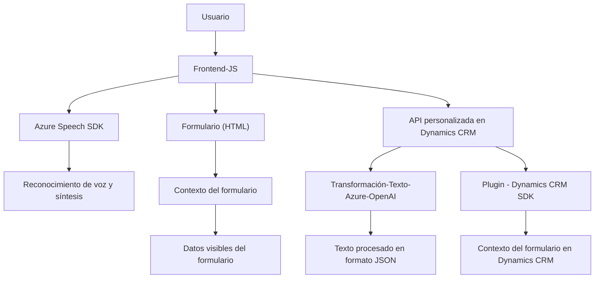

### Breve resumen técnico
El repositorio presenta una solución compuesta por un **frontend** desarrollado en JavaScript y un **back-end** basado en Dynamics CRM con **Azure OpenAI**. El objetivo principal es integrar funcionalidades de reconocimiento de voz, síntesis de voz, procesamiento de texto, y manejo de datos formularios utilizando servicios externos como **Azure Speech SDK** y **Azure OpenAI**.

---

### Descripción de arquitectura
La arquitectura sigue una **n capas**. Se observan dos capas principales:

1. **Frontend (capa de presentación):**
   - Implementado en JavaScript, configura un flujo donde se recoge y manipula información de formularios. Procesa comandos de voz para interactuar con el formulario y emplea el **Azure Speech SDK**.

2. **Back-end (capa de lógica + capa de acceso a datos):**
   - Compuesto por plugins de **Dynamics CRM** que usan el SDK de Dynamics, realizan transformaciones con **Azure OpenAI Services**, y se integran con Dynamics usando servicios web o APIs personalizadas. Los plugins extienden funcionalidades de la plataforma CRM y realizan operaciones con los datos de formularios.

---

### Tecnologías usadas
1. **Frontend:**
   - **HTML/JavaScript**: Construcción de lógica para análisis y síntesis de voz.
   - **Azure Speech SDK**: Uso para reconocimiento de voz y síntesis de texto a voz.
   - **DOM Manipulation**: Procesa datos directamente desde los formularios en la interfaz.

2. **Back-end:**
   - **Dynamics CRM SDK**: Extensiones sobre la plataforma CRM para manipulación de datos y eventos relacionados con formularios.
   - **Azure OpenAI Services**: Para transformación de texto mediante machine learning avanzado.
   - **.NET Core + C#**: Implementación de lógica del plugin y comunicación con APIs.
   - **JSON**: Comunicación y manejo estructurado de datos entre las distintas partes del sistema.
   - **HttpClient**: Para realizar solicitudes HTTP al servicio Azure OpenAI.

---

### Dependencias externas
1. **Azure Speech SDK**: API para el reconocimiento de voz y síntesis de texto a voz.
2. **Azure OpenAI Services**: Plataforma para generar respuestas basadas en IA y transformar texto bajo normas específicas.
3. **Browser APIs**: Posiblemente utiliza APIs de navegador para manipular HTML y gestionar dependencias dinámicas.
4. **Microsoft Dynamics CRM SDK**: Integración directa con formularios, atributos y servicios de CRM.
5. **Newtonsoft.Json**: Parseo y generación de JSON.
6. **HttpClient (System.Net)**: Comunicación con servicios Azure OpenAI y APIs externas.

---

### Diagrama **Mermaid** (estructura compatible con Markdown)

---

### Conclusión final
La solución representa una integración de tecnologías cliente (frontend) y servidor (backend), con un enfoque basado en **n capas**. La capa de presentación (frontend en JavaScript) interactúa con el usuario y los formularios; mientras que la capa lógica/acceso de datos en el backend gestiona y transforma información utilizando plugins de Dynamics CRM y servicios de Azure OpenAI.

Este diseño modular permite la interacción de un **frontend orientado a APIs externas** (reconocimiento de voz y síntesis), y un **backend orientado a operaciones formales** con los datos en Dynamics CRM. Aunque reutilizable, existe una fuerte dependencia de Azure, y los procesos podrían beneficiarse de un manejo más robusto de errores y seguridad en el manejo de credenciales sensibles.