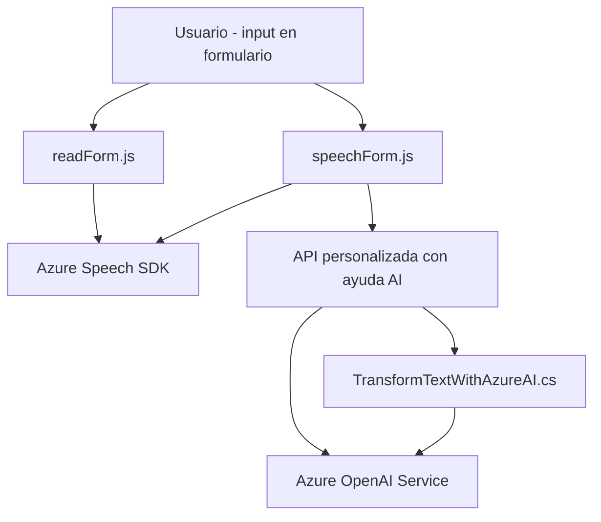

### Breve resumen técnico

El repositorio parece estar diseñado como una solución híbrida que combina accesibilidad y optimización de input mediante interfaces en **Dynamics CRM**. Incorpora funcionalidad tanto para hacer accesible el frontend con voz como para integrar servicios avanzados de inteligencia artificial en tasks dinámicas de procesamiento de datos. 

---

### Descripción de la arquitectura

La solución se divide en tres capas o secciones principales:

1. **Frontend**: Consiste en archivos `readForm.js` y `speechForm.js` que implementan una lógica de accesibilidad mediante integración con **Azure Speech SDK** para convertir datos visibles de formularios o input hablado en texto o audio. El frontend sigue un diseño modular y utiliza callbacks dinámicos.

2. **Backend con Plugins de Dynamics CRM**: Representado por el archivo `TransformTextWithAzureAI.cs`, que actúa como un plugin orientado a eventos. Procesa datos enviados desde Dynamics mediante la API de **Azure OpenAI**, devolviendo resultados estructurados en formato JSON. 

3. **Dependencias Externas**: Estos archivos integran servicios de **Azure Speech SDK** y **Azure OpenAI API**, combinando capacidades de reconocimiento de voz y procesamiento avanzado por inteligencia artificial.

### Tecnologías usadas

- **JavaScript**: Para procesar datos en el frontend (`readForm.js` y `speechForm.js`).
- **Dynamics CRM SDK** (`Microsoft.Xrm.Sdk`): Para manejar plugins y eventos en Dynamics CRM.
- **Azure Speech SDK**: Lógica de reconocimiento de voz y síntesis.
- **Azure OpenAI Service**: Transformación avanzada de texto utilizando inteligencia artificial.
- **APIs REST**: Utilizadas tanto en la capa de frontend como en el backend.
- **JSON**: Para el intercambio de datos entre frontend, backend y APIs.
- **Newtonsoft.Json**: Manejo de serialización JSON en el backend.

### Patrones arquitectónicos

1. **Integración de servicios externos**: Conexión de frontend y backend a servicios proporcionados por Azure, intercomunicándose mediante HTTP y SDKs.
2. **Layered Architecture (n capas)**: UI (formulario), lógica de procesamiento de datos (JavaScript), integraciones de IA (API externas) y plugins CRM forman capas que interactúan progresivamente.
3. **Event-Driven Architecture**: Plugins de Dynamics CRM se ejecutan en respuesta a eventos de sistema, haciendo uso del patrón observer.
4. **Modularity**: Facilitada por funciones bien compartimentadas y clases en el backend.
5. **SRP (Responsabilidad única)**: Métodos y clases en ambas capas tienen funcionalidades acotadas.

---

### Diagrama Mermaid

---

### Conclusión final

La solución completa parece ser un sistema combinado para accesibilidad y procesamiento avanzado de datos basado en voz/texto, formado por las siguientes capas:
- **Frontend modular**: Con JavaScript en el navegador que aprovecha integraciones API de Azure Speech SDK.
- **Plugins de Dynamics CRM**: Proporcionan procesamiento avanzado de eventos en la plataforma CRM utilizando Azure OpenAI.
- **Dependencias externas**: Azure Speech SDK y Azure OpenAI Services son piezas clave en esta solución, asegurando reconocimiento de voz, síntesis de texto y avance en IA.

La arquitectura es una mezcla de **n capas** con integración externa, que permite modularidad y escalabilidad para adaptarse a diferentes entornos de Dynamics CRM. Sin embargo, el diseño puede mejorar trasladando configuraciones externas (claves, endpoints) hacia sistemas de variables de entorno para mayor seguridad y mantenibilidad.