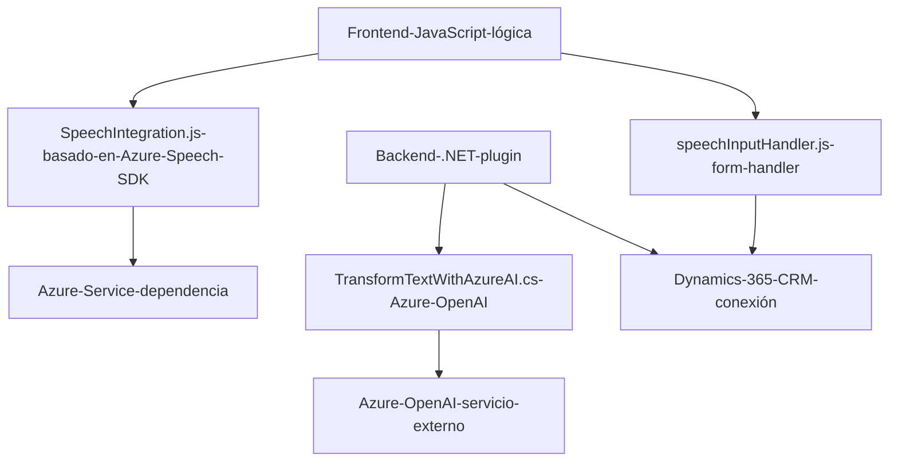

### Resumen técnico

El repositorio integra soluciones de frontend y backend que interactúan con servicios externos como Azure Speech SDK, Azure OpenAI y Dynamics CRM para crear una experiencia avanzada de reconocimiento y síntesis de voz, junto con una transformación estructurada de datos. Está orientado a aplicaciones empresariales, principalmente en el contexto de Dynamics 365.

---

### Descripción de arquitectura

La solución está compuesta por múltiples capas responsables de frontend (JavaScript) y backend (.NET), que se comunican con APIs externas. Se observa un alto nivel de integración con servicios de Azure y Dynamics 365, junto con implementación de módulos claros en cada archivo:

1. **Frontend** (JavaScript): 
   - Captura de datos de formularios (campos visibles y valores).
   - Reconocimiento de voz y síntesis de texto a voz.
   - Carga dinámica de dependencias externas (Azure Speech SDK).

2. **Backend** (.NET Plugin): 
   - Transformación de datos usando Azure OpenAI, implementado como un plugin de Dynamics CRM.

La arquitectura es una mezcla de **modularidad** y **integración directa de servicios externos**, manteniendo una separación clara entre responsabilidades.

---

### Tecnologías usadas

1. **Frontend (JavaScript):**
   - **Azure Speech SDK:** Para síntesis de voz y reconocimiento de voz.
   - **Dynamics 365 Web API:** Interacción con el sistema CRM (formularios y entidades).
   - **JavaScript (ES6):** Utilizado para manejo de funciones asincrónicas y modularidad.

2. **Backend (.NET):**
   - **Azure OpenAI:** Transformación de texto con modelos GPT.
   - **Dynamics CRM SDK:** Para desarrollo de plugins que interactúan con el contexto CRM.
   - **HTTP Cliente:** Usado para comunicarse con APIs externas de Azure.

3. **Dependencias complementarias:**
   - `Newtonsoft.Json.Linq`: Para la manipulación de JSON y gestión de datos estructurados.

---

### Diagrama Mermaid compatible con GitHub Markdown

---

### Conclusión final

Esta solución muestra una arquitectura orientada a aplicaciones interactivas basadas en servicios en un entorno empresarial. El diseño está basado en **modularidad**, con énfasis en accesibilidad y capacidades avanzadas habilitadas por **API externas** de Azure. Aunque sigue una arquitectura de **capas** en la interacción backend-frontend, la dependencia de servicios como Azure Speech SDK y OpenAI posiciona la solución en un enfoque híbrido de **n capas con integración externa**. Las áreas clave incluyen:

- Potente interacción entre frontend y APIs de Azure.
- Modularidad del código, facilitando el mantenimiento.
- Riesgos potenciales como las claves de API explícitas y el manejo de dependencias externas.

Esta solución es ideal para aplicaciones empresariales orientadas a integración y accesibilidad, especialmente en el ecosistema de Dynamics 365.