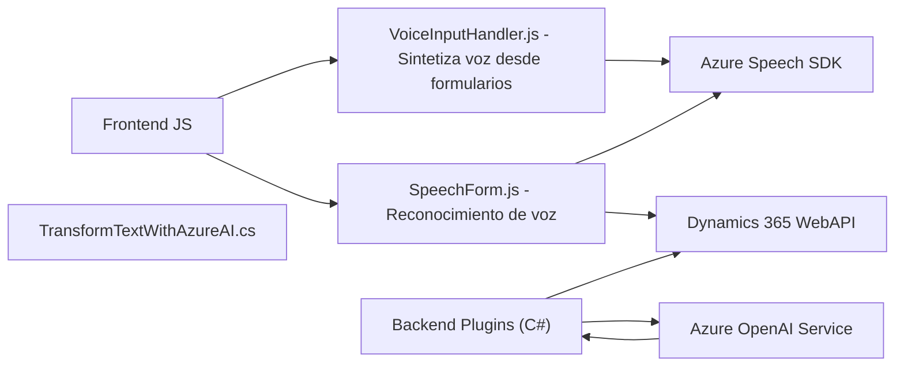

### Breve resumen técnico

La solución presentada es una combinación de componentes centrados en la interacción con formularios, síntesis de voz, reconocimiento de voz, y procesamiento de texto con IA mediante integraciones con **Azure Speech SDK**, **Azure OpenAI Service**, y la **API de Dynamics 365**. Es probable que forme parte de un sistema CRM avanzado con soporte para navegación y entrada basada en voz.

---

### Descripción de arquitectura

La arquitectura utilizada parece estar orientada a capas distribuidas, donde cada componente tiene una función específica:
1. **Frontend (JS)**: Contiene lógica para síntesis y reconocimiento de voz mediante el **Azure Speech SDK**, con integración directa hacia el DOM y la API de Dynamics 365.
2. **Backend (C#)**: Plugins diseñados para tareas específicas como procesamiento de texto mediante Azure OpenAI Service. El flujo se dispara desde dinámicas de usuario en el CRM.
3. **API externa**: Comunicación con servicios de nube de Microsoft (Speech SDK y OpenAI).

En general, la solución adopta una **arquitectura híbrida** con las siguientes características:
- **N-capas**: Separación clara entre frontend (la interacción) y backend (procesamiento).
- **Integración orientada a servicios**: Uso de SDKs y APIs como Azure Speech y Dynamics 365.

---

### Tecnologías usadas

1. **Frontend**:
   - Lenguaje: **JavaScript**.
   - Frameworks/Bibliotecas: Interacción directa con el DOM, uso de SDK externo (Azure Speech SDK).
   - Patrones:
     - Carga Dinámica para el SDK.
     - Separación de responsabilidades.
     - Modelo basado en eventos (Azure Speech).

2. **Backend**:
   - Lenguaje: **C#**.
   - Frameworks/Bibliotecas:
     - **Microsoft Dynamics 365 SDK** para desarrollo de plugins.
     - **Azure OpenAI Service**, utilizando el modelo GPT-4.
     - **System.Net.Http**, **Newtonsoft.Json**, y **System.Text.Json** para realizar solicitudes HTTP y manejar JSON.
   - Patrones:
     - Patrón Plugin propio de Dynamics CRM.
     - Cliente-Servidor para integrar servicios externos.

3. **Componentes externos**:
   - **Azure Speech SDK**: Sistemas para síntesis y reconocimiento de voz.
   - **Azure OpenAI Service**: Procesamiento de texto y generación de JSON estructurado.
   - **Dynamics 365 API**: Gestión de datos de formulario y entidades CRM.

---

### Diagrama Mermaid (100% compatible con GitHub Markdown)

---

### Conclusión final

La solución se centra en la integración de funcionalidades VoC (Voice of Customer) modernas en una plataforma CRM. Utiliza un enfoque modular y servicios en la nube para proporcionar mejoras en la interacción y procesamiento de datos, como integración de síntesis y reconocimiento de voz con **Azure Speech SDK** y procesamiento avanzado mediante **Azure OpenAI GPT-4**.

La arquitectura tiene características de un sistema distribuido con módulos integrables, creando una solución extensible y aislada. Esto asegura flexibilidad al escalar servicios (como usar Azure) sin comprometer la funcionalidad del sistema base. Su elección de tecnologías y diseño es adecuada para aplicaciones CRM modernas.