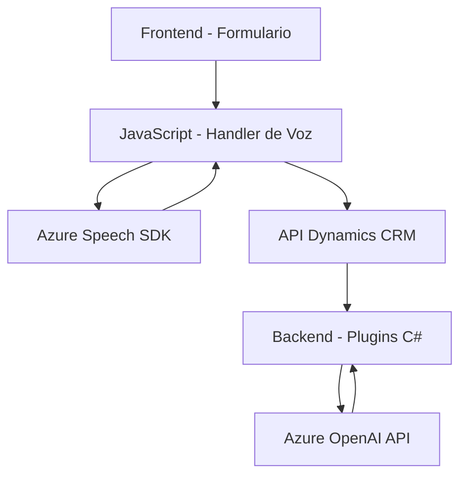

## Breve resumen técnico

Este repositorio combina tecnologías de frontend y backend orientadas a la integración con servicios cloud (Azure SDK y Azure OpenAI) dentro de un contexto de Microsoft Dynamics CRM. Presenta funcionalidades para procesamiento por voz y manipulación de texto con inteligencia artificial en contextos de formularios y plugins personalizados para CRM.

---

## Descripción de arquitectura

La arquitectura general de esta solución es modular y orientada a servicios:
1. **Frontend (JavaScript):** Utiliza una arquitectura de carga dinámica de dependencias (SDK de Azure), y está diseñado para que las funcionalidades de voz y transcripción se integren directamente con formularios.
   - Implementa lógica granular con funciones específicas dentro de un patrón modular.
   - Aprovecha el Event-Driven Programming con asincronía en llamadas API.

2. **Backend (Plugins C#):**
   - Responde al patrón basado en extensibilidad para Dynamics CRM.
   - Actúa como intermediario entre CRM y servicios externos de Azure (Azure OpenAI).
   - Implementación del patrón "Service Connector" al interactuar con APIs externas.

3. **Arquitectura global:** Multicapa, que incluye:
   - **Frontend**: Procesa datos y recoge voz.
   - **API Dynamics 365**: Gestiona los datos recibidos desde el frontend.
   - **Azure APIs**: Procesamiento IA (OpenAI) y síntesis de voz (Speech SDK).

---

## Tecnologías usadas

### Frontend
1. **JavaScript (vanilla):**
   - Sintetización y reconocimiento de voz mediante el **Azure Speech SDK**.
   - Manipulación del DOM y datos contextuales de formularios en Dynamics CRM.
2. **SDK de Speech:** Permite sintetizar y reconocer datos de voz integrados con formularios dinámicos.

### Backend (Plugins C#)
1. **C#** con el SDK para **Dynamics CRM.**
   - Implementación de `IPlugin` para lógica extensible CRM.
   - Llamadas HTTP dinámicas con `HttpClient` hacia la API **Azure OpenAI.**
2. **Frameworks de deserialización JSON:**
   - `Newtonsoft.Json` y `System.Text.Json` para estructuración.
3. **Azure OpenAI Service:** Utilizado para transformar texto siguiendo reglas definidas.

---

## Diagrama Mermaid válido para GitHub Markdown

---

## Conclusión final

Este repositorio proporciona una solución extensible que integra frontend y backend en un flujo de trabajo orientado a servicios cloud y procesamiento de voz. La combinación de **Azure Speech SDK**, **Azure OpenAI**, y la extensibilidad de Dynamics CRM crea una arquitectura de múltiples capas ideal para escenarios empresariales donde se requiera la automatización y procesamiento inteligente de datos (por voz y reglas IA).