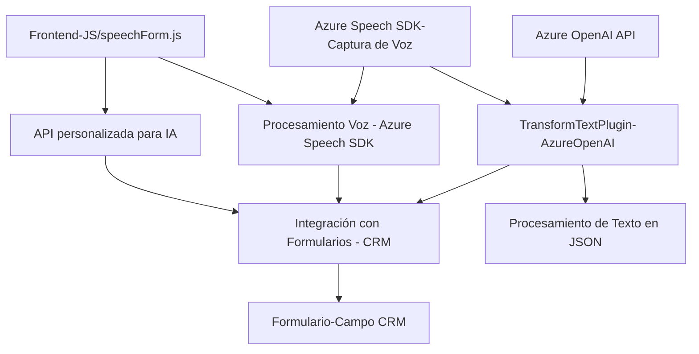

---

### Breve resumen técnico
El repositorio proporciona funcionalidad para integrar el reconocimiento y síntesis de voz en un sistema CRM (Microsoft Dynamics). Utiliza Azure AI y Speech SDK para procesar datos de formularios en tiempo real y también incluye un plugin para transformar texto con reglas específicas usando Azure OpenAI.

---

### Descripción de arquitectura
1. **Tipo de solución:**  
   - **Híbrida Web-App** con backend integrado en Dynamics CRM (plugin) y frontend en JavaScript.
   - Principalmente orientada a procesamiento de voz habilitada por IA.

2. **Patrón arquitectónico:**  
   - **Integración n capas:** La solución implementa múltiples capas (Frontend para reconocimiento/síntesis de voz y llamadas a APIs, Plugin en Dynamics CRM para procesamiento de reglas específicas).  
   - Implementa **SOA (Service-Oriented Architecture)**, utilizando APIs como servicios externos (Azure Speech, Azure OpenAI).
   - **Modularidad:** Cada funcionalidad está estructurada en funciones específicas que interactúan con APIs, enfatizando separación de preocupaciones.  
   - Complementa esto con **carga dinámica de SDK** para optimizar el uso de dependencias en tiempo de ejecución.

3. **Integración:**  
   - Componentes integrados:
     - **Frontend de reconocimiento de voz**: Para captar voz y convertirla en texto, así como para sintetizar texto en audio.
     - **Plugin de CRM dinámico**: Procesa texto dentro del entorno Dynamics CRM.
     - APIs externas: Azure Speech SDK y Azure OpenAI.

---

### Tecnologías usadas:
1. **Frontend**  
   - Lenguaje: JavaScript (para lógica empresarial).
   - CDN externo: Azure Speech SDK (`https://aka.ms/csspeech/jsbrowserpackageraw`).
   - Framework: Microsoft Dynamics Web API (para integración con CRM).
   - APIs utilizadas: Speech SDK, Web API query en Dynamics.

2. **Backend/Plugin**  
   - Lenguaje: C#.
   - Dependencias: `Microsoft.Xrm.Sdk`, `System.Net.Http`, `Newtonsoft.Json`, `System.Text.Json`.
   - API externa: Azure OpenAI.

3. **Patrones en el diseño:**
   - Modularidad: Código separado en funciones independientes para facilitar mantenimiento.
   - Facade/Wrapper: Interfaces encapsulan la complejidad interna de APIs externas como Speech SDK y OpenAI.
   - SOA: Interacciones con servicios externos a través de llamadas API.
   - Plugin Architecture: Integración como complementos de Dynamics CRM.

---

### Diagrama **Mermaid**

---

### Conclusión final
Este repositorio implementa una solución avanzada para habilitar funcionalidades de reconocimiento y síntesis de voz, mapeo de datos transcritos en formularios CRM, y transformación de texto mediante inteligencia artificial.  

La arquitectura enfatiza:
- Modularidad en el desarrollo.
- Uso eficiente de servicios externos como Azure Speech SDK y OpenAI.
- Componentes distribuidos con un patrón **n capas** y características propias de **SOA**.

Esta solución puede escalar para aplicaciones empresariales que deseen integrar reconocimiento de voz, procesamiento de texto avanzado y mapeo directo de datos en formularios CRM.