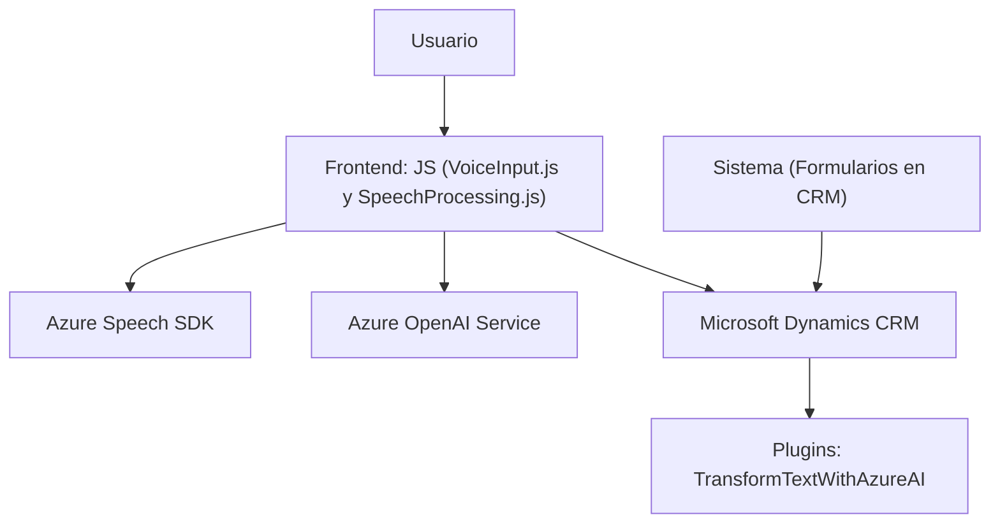

### Resumen Técnico
Este repositorio implementa una solución combinada de Frontend y Backend para una arquitectura de interacción con un sistema CRM (Dynamics 365). Desde el análisis, las funcionalidades están divididas en módulos que forman parte de un sistema de síntesis y reconocimiento de voz, procesamiento de datos de formularios y comunicación con APIs externas, incluidos servicios de Azure Speech SDK y Azure OpenAI.

---

### Descripción de arquitectura
- La arquitectura de esta solución sigue el principio de **modularidad** y combinación de capas orientadas a servicios. Aunque no se observa una estructura explícita de microservicios, el código está diseñado con una separación clara entre procesos de frontend (JavaScript) y backend (Plugins para Dynamics CRM). Esto indica un modelo de arquitectura de **n capas**, en donde:
  - La capa de presentación (Frontend/JS) actúa como interfaz con el usuario.
  - La capa de lógica empresarial (Plugins/*) interactúa y transforma datos mediante Azure OpenAI o SDK de voz.
  - La capa de servicios externos integra funcionalidades como IA y servicios de voz de Azure.

Desde un punto de vista funcional, la solución también utiliza un enfoque orientado a servicios.

---

### Tecnologías Usadas
Las tecnologías y frameworks detectados incluyen:
1. **Frontend**:
   - **JavaScript**: Lenguaje principal para la interacción del frontend.
   - **Azure Speech SDK**: SDK utilizado para la síntesis de voz y reconocimiento de voz.
   - **DOM (Windows/Browser APIs)**: Para la interacción directa con formularios y elementos de página web.
   
2. **Backend**:
   - **Microsoft Dynamics CRM SDK (`Microsoft.Xrm.Sdk`)**: Integración como plugins para extender funcionalidades del CRM.
   - **Azure OpenAI Service**: Para transformar texto mediante GPT-4.
   - **Newtonsoft.Json y System.Text.Json**: Para manejo de estructuras JSON.
   - **System.Net.Http**: Para manejar conexiones HTTP hacia servicios de Azure.

3. **Patrones de diseño**:
   - **N Capas**: Dividido en presentación (frontend), lógica empresarial (backend) y acceso a servicios externos.
   - **Carga Dinámica**: El SDK de Azure Speech es cargado únicamente si no se encuentra previamente cargado.
   - **Integraciones de servicios externos** para voz (Azure Speech SDK) y texto (Azure OpenAI).

---

### Diagrama **Mermaid**
El siguiente diagrama simplifica la interacción entre componentes usando los estándares del repositorio. Representa un flujo orientado a datos donde el frontend interactúa con el usuario y el backend procesa esos datos utilizando servicios externos.

---

### Conclusión Final
Este repositorio implementa una solución orientada a la interacción entre usuarios y un sistema CRM extendido mediante el uso de APIs avanzadas de Azure (Speech y OpenAI). La arquitectura adoptada sigue el patrón clásico de **n capas**, separado en frontend, backend y servicios externos. Utiliza tecnologías actuales y bien integradas, promoviendo modularidad, fácil interacción con el usuario y dinámica en la carga de recursos. Esta arquitectura es adecuada para escenarios de personalización avanzada, como la interacción con formularios mediante voz y análisis de texto, en un marco corporativo como Dynamics CRM.