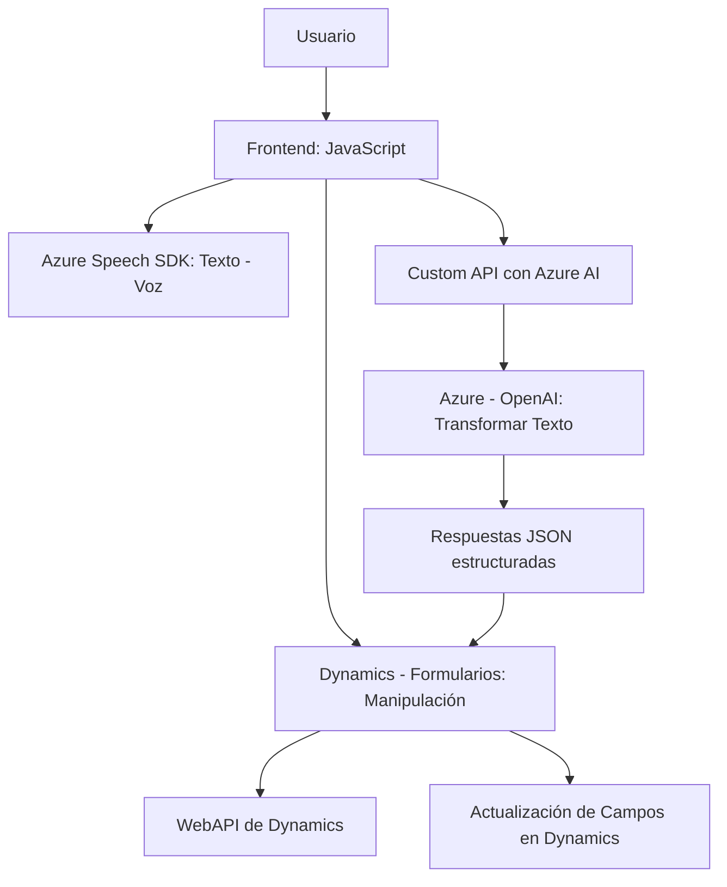

# Análisis detallado

### **Breve Resumen Técnico**
Estos archivos forman parte de una solución híbrida que implementa funciones relacionadas con la captura, procesamiento, y actualización de datos en formularios de Dynamics 365, integrando servicios externos como Azure Speech SDK y Azure OpenAI. La solución combina funcionalidad de frontend (JavaScript) con lógica de backend (C# Plugins) en un entorno empresarial.

---

### **Descripción de Arquitectura**
1. **Tipo de solución:**  
   La solución corresponde a una combinación entre **frontend** y **backend**, diseñada como una integración con Dynamics 365 para extender funcionalidades de entrada y transformación de datos mediante *Inteligencia Artificial*. Incluye una implementación de **plugin** en el lado del servidor y módulos en JavaScript para dinámicas en el cliente.

2. **Arquitectura:**  
   - **Cliente:** El frontend implementa una arquitectura de **n capas**, delegando la responsabilidad de las transcripciones y gestión de datos a Azure Speech SDK y otros servicios externos. Es modular y event-driven con callbacks.  
   - **Servidor:** El plugin se alinea con el patrón **monolítico basado en eventos**, siendo una implementación típica en plataformas como Dynamics que reaccionan a operaciones del sistema, pero incorporando llamadas asíncronas a servicios en la nube.  
   - **Integración:** La solución es un híbrido que sigue el paradigma de **event-driven architecture** y las mejores prácticas en extensibilidad para integrar servicios de terceros.  

---

### **Tecnologías Usadas**
1. **Frontend:**  
   - **JavaScript:** Base del desarrollo del cliente, centrado en funciones de manipulación DOM y lógica.  
   - **Azure Speech SDK:** Para funcionalidades de reconocimiento de voz y síntesis de texto a audio.
   - **Dynamics 365 WebAPI:** Para manipulación y actualización del modelo de datos en formularios.  

2. **Backend:**  
   - **C#:** Base para la implementación del plugin como extensión de Dynamics CRM.  
   - **Microsoft.Xrm.Sdk:** Librería específica para integrar plugins.  
   - **System.Net.Http:** Para llamadas HTTP al servicio Azure OpenAI.  
   - **Azure OpenAI API:** Para transformación de texto basada en inteligencia artificial.  
   - **JSON Libraries:** `System.Text.Json` y `Newtonsoft.Json` para manejo de datos JSON.

---

### **Dependencias o Componentes Externos**
- Azure Speech SDK: Reconocimiento y síntesis de voz.  
- Azure OpenAI: Procesamiento avanzado de texto con normas específicas.  
- Dynamics 365 WebAPI: Para acceder y modificar datos del sistema.  
- Libraries: `Newtonsoft.Json.Linq`, `System.Text.Json` para manipulación de estructuras JSON.  
- Dynamics SDK: Librerías estándar para CRM (`Microsoft.Xrm.Sdk`).  
- Requerimientos DOM: Manipulación de HTML para cargar scripts y trabajar con formularios.  

---

### **Diagrama Mermaid**

---

### **Conclusión Final**
La solución presentada implementa capacidades avanzadas de captura de voz y procesamiento basado en IA, integrando servicios del ecosistema de Azure con Dynamics 365. Su diseño modular, combinado con la extensibilidad ofrecida por los plugins en el backend y la capacidad de interactuar con APIs externas, asegura una arquitectura sólida y escalable. Sin embargo, podría optimizarse si se adoptan otros patrones como *hexagonal architecture* para delimitar dependencias externas y mejorar la testabilidad.