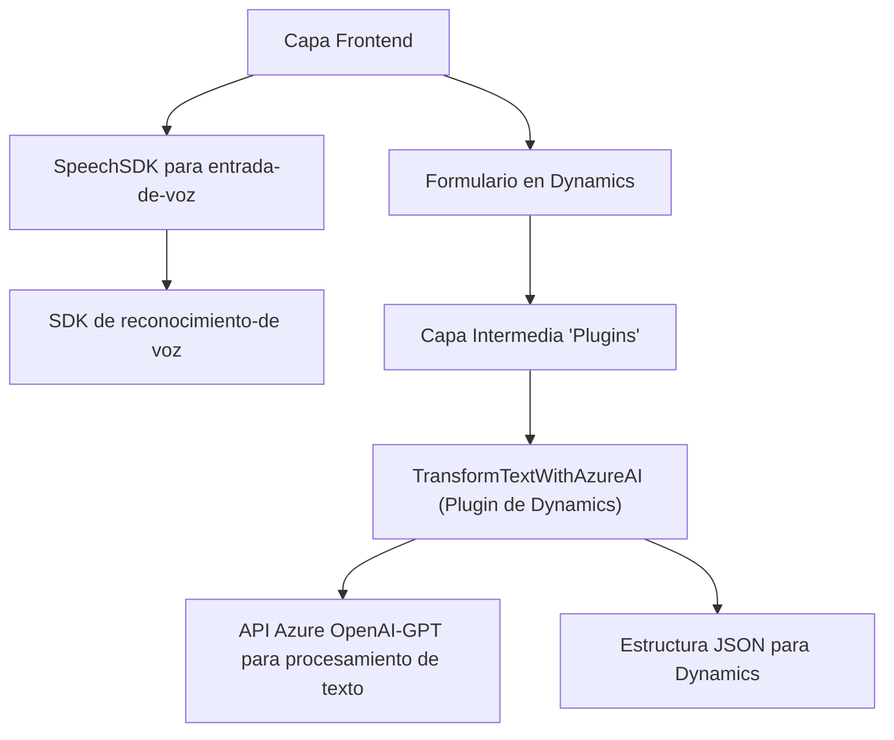

### Breve Resumen Técnico:
El proyecto descrito es una solución híbrida que integra funcionalidades de *Frontend*, *Backend* y *Plugins* en un entorno Microsoft Dynamics 365. Se destaca por el uso de **Azure Speech SDK** para entrada de voz en el cliente y de **Azure OpenAI API** dentro de *plugins backend* para transformaciones de texto mediante IA avanzada. La estructura se orienta hacia aplicaciones basadas en eventos y flujo continuo de datos.

---

### Descripción de Arquitectura:
La arquitectura es de **n capas**, trabajando en tres niveles:
- **Capa Cliente (Frontend):** Implementa interacciones basadas en voz usando *Azure Speech SDK*. Los datos de los formularios son recolectados, procesados y enviados hacia el backend.
- **Capa Intermedia (Dynamics 365 Plugin):** Convierte texto dinámico en JSON estructurado vía integración con **Azure OpenAI API** empleando el modelo GPT-4.
- **Capa Servicios Backstage:** Comunicación con APIs externas (Azure Speech y OpenAI) y SDKs específicos de Dynamics CRM.

El enfoque es modular y asincrónico, utilizando APIs y servicios externos para delegar la transformación de datos y procesamiento de voz/texto.

---

### Tecnologías Usadas:
1. **Frontend:**
   - **Azure Speech SDK:** Para reconocimiento de voz y síntesis texto-a-voz.
   - **JavaScript:** Lógica de cliente en formulación activa y manipulación de DOM.
   - **Dynamics 365 SDK:** Interacción directa con formularios y campos de CRM.
2. **Backend (Plugins):**
   - **Azure OpenAI API:** Transformaciones avanzadas de texto mediante configuración GPT.
   - **C# .NET Framework:** Para crear *plugins*.
3. **Patrones y Estilos:**
   - **Carga dinámica:** (Speech SDK).
   - **Eventos asíncronos y Promesas.**
   - **SDK Wrapper y modularidad.**
   - **Validaciones extensivas en todas las entradas.**

---

### Diagram Mermaid:

---

### Conclusión Final:
El repositorio en evaluación implementa una solución integral que conecta interfaces de usuario con la plataforma **Microsoft Dynamics 365**, las funcionalidades de reconocimiento de voz, y procesamiento inteligente de texto con **Azure OpenAI**. El diseño modular, basado en *n capas*, admite escalabilidad y permite integrar servicios externos para amplificar las capacidades del sistema. Las dependencias externas (Azure Speech SDK y Azure OpenAI) pueden crear limitaciones relacionadas con la gestión segura de credenciales y costos asociados al consumo API, que deben supervisarse cuidadosamente cuando se utilice esta solución en producción.