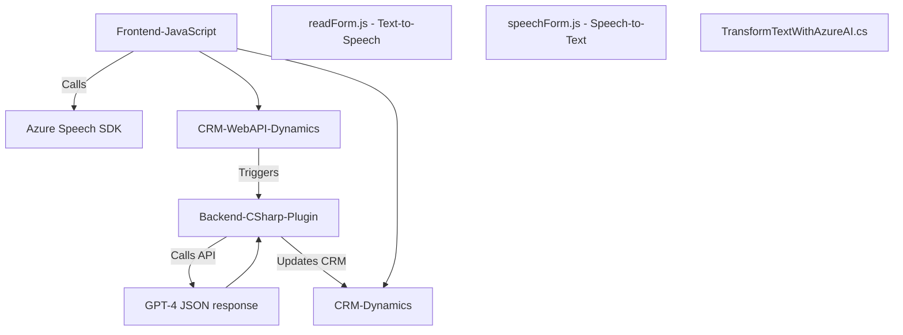

### Breve resumen técnico:
El repositorio contiene diversos archivos que implementan funcionalidades específicas para una solución que integra tecnologías de reconocimiento de voz, procesamiento de texto con inteligencia artificial, y manipulación de datos en un sistema CRM Dynamics. La solución utiliza tanto el Azure Speech SDK como Azure OpenAI para ofrecer accesibilidad mediante voz y procesamiento avanzado de datos con IA.

---

### Descripción de arquitectura:
1. **Tipo de solución:**  
   El repositorio parece ser parte de una solución CRM extendida que combina **procesamiento de voz (Speech-to-Text y Text-to-Speech)** con **manipulación de datos** mediante Azure AI. Los archivos pueden estar distribuidos entre un frontend de interacciones del usuario, un procesamiento en el backend (Dynamics CRM), y una API externa de Azure OpenAI.

2. **Arquitectura adoptada:**  
   La solución utiliza varios patrones arquitectónicos:
   - **Arquitectura en capas:** Se observa una separación entre manejo de voz (en los archivos JavaScript), procesamiento en el CRM (plugins .NET) y servicios externos (APIs de Azure).
   - **Integración con microservicios:** Utiliza servicios externos como Azure Speech SDK y OpenAI en modalidades desacopladas.
   - **Patrón de plugin:** Siguiendo el patrón típico de Dynamics CRM, los archivos .NET implementan lógica específica que se ejecuta en respuesta a eventos en el sistema.

---

### Tecnologías usadas:
1. **Frontend (JavaScript):**
   - JavaScript ES6.
   - **SDKs de Azure:**
     - Azure Speech SDK para reconocimiento y síntesis de voz.
     - Integración directa mediante `https://aka.ms/csspeech/jsbrowserpackageraw`.
   - API personalizada del CRM para normalización de datos de voz.

2. **Backend (C# y .NET):**
   - **Microsoft Dynamics CRM SDK** (`Microsoft.Xrm.Sdk`).  
   - Ado.net, System.Net.Http, System.Text.Json, Newtonsoft.Json.Linq para manipulación web y acceso remoto a recursos.  
   - **Azure OpenAI Service** integrado para procesamiento de texto.

3. **Patrones relevantes:**
   - **Funcional:** Uso organizado de funciones o módulos independientes en JavaScript para lógica granular.
   - **Plugin event receiver:** Manejo de eventos dentro de Dynamics CRM.
   - **Builder Pattern:** Generación dinámica de solicitudes y respuestas JSON.

---

### Diagrama Mermaid válido para GitHub:

---

### Conclusión final:
La solución implementada en el repositorio está pensada para mejorar la accesibilidad y experiencia de usuario en un sistema CRM como Dynamics, con capacidades avanzadas de reconocimiento de voz e inteligencia artificial. La arquitectura, aunque distribuida, sigue siendo en gran medida una combinación de **funcional** y **event-driven** (particularmente en los componentes de Dynamics CRM). Las dependencias externas, como Azure Speech SDK y Azure OpenAI, permiten robustez y escalabilidad, aunque también generan dependencia directa con los servicios de Azure.

Por su combinación de funcionalidades de accesibilidad, procesamiento por IA, y extensión para un CRM, esta solución puede ser especialmente útil en un entorno empresarial enfocado en accesibilidad y automatización inteligente.