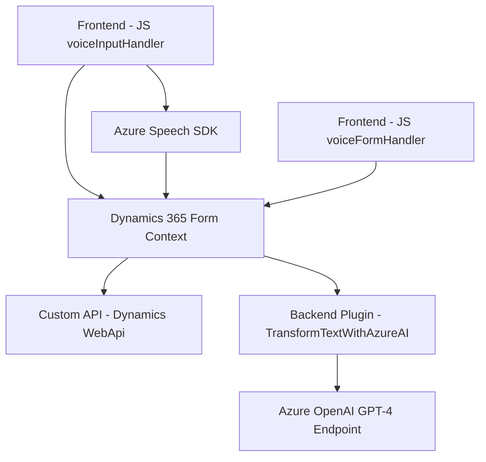

### Breve Resumen Técnico
El repositorio contiene componentes orientados al procesamiento de voz y texto relacionados con formularios en Dynamics 365. Los scripts de **frontend** integran Azure Speech SDK para reconocimiento de voz y conversión de texto a audio, mientras que el plugin en .NET interactúa con Azure OpenAI para transformar texto según reglas específicas.

---

### Descripción de Arquitectura
1. **Tipo de solución**: La solución está diseñada como una integración híbrida:
   - **Frontend**: Scripts diseñados para interactuar directamente con usuarios en Dynamics 365, procesando formularios mediante texto y voz. También se comunican con APIs externas como Azure Speech SDK y una API personalizada.
   - **Backend Plugin**: Implementa un plugin de Dynamics 365 que transforma texto utilizando Azure OpenAI (GPT-4).

2. **Modelo arquitectónico**:
   - Predominantemente del tipo **n-capas**:
     - **Capa de Presentación**: Scripts de frontend que interactúan con Azure Speech SDK y Dynamics 365 para gestionar el reconocimiento y síntesis de voz.
     - **Capa de Negocio**: Contiene lógica para manipulación y actualización de formularios, procesando transcripciones y generando configuraciones específicas.
     - **Capa de Datos**: Implementada mediante el plugin .NET que interactúa con Dynamics 365 y Azure OpenAI para transformar texto.

   - Existe integración con servicios externos (Speech SDK y OpenAI GPT-4), lo que sugiere un enfoque de **arquitectura orientada a servicios**.

---

### Tecnologías Usadas
1. **Frontend Scripts**:
   - **JavaScript**: Desarrollo de funcionalidades ligadas a la interacción usuario-formulario.
   - **Azure Speech SDK**: Reconocimiento y síntesis de voz.
   - **Xrm.WebApi**: Para llamadas a APIs personalizadas en Dynamics 365.

2. **Backend Plugin** (.NET):
   - **C#**: Implementación del plugin.
   - **Azure OpenAI**: Transformación de texto mediante modelos GPT-4.
   - **Microsoft Dynamics SDK**: Recoge y manipula datos de formularios.

3. **Patterns**:
   - **Modularization**: Uso de funciones bien definidas para encapsular responsabilidades individuales.
   - **Factory Pattern**: Para inicializar objetos dinámicos como reconocimiento de voz.
   - **Integration Pattern**: Uso de APIs externas (Azure Speech y Dynamics WebApi).

---

### Diagrama Mermaid

---

### Conclusión Final
La solución combina un enfoque centrado en la interacción de **frontend** con servicios externos (Azure Speech SDK) para reconocimiento y síntesis de voz, combinado con un **backend plugin** que utiliza Azure OpenAI para procesamiento avanzado de texto. Este diseño optimiza la usabilidad en sistemas Dynamics 365 mediante una arquitectura de **n-capas**, con integración transparente entre distintos módulos y servicios externos. Sin embargo, aspectos como la configurabilidad y manejo de errores en servicios externos pueden mejorarse para aplicaciones productivas robustas.