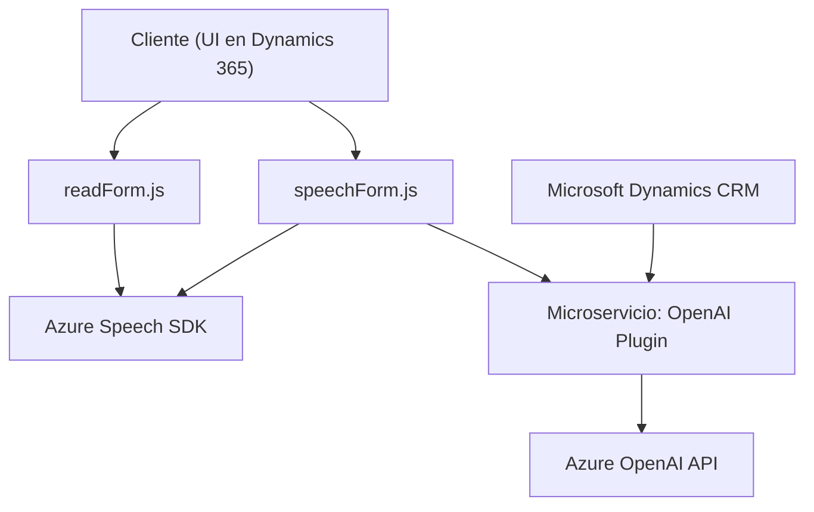

### **Resumen Técnico**
El análisis de los archivos en el repositorio indica que se trata de un proyecto que implementa la integración entre una aplicación frontend basada en Dynamics 365 y la suite de servicios de Azure relacionados con la inteligencia artificial, específicamente el reconocimiento de voz (Azure Speech SDK) y el procesamiento de lenguaje natural proporcionado por OpenAI.

---

### **Descripción de la arquitectura**
La solución sigue una arquitectura de **n capas** (separación de frontend y backend) donde el frontend está compuesto por archivos JavaScript que interactúan con Dynamics 365, principalmente con formularios. El backend está formado por un plugin desarrollado en C# para integrar una API externa utilizando el servicio de **Azure OpenAI GPT**.

1. **Frontend**: Se centra en la captura y sintetización de voz y transcripción en tiempo real. Además, manipula y aplica datos en formularios dinámicos de Dynamics 365.
2. **Backend**: Diseñado como un servicio que utiliza el modelo extension-plugin de Dynamics CRM. Este se conecta al servicio de Azure OpenAI para transformar el texto transcrito en una estructura JSON procesada.

---

### **Tecnologías usadas**
1. **Frontend**:
   - **Azure Speech SDK**: Provee la capacidad de convertir texto a voz y transcribir voz a texto.
   - **Dynamics 365 JS Framework**: Utilizado para la interacción y manipulación de datos en formularios de CRM.
   - **JavaScript**: Lógica programada mediante funciones modulares en el cliente.

2. **Backend**:
   - **Microsoft Dynamics CRM Plugin SDK (Microsoft.Xrm.Sdk)**: Base para desarrollar e integrarse como complementos dentro de Dynamics 365.
   - **Azure OpenAI (GPT / LLM)**: Servicio en la nube para el procesamiento avanzado de lenguaje natural.
   - **System.Net.Http / System.Text.Json**: Para realizar llamadas HTTP a la API de Azure y manejar el formato JSON.
   - **Newtonsoft.Json.Linq**: Manejo y navegación de objetos JSON dinámicos.

---

### **Posibles dependencias o componentes externos**
1. **Frontend**:
   - Azure Speech SDK (versión `jsbrowserpackageraw`).
   - Dynamics 365 context (`formContext`, `XRM.Page`).
   
2. **Backend**:
   - Azure OpenAI API endpoint (requiere suscripción y API-Key).
   - .NET Framework/SDK para compilación del plugin.

3. **General**:
   - Azure backend para Speech API y AI API access.
   - Hosting dentro de Dynamics CRM para el plugin.
   - Infrastructure-related services (logging systems, deployment pipelines, etc).

---

### **Diagrama Mermaid**

---

### **Conclusión Final**
La solución representa una combinación de una arquitectura de **n capas** con un modelo híbrido de integración con servicios externos como **Azure Speech SDK** y **Azure OpenAI**. El proyecto implementa funcionalidades relacionadas con el reconocimiento de voz y el procesamiento de formularios dinámicos basados en el contenido transcrito. 

El código hace uso de patrones como programación modular y orientación a eventos, siendo una solución adecuada para entornos corporativos que emplean Dynamics 365 y demandan tecnología avanzada como AI y procesamiento de voz. Sería útil un análisis adicional para garantizar la optimización del rendimiento del reconocimiento de voz y la integración con la API de Azure OpenAI.