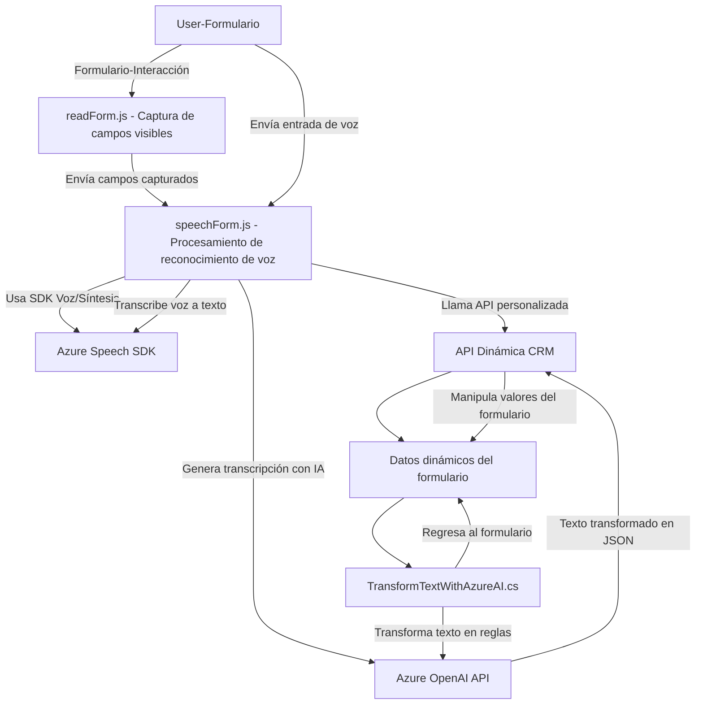

### Breve resumen técnico:
El repositorio contiene múltiples archivos relacionados con un sistema integrado que utiliza el **Azure Speech SDK**, **Microsoft Dynamics CRM Web API**, y **Azure OpenAI API**. Estas herramientas trabajan juntas para procesar tanto entradas de voz e información de formularios como texto transformado con Inteligencia Artificial en el entorno de Dynamics CRM.

---

### Descripción de arquitectura:
La solución está compuesta por tres módulos principales:
1. **Frontend/JS/`readForm.js` y `speechForm.js`:** 
   - Son responsables de interactuar con el usuario mediante reconocimiento y síntesis de voz a través del **Azure Speech SDK**. 
   - Además realizan la preprocesación de datos del formulario y mapean etiquetas visibles a los datos internos del sistema.
   
2. **Plugins/`TransformTextWithAzureAI.cs`:**
   - Implementa un servicio basado en el modelo de plugin de Dynamics CRM.
   - Usando una petición HTTP, interactúa con el **Azure OpenAI API** para transformar texto de entrada en estructuras JSON normalizadas.

La arquitectura sigue un **patrón de n capas**:
- **Capa de presentación (Frontend):** Procesa las interacciones con el usuario (formulario y voz).
- **Capa de negocio:** Reside dentro de los plugins (Dynamics CRM) donde se ejecuta la lógica empresarial y maneja la integración con otros sistemas.
- **Capa de integración/external services:** Integra el SDK de Azure Speech y las REST APIs de Azure OpenAI y Microsoft Dynamics CRM.

Aunque el sistema es modular y se acerca al diseño de una arquitectura hexagonal debido a su dependencia en APIs externas y su enfoque por roles, sigue más fielmente una arquitectura de *n-capas tradicional*.

---

### Tecnologías usadas:
1. **Frontend:**
   - **JavaScript** (vanilla para funciones de procesamiento de datos).
   - **Azure Speech SDK** (Reconocimiento y síntesis de voz).
   - **Microsoft Dynamics CRM Web API** (interacción con datos del formulario y CRM).

2. **Backend (Plugin):**
   - **C# (.NET Framework)** para la lógica de negocio y extensibilidad en Dynamics CRM.
   - **Azure OpenAI Service** para la transformación de texto.
   - **Newtonsoft.Json.Linq** para la manipulación avanzada de JSON.

---

### Diagrama Mermaid válido para GitHub:

---

### Conclusión final:
Esta solución representa un sistema centrado en la automatización de procesos dentro del ecosistema de **Microsoft Dynamics CRM**. Combina un **frontend** en JavaScript, integraciones con el **Azure Speech SDK**, bajo un **patrón n-capas** clásico. La extensión hacia la inteligencia artificial mediante **Azure OpenAI API** y la síntesis de voz le añade capacidades de vanguardia, resultando en un diseño especialmente adecuado para aplicaciones orientadas a la captura y procesamiento automatizado de datos con baja intervención manual.

Aunque la solución tiene componentes distintos, su modularidad y descomposición de responsabilidades por archivos muestra que los desarrolladores están utilizando patrones de diseño como *adapter*, *plugin*, y *modularidad por rol* de manera efectiva.