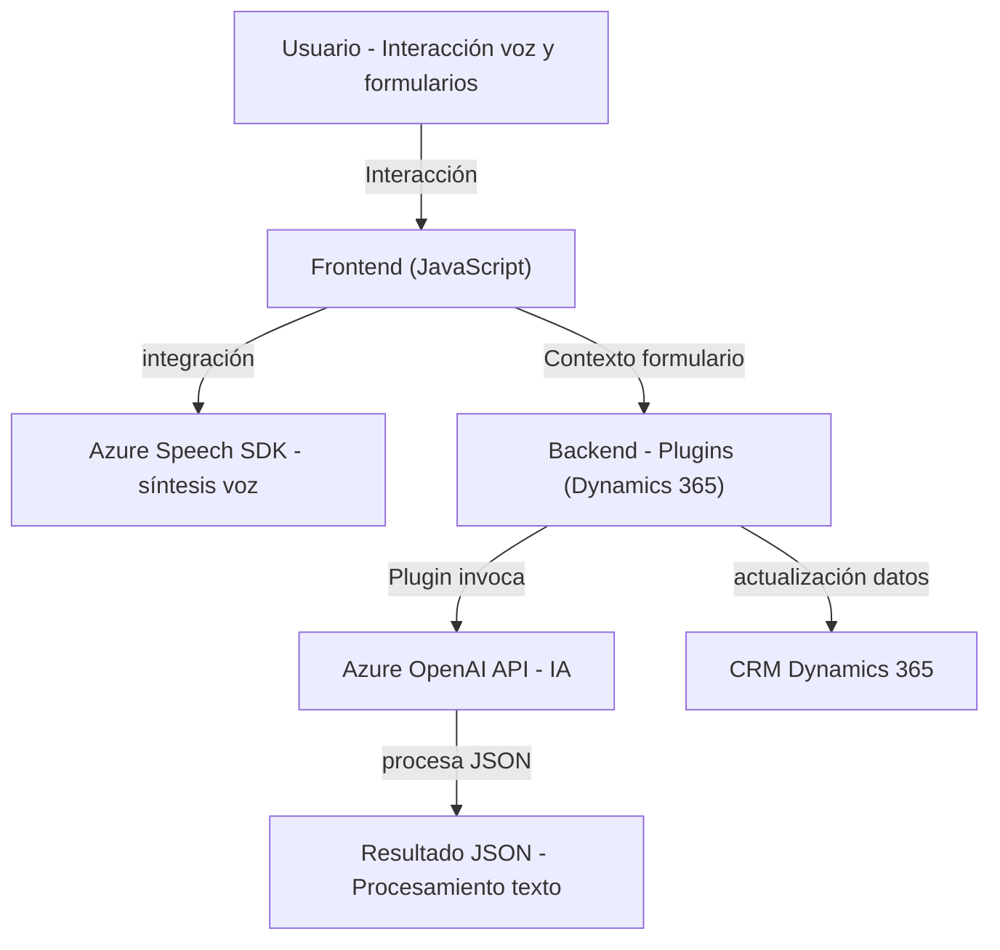

### Breve resumen técnico
El repositorio contiene una solución que integra reconocimiento y síntesis de voz, AI generativa y procesamiento de datos en contextos de formularios dentro de CRM Dynamics 365. Combina frontend con soluciones backend personalizadas como plugins y servicios inteligentes de Azure Speech SDK y Azure OpenAI.

---

### Descripción de la arquitectura
La arquitectura general parece ser de **n capas**, con una clara separación entre frontend y backend. El frontend maneja la interfaz de usuario y comunicación con servicios externos (Azure Speech SDK), mientras que el backend está compuesto por plugins específicos para extender funcionalidades de Dynamics 365. La solución utiliza patrones de **integración de APIs** y desacople modular para conectar los servicios.

---

### Tecnologías usadas
1. **Frontend**:
   - **JavaScript**: Para manipulación de DOM, integración con el contexto del formulario y comunicación con servicios de Azure Speech SDK.
   - **Azure Speech SDK**: Utilizado para reconocimiento de voz y síntesis de texto a voz.

2. **Backend**:
   - **C# (.NET)**: Para desarrollo de plugins en Dynamics 365 que interactúan con la plataforma CRM y Azure OpenAI.
   - Librerías adicionales: `Newtonsoft.Json`, `System.Net.Http`, `Microsoft.Xrm.Sdk`.

3. **Servicios de Azure**:
   - Azure Speech SDK: Reconocimiento de voz y generación de audio.
   - Azure OpenAI Service: Transformación del texto basado en inteligencia artificial.

---

### Patrones de diseño aplicados
1. **Patrón de fachada**:
   En el frontend, el método `startVoiceInput()` simplifica el acceso al SDK y otras funcionalidades relacionadas.
  
2. **Carga dinámica**:
   El SDK de Azure Speech se carga únicamente cuando es necesario para optimizar el uso de recursos.
  
3. **Eventos y plug-ins**:
   En el backend, el plugin implementa `IPlugin` de Dynamics para ejecutar transformación del texto en procesos desencadenados por eventos específicos.
  
4. **Integración de microservicios**:
   La solución conecta servicios externos de Azure Speech SDK y Azure OpenAI como componentes modulares que extienden las capacidades del sistema CRM.
  
5. **Modularidad**:
   Tanto el frontend (manipulación de formularios y voz) como el backend (transformación de texto), dividen tareas en funciones autónomas y específicas de responsabilidades.

---

### Diagrama Mermaid

---

### Conclusión final
La solución presentada es una implementación híbrida de **n capas**, donde el frontend interactúa con formularios y servicios de reconocimiento/síntesis de voz mediante **Azure Speech SDK**, mientras que el backend extiende funcionalidades de **Dynamics CRM** con **plugins personalizados** aprovechando **Azure OpenAI**. Gracias a su modularidad y uso de APIs, garantiza escalabilidad, buen manejo del contexto y extensibilidad. Es bien estructurada y diseñada para simplificar futuras integraciones y mejorar la eficiencia en un entorno CRM mediante inteligencia artificial y voz.