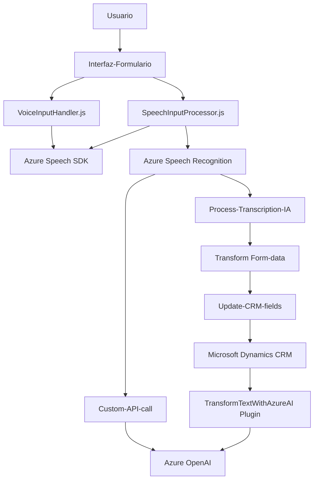

### Breve resumen técnico

El repositorio contiene tres archivos principales: dos del lado del frontend (`VoiceInputHandler.js` y `SpeechInputProcessor.js`) y uno perteneciente a un plugin en C# para Dynamics CRM integrado con Azure AI (`TransformTextWithAzureAI.cs`). La solución tiene como objetivo integrar múltiples servicios de Microsoft Azure (Speech SDK, OpenAI) dentro de un entorno de formularios interactivos, específicamente en Microsoft Dynamics CRM.

---

### Descripción de arquitectura

La arquitectura de esta solución parece implementar un patrón híbrido basado en **n-capas**, donde las piezas clave son:
1. **Frontend/Javascript Layer**: Se encarga de la interfaz de usuario y de ejecutar operaciones como la lectura y procesado de formularios por voz.
2. **Backend Dynamics CRM plugins**: Gestiona operaciones con datos y conecta la solución a través de los servicios personalizados de Dynamics CRM.
3. **Azure Cloud Services**: Para la integración con Speech SDK (para síntesis y transcripción de voz) y OpenAI (para transformación de texto).

Esta arquitectura utiliza una combinación modular para manejar las operaciones específicas del frontend (procesamiento de voz, lectura de formularios, llamadas a APIs) junto con una capa de integración en el backend para interactuar con servicios externos en tiempo de ejecución.

---

### Tecnologías usadas

#### **Frontend**
1. **JavaScript**:
   - Utilización de funciones modulares para facilitar la lectura de datos y la síntesis/transcripción de voz.
2. **Microsoft Azure Speech SDK**:
   - Utilizado para convertir texto en voz y para transcribir entrada de voz.
3. **Dynamics CRM context (`executionContext`, `formContext`)**:
   - Para interactuar con formularios y atributos.

#### **Backend (Plugin en C#)**
1. **Microsoft Dynamics CRM (Plugin SDK)**:
   - Módulo que interactúa con la base de datos y contexto del entorno CRM.
2. **Azure OpenAI Service**:
   - Utilizado para transformar texto aplicando reglas predefinidas.
3. **HTTP Client y JSON libraries**:
   - Comunicación con APIs externas, serialización/deserialización JSON usando `System.Text.Json` y `Newtonsoft.Json.Linq`.

#### **Patrones de diseño**
- **Modularidad/SRP (Single Responsibility Principle)**: Cada función cumple un rol específico que facilita la lectura, mantenimiento y posibilidad de reuso.
- **Plugin Architecture**: Usado en `TransformTextWithAzureAI.cs` en cumplimiento con las especificaciones de Dynamics CRM.
- **Service-Oriented Architecture (SOA)**: El sistema se apoya en la integración de servicios externos como Azure Cloud (Speech SDK y OpenAI).
- **Layered Architecture (n-capas)**: División de responsabilidades entre capa de presentación, lógica del negocio y servicios externos.

---

### Diagrama **Mermaid** válido para GitHub Markdown

---

### Conclusión final

Basado en el análisis del código:
- **Tipo de solución**: Sistema híbrido que integra un componente frontend para formularios interactivos con voz y procesamiento, un backend que incluye el uso de plugins con Dynamics CRM, y dependencias de servicios externos como Microsoft Azure.
- **Tecnologías**: Se utilizan Microsoft Dynamics CRM, JavaScript, Azure Speech SDK y OpenAI, junto con patrones de diseño como SOA, n-capas y Plugin Architecture.
- **Arquitectura**: El sistema tiene características de arquitectura modular combinada, n-capas, con una fuerte dependencia de servicios externos (Cloud-Azure). También cuenta con puntos de integración entre las capas, destacando su naturaleza híbrida.

Este diseño demuestra una solución robusta que utiliza la nube para aprovechar servicios de procesamiento de voz y AI en una integración más amplia con sistemas CRM empresariales.