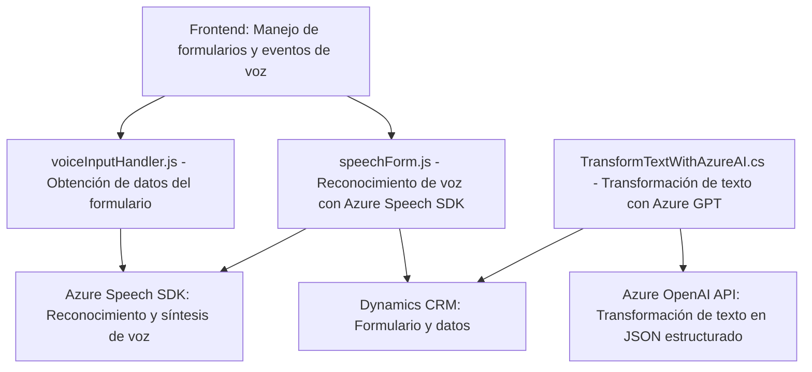

## Breve resumen técnico
El repositorio muestra una solución centrada en funcionalidades para procesar datos de formularios mediante entrada y reconocimiento de voz, así como transformación de texto en objetos estructurados JSON utilizando servicios de Azure, específicamente Azure Speech SDK y Azure OpenAI (GPT). Está compuesto por varias capas que interactúan con APIs externas para habilitar un flujo de trabajo integrado en Microsoft Dynamics CRM.

---

## Descripción de arquitectura

La solución combina diferentes componentes:
1. **Frontend JS**:
   - Manejo de formularios dinámicos y lógica para entrada/salida de voz con Azure Speech SDK.
   - Procesamiento directo de datos según atributos del formulario.
2. **Backend Plugins (.NET)**:
   - Lógica avanzada de transformación de texto y creación de objetos estructurados JSON mediante Azure OpenAI.
   - Integración directa con Dynamics CRM.
3. **Servicios externos**:
   - Azure Speech SDK: Para reconocimiento y síntesis de voz en el frontend.
   - Azure OpenAI API: Desde el plugin para procesamiento y creación de datos estructurados.
   - Xrm.WebApi: Consulta y actualización de datos en la plataforma Dynamics CRM.

---

## Tecnologías empleadas

1. **Frontend (JavaScript):**
   - **Azure Speech SDK**: Reconocimiento y síntesis de voz.
   - **DOM Manipulation**: Para manipular formularios dinamizados.
   - **Asincronía**: Uso de promesas y callbacks para operaciones con servicios externos.

2. **Backend (.NET):**
   - **Dynamics CRM Plugin**:
     - **IPlugin Interface**: Patrón específico de extensibilidad para Dynamics CRM.
     - **Microsoft Azure OpenAI Service**: Consumo de GPT mediante llamadas HTTP RESTful.
     - **Serialization Libraries**: System.Text.Json y Newtonsoft.Json para manejar JSON.

3. **Otros**:
   - **Event-driven Architecture**: Utilización de manejadores de eventos y callbacks para cargar SDK dinamizados.
   - **API-based Architecture**:
     - Integración con APIs externas (Azure Speech SDK, Azure OpenAI API).
     - Uso de APIs internas de Dynamics CRM como Xrm.WebApi.

---

## Diagrama Mermaid

---

## Conclusión final

La solución representa un **sistema orientado a la extracción, transformación y comunicación de datos entre componentes externos y plataformas empresariales**. Está estructurada como una arquitectura **modular de múltiples capas** que combina elementos de frontend para la interacción del usuario, con complementos backend que extienden funcionalidades empresariales de Microsoft Dynamics CRM. Los patrones detectados incluyen **event-driven architecture**, **facade**, y **plugin pattern**. La integración con tecnologías de **Microsoft Azure**, como Speech SDK y OpenAI GPT API, destaca su adaptabilidad y escalabilidad en entornos empresariales modernos.