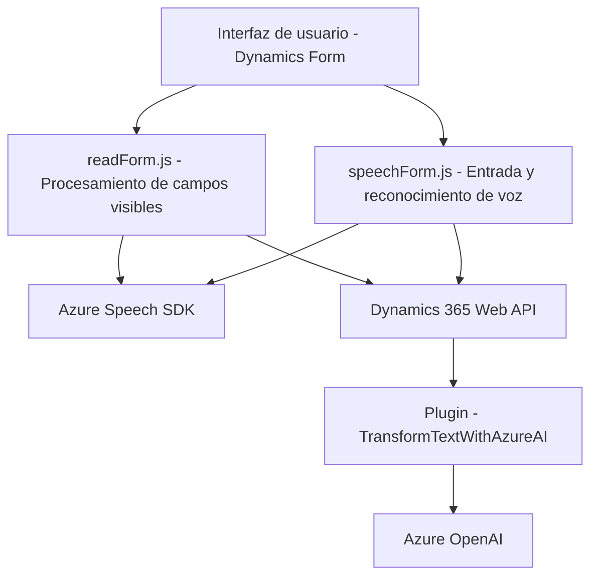

### Breve resumen técnico
El repositorio presenta una solución tecnológica relacionada con la integración de capacidades de inteligencia artificial y procesamiento de voz con Microsoft Dynamics 365, utilizando Azure Speech SDK y Azure OpenAI. Incluye tanto componentes de frontend como de backend.

---

### Descripción de la arquitectura
La arquitectura sigue un enfoque híbrido de **n capas**, con un **frontend** basado en JavaScript que interactúa directamente con los usuarios en los formularios de Dynamics 365, y un **backend** compuesto por plugins (.NET) que procesan datos, transforman texto, y se integran con servicios externos como Azure OpenAI. El diseño modular del frontend y funciones encapsuladas del backend facilitan el mantenimiento y la extensibilidad del sistema.

---

### Tecnologías usadas
- **JavaScript:** Para los archivos de frontend (`readForm.js`, `speechForm.js`) con modularidad y event-driven programming.
- **Azure Speech SDK:** Para la síntesis y reconocimiento de voz (`readForm.js`, `speechForm.js`).
- **Microsoft Dynamics 365 Web API:** Usada en las funciones del frontend y en el backend (con el SDK de Dynamics).
- **C# (.NET):** Implementación del plugin para Dynamics (`TransformTextWithAzureAI.cs`).
- **Azure OpenAI:** Consumo de servicios AI (como GPT) desde el plugin del backend para transformación de texto.
- **System.Net.Http:** Comunicación HTTP desde el plugin del backend.

---

### Dependencias o componentes externos
1. **Azure Speech SDK:** Reconocimiento y síntesis de voz en el frontend.
2. **Azure OpenAI:** Procesamiento avanzado de texto (GPT) en el backend.
3. **Dynamics 365 SDK:** Extendido en el frontend y el plugin para integrar con formularios y datos del CRM.
4. **Dynamics Web API:** Actualizaciones dinámicas de formularios (en `speechForm.js`) y ejecución de APIs personalizadas.
5. **Newtonsoft.Json y System.Text.Json:** Para procesamiento JSON en el backend del plugin.

---

### Patrones presentes en el diseño
1. **Event-driven programming:** Uso de callbacks para manejar eventos asincrónicos (SDK de voz y actualización de formularios).
2. **Singleton:** Dependencia directa y centralizada con el objeto global `SpeechSDK`.
3. **Facade:** Encapsula la complejidad de los servicios de voz en funciones simples como `speakText()` o `ensureSpeechSDKLoaded()`.
4. **Plugin pattern:** En el backend, el plugin sigue las convenciones de Dynamics 365 para integrar lógica personalizada.
5. **Client-server:** Arquitectura básica que conecta el frontend dinámico con un backend extensible.

---

### Diagrama Mermaid válido para GitHub

---

### Conclusión final
El repositorio describe una solución basada en n capas para integrar capacidades avanzadas de inteligencia artificial y procesamiento de voz con Microsoft Dynamics 365. Mientras el frontend utiliza tecnologías como JavaScript y Azure Speech SDK para interactuar con los usuarios en tiempo real (reconocimiento y síntesis de voz), el backend complementa estas funciones mediante plugins en C# (.NET) que procesan textos mediante Azure OpenAI y asegura la actualización dinámica de datos en Dynamics 365.

Su diseño modular, uso de SDKs externos y empleos de patrones estándar destacan por su ético uso de integraciones y su extensibilidad para futuras mejoras. El diagrama ilustra el flujo básico entre los componentes de usuario, voz, API y AI.