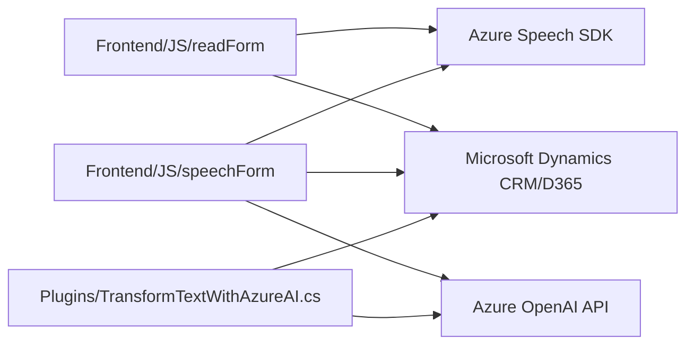

### Breve resumen técnico
Este repositorio contiene componentes de software que integran reconocimiento de voz, procesamiento dinámico de formularios y transformaciones basadas en inteligencia artificial (IA). Está orientado hacia sistemas que ejecutan formularios dinámicos en plataformas como Microsoft Dynamics CRM/D365. Utiliza una combinación de librerías externas (Azure Speech SDK y Azure OpenAI API) y APIs internas (Microsoft Dynamics Web API).

---

### Descripción de arquitectura
La solución está basada en una arquitectura **orientada a eventos** y **modular**. Cada funcionalidad del sistema interactúa como un componente independiente que realiza tareas específicas:
1. Los módulos de frontend (JavaScript) se integran con un formulario dinámico en Microsoft Dynamics y con el Azure Speech SDK. Estas capas del frontend procesan la entrada de voz y ejecutan operaciones de síntesis de voz para enriquecer la experiencia del usuario.
2. El componente del backend (C# Plugin) interactúa directamente con la API de Azure OpenAI para aplicar transformaciones inteligentes (mediante GPT-4) y devolver datos estructurados en formato JSON. Este plugin sigue el patrón típico de extensibilidad de Dynamics.
3. Se utiliza comunicación asincrónica (promesas y callbacks) para garantizar la integración en tiempo real con los servicios externos.

---

### Tecnologías usadas
1. **Frontend**:
   - JavaScript:
     - Interacción con formularios dinámicos mediante APIs de Microsoft Dynamics (`executionContext` y `formContext`).
     - Integración directa con **Azure Speech SDK** para síntesis de voz y reconocimiento de voz.
   - Azure Speech SDK:
     - Reconocimiento de voz.
     - Síntesis de voz.
     - Configuración específica con claves y regiones de Azure.
   - Promesas y callbacks: Para la ejecución de procesos asincrónicos con APIs dinámicas.

2. **Backend**:
   - **C# Plugin (Dynamics SDK)**:
     - Microsoft Dynamics CRM/D365 SDK (`IPlugin`, `IOrganizationService`).
     - Lógica desencadenada por eventos definidos en la ejecución de CRM.
   - **Azure OpenAI API**:
     - Uso de GPT-4 mediante solicitudes HTTP con parámetros dinámicos en formato JSON.
   - .NET Framework (`System.Net.Http`, `System.Text.Json`, `Newtonsoft.Json.Linq`).

---

### Diagrama Mermaid

### Conclusión final
Esta solución corresponde a una arquitectura **event-driven y orientada a servicios**, que integra múltiples componentes:
1. **Frontend** basado en **JavaScript**, responsable de síntesis de voz, procesamiento dinámico de formularios.
2. **Backend** basado en **C# Plugin**, responsable del procesamiento lógico avanzado con Azure OpenAI API.
3. Uso de tecnologías de **Microsoft Dynamics CRM/D365** y **Azure** (Speech SDK + OpenAI GPT-4) hacen que esta solución sea excelente para implementar sistemas inteligentes sobre plataformas empresariales modernas.
4. La modularidad en integración con dependencias externas y el enfoque en la carga diferida de librerías contribuyen a una optimización del desempeño del sistema frente a recursos de red y computación.

Se sigue una arquitectura que, aunque en algunos casos tiene nociones de arquitectura en capas y modularidad, está más orientada a eventos y microservicios debido a la dependencia de APIs externas. Idealmente, el sistema podría evolucionar hacia una arquitectura de tipo hexagonal para una mayor adaptabilidad y separación de responsabilidades.