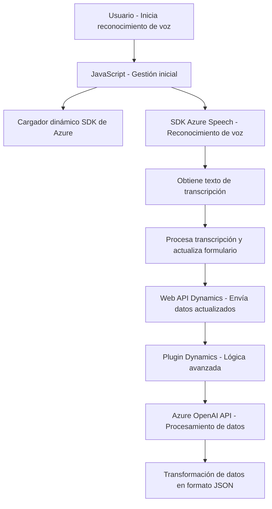

### Breve resumen técnico
El repositorio representa una solución que integra funcionalidades de reconocimiento y síntesis de voz basada en el **Azure Speech SDK**, además de una **API de transformación basada en OpenAI** para mejorar la interacción con formularios y CRM dinámicos. Consiste en tres elementos principales:
1. **Frontend/JS**: Scripts que gestionan la interacción con formularios mediante reconocimiento y síntesis de voz.
2. **Plugins**: Lógica de negocio desplegada como plugins de Dynamics 365 para transformar y procesar datos usando Azure OpenAI.

---

### Descripción de arquitectura
La arquitectura tiene un diseño híbrido que mezcla un **frontend modular**, un **patrón plugin** para Dynamics 365, y el uso de una **Service-oriented Architecture (SOA)** al integrar servicios externos (Azure Speech SDK y Azure OpenAI). La aplicación se apoya en:
- **Event-driven flow**: Los eventos disparados por los usuarios activan el flujo de voz, procesamiento y actualización del contexto del formulario.
- **Modularidad**: El código frontend está altamente desacoplado, con funciones específicas para tareas como carga de SDK, generación de audio y reconocimiento de voz.
- **Servicios externos y plugins**: La transformación avanzada se delega al plugin, que actúa como un microservicio interactuando con Azure OpenAI.

### Tecnologías usadas
- **Frontend**:
  - **JavaScript** (modular, orientado a tareas específicas)
  - Azure Speech SDK (para servicios de voz)
  - Integración con Dynamics CRM a través de `Xrm.WebApi`.
  
- **Backend (Plugins)**:
  - **C# (.NET Framework)** para lógica backend.
  - Dynamics CRM SDK (`Microsoft.Xrm.Sdk`) para desarrollo de plugins.
  - Azure OpenAI API para transformación de datos.

- **Patrones**:
  - **Cargador dinámico** para integrar scripts externos.
  - **Encapsulación funcional** para modularizar tareas complejas.
  - **SOA**: Dependencia de APIs externas.
  - **Event-driven callbacks**: En la integración con sistemas de formularios.

### Dependencias o componentes externos
1. **Servicios y bibliotecas externas**:
   - Azure Speech SDK (`https://aka.ms/csspeech/jsbrowserpackageraw`) para voz.
   - Azure OpenAI API para procesamiento de texto avanzado.
   - Dynamics CRM Web API (`Xrm.WebApi.online.execute`) para interacción directa con CRM.
2. **Dependencias internas específicas de Dynamics CRM**:
   - Uso del plugin pattern y extensiones CRM para lógica de negocio.

---

### Diagrama Mermaid

---

### Conclusión final
Esta solución tiene como propósito mejorar la accesibilidad y automatización dentro de un ecosistema CRM mediante servicios avanzados de voz soportados por **Azure Speech SDK** y procesamiento de datos vía **Azure OpenAI**. La arquitectura es modular, flexible y orientada a eventos, lo que facilita su integración y escalabilidad. Sin embargo, la dependencia de múltiples servicios externos exige una gestión robusta de claves, autenticación y latencia en comunicación. Optimizar estos elementos podría mejorar aún más el rendimiento en operaciones críticas.