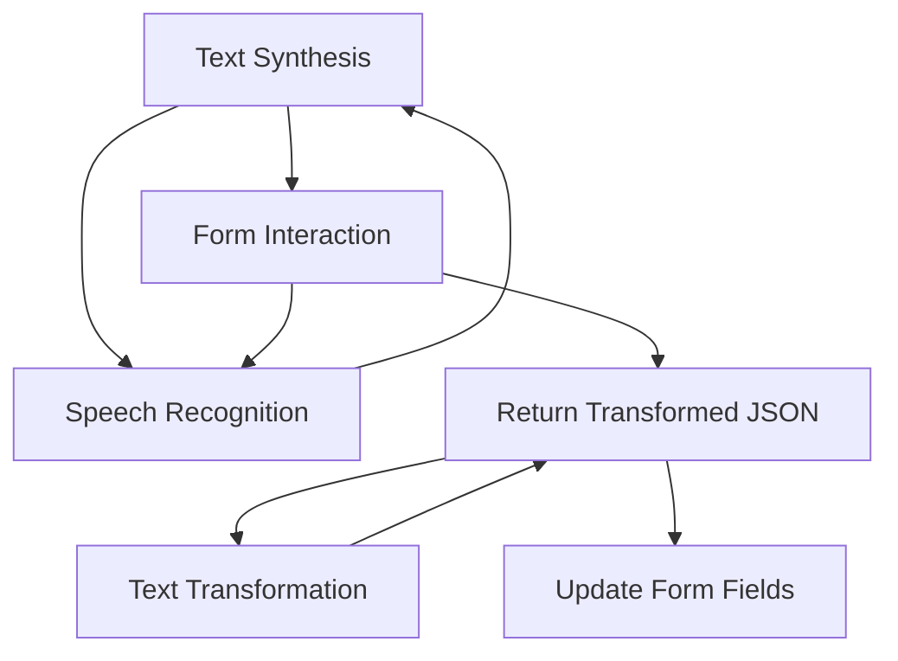

### Breve resumen técnico:
Este repositorio contiene una solución de software que combina un frontend basado en JavaScript y Dynamics 365 junto con un plugin personalizado en C#. Su propósito principal es proporcionar integración de voz a texto y procesamiento de formulario mediante Azure Speech SDK y un modelo de IA alojado en Azure OpenAI. La arquitectura está diseñada para manejar la interacción entre usuarios y formularios dinámicos, aprovechando servicios como reconocimiento de voz, síntesis de texto en voz y transformación semantic-textual mediante GPT-4 en Azure.

---

### Descripción de arquitectura:
La solución implementada corresponde a una arquitectura de **n capas** con integración de elementos de **event-driven architecture**.  
- **Capa de presentación**: El frontend escrito en JavaScript maneja la interfaz gráfica en Dynamics 365, proporcionando interacción usuario-formulario e integración con reconocimiento de voz.
- **Capa de lógica de negocio**: El backend (plugin en C#) procesando texto con Azure OpenAI, asume tareas específicas como transformar el texto en JSON estructurado mediante reglas semánticas.
- **Capa de datos**: Dynamics 365 maneja la persistencia e interacción con los datos en los formularios dinámicos y los sistemas relacionados (entidades, CRM).

El diseño desacopla las dependencias externas (SDK dinámico, servicios REST externos) y utiliza patrones como callbacks en el frontend para sincronización asincrónica y validación de flujo.

---

### Tecnologías usadas:
1. **Frontend**:
   - **Vanilla JavaScript**
   - **Azure Speech SDK**: Para el reconocimiento y síntesis de voz.
   - **DOM Manipulation**: Interacción directa con formularios dinámicos de Dynamics 365.

2. **Backend**:
   - **C# (Microsoft Dynamics Plugin)**:
     - Integración con Dynamics 365 mediante `Microsoft.Xrm.Sdk`.
     - Comunicación HTTP con `System.Net.Http`.
     - JSON serialización/deserialización mediante `System.Text.Json` y Newtonsoft.Json.
   - **Azure OpenAI (GPT-4)**: Para procesamiento de texto transformado en JSON.

3. **APIs Externas**:
   - Azure Speech y Azure OpenAI.

4. **Patrones de diseño**:
   - **Callback pattern**: Para modularización en funciones frontend.
   - **Dependency Injection**: En el plugin de Dynamics 365.
   - **Partitioned Layers**: Dividiendo lógica entre capas frontend y backend.

5. **Servicios en Cloud**:
   - Azure AI (Speech SDK y OpenAI).

---

### Diagrama Mermaid válido para GitHub:

---

### Conclusión final:
Este proyecto presenta una integración avanzada entre tecnologías de reconocimiento y síntesis de voz (Azure Speech SDK) y transformación semántica del texto mediante modelos de IA (Azure OpenAI). La arquitectura está estructurada de manera modular y escalable, aprovechando la robustez de Dynamics 365 como capa de datos y lógica, junto con servicios distribuidos de Azure.

La solución está diseñada para optimizar la interacción usuario-sistema, automatizar la entrada de datos y mejorar la experiencia en entornos de negocio dinámicos como CRM. Es una implementación bien segmentada, permitiendo futuras ampliaciones (funcionalidades de IA, nuevos flujos, otras APIs).