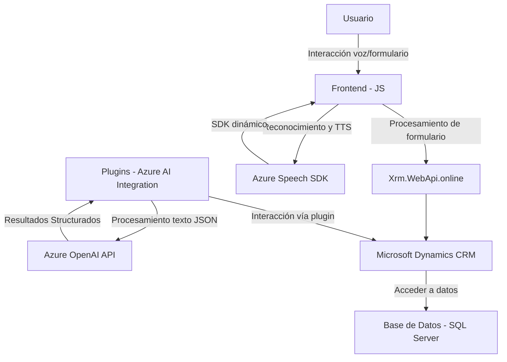

### Breve Resumen Técnico
El repositorio contiene código relacionado con una solución que integra un frontend y plugins para Dynamics CRM. Este sistema utiliza el **Azure Speech SDK** para reconocimiento y síntesis de voz, y la **Azure OpenAI API** para la transformación de texto en estructuras JSON mediante procesamiento de lenguaje natural (NLP). La funcionalidad principal está orientada a mejorar la interacción de formularios en Dynamics CRM con inteligencia artificial y voz.

---

### Descripción de la arquitectura
La arquitectura puede clasificarse como **modelo de capas (n capas)** con integración modular. Al nivel más general:
1. **Frontend:** Encargado de la interacción usuario-formulario, captura de inputs y comunicación con servicios externos como Azure Speech SDK.
2. **Plugins (backend):** Extienden las capacidades del CRM mediante lógica personalizada y comunicación directa con la **Azure OpenAI API** para procesamiento de datos externos.
3. **Servicios externos:** Comunicación con Azure Speech y OpenAI para integrar funcionalidades avanzadas como reconocimiento/síntesis de voz y NLP.

Aunque hay elementos de integración con servicios, el sistema parece operar dentro de un monolito, ya que los plugins están fuertemente acoplados a Dynamics CRM y todo el flujo se integra bajo esta plataforma. Sin embargo, la división funcional denota buen diseño modular.

---

### Tecnologías, Frameworks y Patrones Utilizados
1. **Tecnologías:**
   - **Frontend:** JavaScript ejecutado en el navegador, posiblemente con Dynamics 365 interfacing.
   - **Backend:** .NET utilizando `Microsoft.Xrm.Sdk` para integrar plugins con Dynamics CRM.
2. **Frameworks:**
   - **Microsoft Dynamics CRM:** Plataforma para gestionar datos empresariales.
   - **Azure Speech SDK:** Text-to-Speech (TTS) y Speech-to-Text (STT).
   - **Azure OpenAI API:** Procesamiento y generación de texto inteligente.
3. **Patrones de diseño:**
   - **Plugin Architecture:** Los plugins se integran con Dynamics CRM para extender su funcionalidad.
   - **Dynamic Dependency Loading:** El arreglo para cargar el Azure Speech SDK de manera dinámica muestra un modelo flexible para dependencias externas.
   - **Modularidad funcional:** Organización de las funciones en módulos con responsabilidades autónomas, facilitando el mantenimiento y la reutilización.

---

### Dependencias o Componentes Externos
1. **Azure Speech SDK:** Para realizar operaciones de TTS y STT.
2. **Azure OpenAI API:** Procesa texto basado en reglas usando NLP avanzado.
3. **Newtonsoft.Json:** Para manipulación de datos JSON.
4. **Xrm.WebApi.online:** Usado en el frontend para integrarse con Dynamics CRM y realizar acciones específicas.
5. **Microsoft.Xrm.Sdk:** Dependencia del backend (plugins) para comunicarse con la organización de CRM.

---

### Diagrama Mermaid Válido para GitHub Markdown

---

### Conclusión Final
El repositorio incluye una solución mixta que combina interacción de usuario basada en voz, procesamiento de texto con IA y gestión avanzada de datos en formularios de Dynamics CRM. Aunque implementa elementos modulares eficaces y reutilizables tanto en el frontend como en el backend, su arquitectura está orientada hacia un modelo de **n capas con integración modular** más que hacia microservicios. El uso de la dinámica de servicios de Azure y los plugins de Dynamics CRM le dan un enfoque potente hacia la automatización de procesos basados en interacciones humanas y procesamiento avanzado.