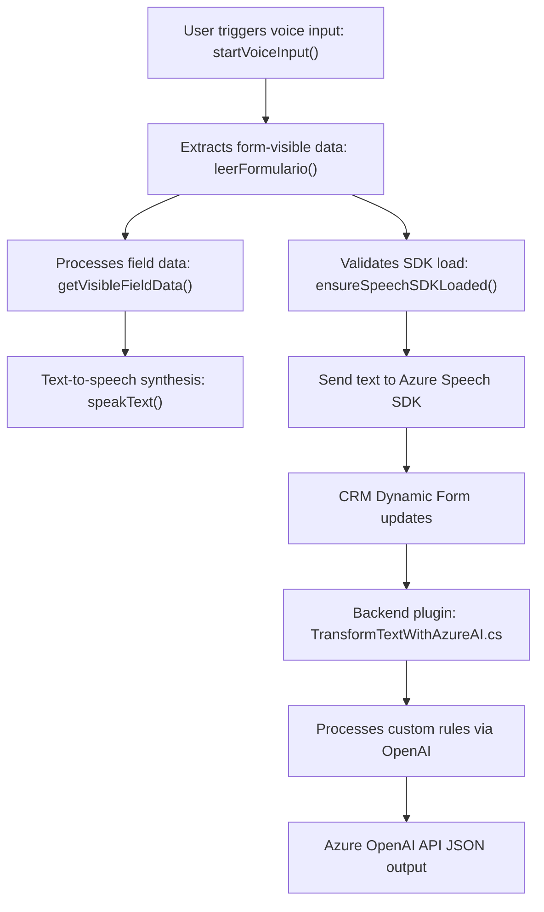

**Breve resumen técnico:**
El repositorio incluye componentes relacionados con el procesamiento de formularios y reconocimiento de voz, diseñados para integrarse con sistemas CRM como Microsoft Dynamics 365. Combina funcionalidad frontend en JavaScript y plugins backend en C# con extensiones mediante APIs externas (Azure Speech SDK y Azure OpenAI).

---

**Descripción de arquitectura:**
La arquitectura es híbrida, combinando las siguientes características:

1. **Frontend:**
   - Modularización basada en funciones para manejar entrada y salida de datos de formularios dinámicos en tiempo real mediante voz y reconocimiento de voz, orquestado con lógica de validación y eventos del usuario.
   
2. **Backend:**
   - Uso de un plugin de Dynamics 365 que implementa el patrón de Plugin Design para procesar datos mediante un servicio de Azure OpenAI.
   
3. **Integración con servicios externos:**
   - APIs de Azure para reconocimiento de voz y procesamiento mediante IA sirven como servicios externos, implementados bajo patrones SOA.
   
4. **Tipo de arquitectura:** Aunque tiene componentes desacoplados, el sistema principal funciona como un **monolito**, ya que los plugins están diseñados para ejecutarse dentro del entorno de Dynamics 365 y dependen de su infraestructura. La presencia de APIs externas sugiere una estrategia **service-oriented**.

---

**Tecnologías usadas:**
1. **Frontend:** 
   - JavaScript
   - Azure Speech SDK (para voz y reconocimiento).
   - Framework de UI del CRM Dynamics 365.

2. **Backend:**
   - **Lenguaje:** C# (con .NET Framework o posiblemente .NET Core).
   - **Dependencias:**
     - `Microsoft.Xrm.Sdk` para interacciones con Dynamics 365.
     - `System.Net.Http` para llamadas API REST.
     - `Newtonsoft.Json.Linq` y `System.Text.Json` para manipulación de JSON.
     - Azure OpenAI API.

3. **APIs externas:** 
   - Azure Speech SDK.
   - Azure OpenAI API.

4. **Patrones:**
   - Modularización de funciones en el frontend.
   - Validación dinámica de dependencias.
   - Plugin Design Pattern para extensibilidad en Dynamics.
   - SOA para integración con APIs externas (con microservicios dedicados a procesamiento por IA).

---

**Diagrama Mermaid:**

---

**Conclusión final:**
El repositorio implementa una solución híbrida donde componentes JavaScript del frontend interactúan con Azure Speech SDK para sintetizar voz y manejar formularios dinámicos en sistemas CRM como Microsoft Dynamics 365. En paralelo, un plugin backend en C# procesa datos textuales mediante Azure OpenAI, extendiendo la funcionalidad del CRM. La arquitectura es **service-oriented con monolítico CRM** y dependencia fuerte de APIs externas. Aunque cada componente está bien modularizado, la relación estrecha con Dynamics 365 refleja una arquitectura diseñada para integrarse profundamente con este entorno.