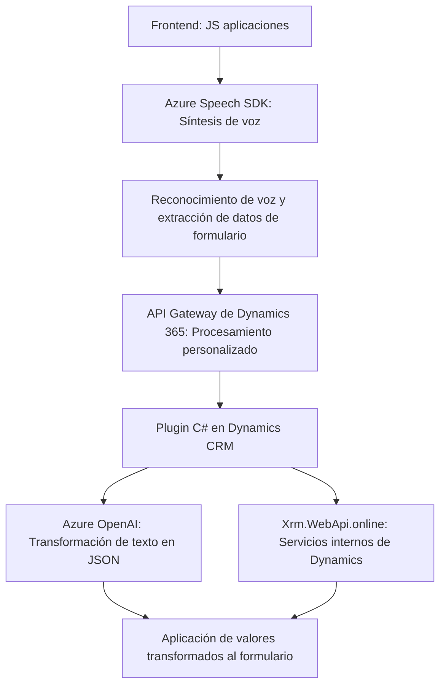

### Breve resumen técnico

El repositorio representa una solución completa enfocada en la integración de formularios y servicios avanzados de reconocimiento de voz y procesamiento de texto mediante Azure Speech SDK y Azure OpenAI en el contexto de Dynamics 365. Se implementan funcionalidades tanto en el frontend como en el backend para interactuar con el usuario, extraer datos y aplicar transformación inteligente de los mismos.

---

### Descripción de arquitectura

1. **Tipo de solución:**  
   - Principalmente consiste en una combinación de _frontend_ (JavaScript) y _backend_ (C# plugin) que interactúa con plataformas externas como Azure Speech y Azure OpenAI.
   - Implementa una API personalizada en Dynamics 365 que utiliza los servicios de Azure para procesamiento de texto avanzado.

2. **Tipo de arquitectura:**  
   - En el frontend, utiliza una estructura modular basada en una arquitectura n-capas: la capa de presentación (HTML/JS) interactúa con los servicios externos (Azure Speech y backend Dynamics).
   - En el backend, se sigue una arquitectura basada en eventos (IPlugin) típica de Dynamics CRM para operaciones contextuales.
   - Utiliza patrones de integración (API Gateway y Service Locator) para las interacciones con Azure, reflejando elementos de la arquitectura hexagonal en el manejo de dependencias externas.

3. **Tecnologías utilizadas en el repositorio:**  
   - **Frontend:** JavaScript con Azure Speech SDK.
   - **Backend:** C# para desarrollo de plugins personalizados en Dynamics CRM.
   - **Servicios externos:** Azure Speech SDK y OpenAI para reconocimiento de voz y procesamiento de texto.
   - **Microsoft Dynamics 365 API:** Servicios internos como Xrm.WebApi.online para trabajar con la capa de datos.

4. **Patrones de diseño aplicados:**  
   - **Modularización:** Cada funcionalidad es encapsulada en su respectivo archivo o método.
   - **Integración dinámica:** El SDK de Speech se carga solo cuando es necesario, aprovechando servicios externos sin sobrecargar el frontend o backend.
   - **Uso de API externa:** Patrón API Gateway para interactuar con Azure Speech y OpenAI desde los plugins.

5. **Componentes externos presentes:**  
   - **Azure Speech SDK:** Para síntesis y reconocimiento de voz.
   - **Azure OpenAI:** Para procesamiento inteligente de texto.
   - **Microsoft Dynamics 365 APIs:** Para manipular datos de formularios y entidades en Dynamics CRM.
   - **HTTP Client:** En el backend para conectarse con Azure servicios.

---

### Diagrama Mermaid válido para GitHub

---

### Conclusión final

El repositorio es una solución híbrida, que combina un frontend altamente funcional con soporte para síntesis y reconocimiento de voz, y un backend especializado en procesamiento contextual de datos mediante plugins en Dynamics CRM. Utiliza servicios de Azure para interactuar con tecnologías avanzadas como Speech SDK y OpenAI, reflejando una arquitectura distribuida y modular orientada a servicio (SOA). Las implementaciones corresponden a una arquitectura n-capas en el frontend y hexagonal en el backend, lo que garantiza escalabilidad y extensibilidad.