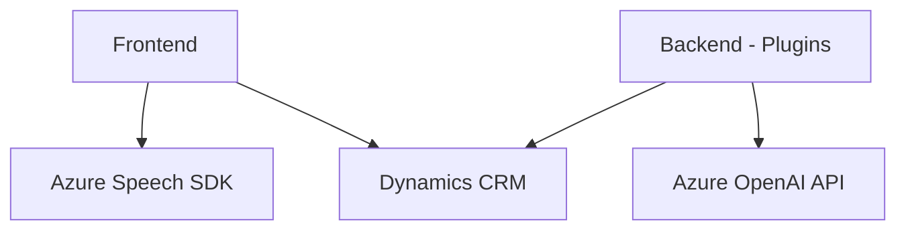

### **Breve resumen técnico**

El repositorio es una solución híbrida que combina un frontend interactivo basado en JavaScript, plugins personalizados en Dynamics CRM, y servicios externos como Azure Cognitive Services y OpenAI para habilitar accesibilidad mediante voz, procesamiento de comandos y transformación avanzada de texto. Está diseñado para aplicaciones empresariales integradas con Dynamics CRM.

---

### **Descripción de arquitectura**

La solución muestra características de una **arquitectura de múltiples capas**, con una separación clara entre las siguientes componentes:
1. **Frontend**:
   - Proporciona interacción entre usuario y sistema mediante el procesamiento de voz (Azure Speech SDK).
   - Procesa datos del formulario visible en una aplicación frontend y facilita accesibilidad por medio de herramientas como síntesis y reconocimiento de voz.
2. **Backend/Plugins**:
   - Plugins aplicados como extensiones de Dynamics CRM que procesan comandos y datos mediante la API de Azure OpenAI.
   - Utilizan arquitectura clásica de extensiones de Dynamics CRM basados en el patrón de Plugin.
3. **Servicios Externos**:
   - Azure Cognitive Services (Speech SDK) y OpenAI agregan servicios avanzados de IA (como generación de texto) que interactúan con la lógica de negocio.

Arquitectónicamente, esta solución es una combinación de enfoques:
- **N Capas**: Separación entre frontend, lógica de plugins en el backend y servicios externos.
- **Integración de servicios externos**: Dependencia de SDKs externos como Azure Speech y OpenAI.

---

### **Tecnologías usadas**

1. **JavaScript (Frontend)**:
   - Lógica principal para interactuar con formularios.
   - Acceso al API de Dynamics CRM desde el contexto del formulario.
   - Azure Speech SDK: Para reconocimiento y síntesis de voz.
2. **C# (Backend)**:
   - Plugins Dynamics CRM integrados en el framework del sistema.
   - Manipulación de datos JSON (Newtonsoft.Json y System.Text.Json).
   - Comunicación con APIs REST para servicios de inteligencia artificial.
   - Enfoque modular con patrones Plugin y RESTful.
3. **Azure Cognitive Services**:
   - Speech SDK (Frontend): Procesamiento de voz en tiempo real.
   - OpenAI API (Backend): Transformación avanzada de texto usando IA.
4. **Dynamics CRM APIs**:
   - Manipulación de formularios, búsqueda de entidades, y aplicación de valores mediante atributos del sistema.

---

### **Diagrama Mermaid**

---

### **Conclusión final**

La solución se enfoca en la integración de accesibilidad, inteligencia artificial y procesamiento de voz en un sistema empresarial basado en Dynamics CRM. Su arquitectura es flexible, con módulos independientes que interactúan mediante servicios externos como Azure y APIs RESTful. Aunque existe una clara separación de responsabilidades y componentes, podría beneficiarse de refinar patrones modernos como arquitectura hexagonal para desacoplar aún más los servicios externos e interneces del sistema.

Además, se observa que los puntos críticos de esta solución son:
1. **Gestión de seguridad**: Las claves de Azure (para Speech SDK o OpenAI) deben gestionarse de manera segura.
2. **Baja acoplamientación**: La dependencia de los servicios de Azure y Dynamics CRM sugiere priorizar el desacople mediante abstracciones, interfaces y configuraciones adaptables.
