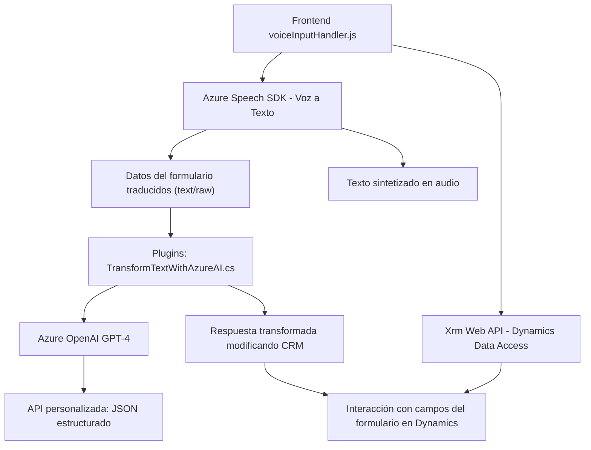

### Breve resumen técnico:
El repositorio presenta tres archivos principales que implementan una interfaz y lógica de negocio para una solución que integra tecnologías como Azure Speech SDK y Azure OpenAI GPT-4 con Microsoft Dynamics 365. Esta solución permite manejar formularios dinámicos de CRM y procesamiento de entrada/salida de voz, utilizando APIs y servicios avanzados de inteligencia artificial. Las tres capas colaboran para un flujo completo desde reconocimiento de voz, procesamiento semántico y audio hasta la interacción con formularios en Dynamics CRM.

---

### Descripción de arquitectura:
La arquitectura general combinada parece ser una solución híbrida **n-capas orientada a servicios.**  
- Se observa una clara separación entre [Frontend] (manejo del reconocimiento y reproducción de voz), [API externa] (Azure OpenAI para procesamiento de texto) y [Plugins del CRM] (computación backend que interactúa dinámicamente con base de datos y reglas de negocio).  
- Aunque no es puramente hexagonal, se adapta al modelo orientado a servicios y eventos, enfocándose en integrar múltiples tecnologías a través de contratos y patrones modulares.  

---

### Tecnologías usadas:
1. **Frontend:**
   - JavaScript (clásico).
   - Azure Speech SDK para entrada y salida de voz.
   - Integración con Dynamics 365 (Xrm.WebApi).
   - Asincronía con `async/await` y callbacks.

2. **Backend (Plugin):**
   - C# .NET SDK.
   - Microsoft Dynamics CRM SDK (`IPlugin`).
   - Azure OpenAI para procesamiento avanzado de texto.

3. **Servicios externos:**
   - Azure Speech API (síntesis y reconocimiento de voz).
   - Azure OpenAI (GPT-4 endpoint para procesamiento de texto transitorio).

4. **Patrones empleados:**
   - Arquitectura basada en eventos (callbacks, listener de SDK).
   - Modularidad en funciones (principio de separación de responsabilidades).
   - Pluggable frameworks (extensiones dinámicas en Dynamics 365).
   - Facade pattern para simplificar la integración de servicios externos.

---

### Diagrama Mermaid para GitHub Markdown:

---

### Conclusión final:
La solución representa un sistema que une lo mejor de tres mundos: procesamiento de entrada/salida por voz (Azure Speech SDK), generación de audio dinámico y contenido procesado por IA (Azure OpenAI), y la interacción con datos en tiempo real a través de CRM Dynamics. Su arquitectura modular y orientada a servicios favorece la escalabilidad y reusabilidad, mientras se aprovechan los ecosistemas de Azure y Microsoft. Sin embargo, sería recomendable desacoplar funciones más críticas del sistema y reforzar la gestión segura de las credenciales usadas para consumir los servicios de Azure.