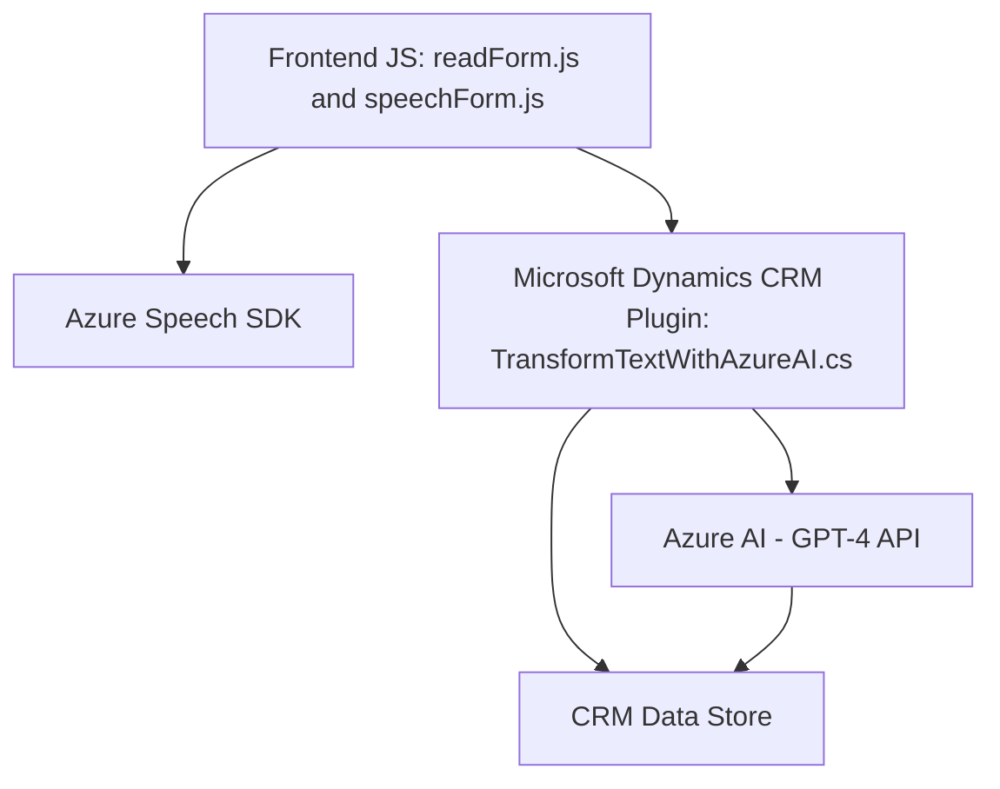

### Breve resumen técnico:
El repositorio parece incluir distintos componentes de una solución orientada al procesamiento de datos en formularios dinámicos y manipulación de texto usando servicios basados en voz y AI. Consiste en funciones que integran un frontend para interacción del usuario, plugins como servicios en CRM, y conexiones con APIs externas para tareas avanzadas de procesamiento AI.

---

### Descripción de arquitectura:
1. **Frontend (JS):** Utiliza funciones para reconocimiento de voz, lectura de formularios y manipulación de datos. Estas interactúan con APIs externas y con el plugin del backend.
2. **Backend (CRM Plugin):** Define un patrón de plugins para extender funcionalidades del CRM donde se invoca Azure OpenAI para procesar texto y devolver contenido estructurado.
3. La arquitectura general sigue un patrón basado en integración, donde:
   - Los JS actúan como una capa de presentación (Frontend).
   - Los plugins implementan lógica de aplicación y conectan servicios del entorno CRM (Backend).
   - El servicio de Azure Speech y Azure AI actúan como dependencias externas integradas.

La arquitectura refleja un diseño **orientado a componentes**:
- Servicios distribuidos interactúan mediante APIs externas (SaaS) y plugins.
- Uso de patrones "n-capas" debido a la separación lógica de presentación (frontend), negocio (CRM plugin) y datos (API externa y CRM entity framework).

---

### Tecnologías usadas:
1. **Frontend:**
   - **JavaScript:** Lógica del cliente para lectura y procesamiento de voz.
   - **Azure Speech SDK:** Reconocimiento y síntesis de voz.
   - **Microsoft Dynamics CRM SDK/Web SDK:** Comunicación con CRM backend.

2. **Backend:**
   - **C#:** Implementación del plugin en Microsoft Dynamics CRM.
   - **Azure OpenAI:** Para integrar GPT-4 y transformar texto de usuario en JSON.
   - **System.Net.Http:** Biblioteca para comunicación HTTP.
   - **Newtonsoft.Json:** Manipulación avanzada de objetos JSON.

3. **Patrones de diseño usados:**
   - **Factory:** Para inicializar clases como configuraciones del Speech SDK.
   - **Callback:** Operaciones asíncronas en JavaScript.
   - **Integration Layer:** Gateway entre APIs externas e internas (Azure Speech, Azure OpenAI y CRM plugins).

---

### Diagrama Mermaid:
A continuación te presento el esquema de interacción y arquitectura:

---

### Conclusión final:
Este repositorio implementa una solución híbrida que combina frontend y backend enfocados en interacción con servicios externos (Azure Speech y OpenAI), generando funcionalidades basadas en voz y manipulación de datos en formularios dinámicos. La arquitectura evidencia separación en capas y orientación hacia componentes, aunque no alcanza un nivel de microservicios debido a la dependencia central en un entorno CRM y plugins. Es ideal para implementaciones relacionadas con sistemas empresariales integrados.