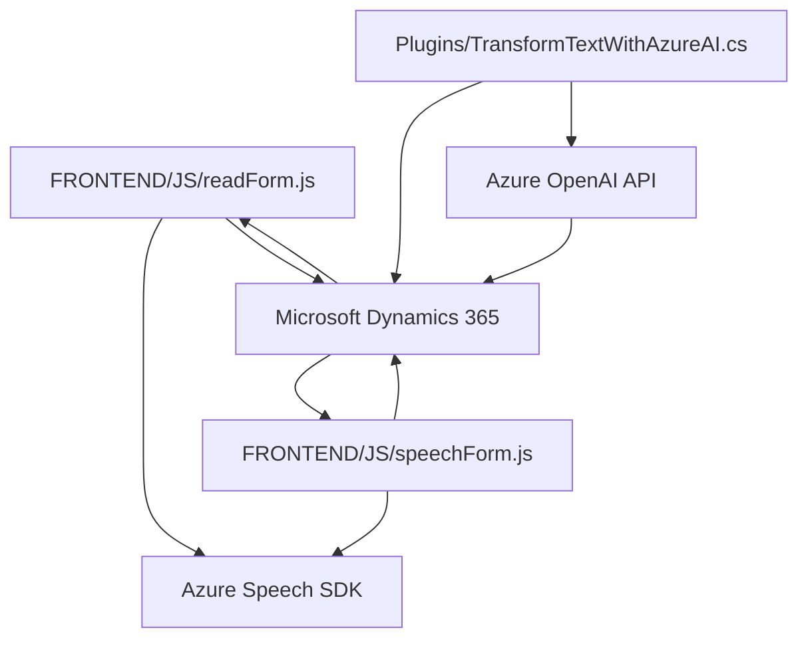

### Breve resumen técnico:
El repositorio contiene módulos y plugins que integran tecnologías como reconocimiento de voz, síntesis de voz y procesamiento de texto basado en IA dentro de una solución orientada a formularios en el entorno de Microsoft Dynamics 365. Los archivos encapsulan funcionalidades específicas para habilitar interacciones por voz mediante el **Azure Speech SDK** y el procesamiento de texto con **Azure OpenAI API**.

---

### Descripción de arquitectura:
La solución parece estructurarse en **n capas**:
1. **Capa de presentación**: Representada por el contenido de los archivos en `FRONTEND/JS`, que incluye lógica de interacción por voz y la gestión de datos de los formularios.
2. **Capa de negocio**: Implementada como plugins en la carpeta `Plugins`, que procesan lógica asociada a las aplicaciones de CRM Dynamics.
3. **Capa de servicios**: Se integran servicios externos como el **Azure Speech SDK** y **Azure OpenAI API** para reconocimiento de voz y procesamiento de texto inteligente respectivamente.

Aunque se utiliza el patrón modular, la arquitectura general corresponde más a un **monolito**, ya que las distintas piezas parecen formar una solución centralizada que interactúa con otros sistemas. Sin embargo, existe una comunicación con microservicios externos (Azure APIs) para funcionalidades específicas.

---

### Tecnologías usadas:
1. **Azure Speech SDK**:
   - Utilizado para la síntesis y el reconocimiento de voz.
   - Permite trabajar con entrada y salida de audio en tiempo real.
2. **Microsoft Dynamics CRM SDK**:
   - Proporciona las herramientas necesarias para interactuar con el sistema CRM (configuración de formularios, plugins).
3. **Azure OpenAI API**:
   - Utilizada para transformar textos mediante GPT-4, habilitando el procesamiento de texto basado en IA.
4. **Frontend (JavaScript)**:
   - Lógica cliente para eventos, manipulación de DOM y control de interacciones en formularios.
5. **Librerías y Frameworks de .NET**:
   - Gestión de tareas HTTP (`System.Net.Http`) y deserialización con JSON (`System.Text.Json`).

---

### Diagrama Mermaid válido para GitHub:

### Conclusión Final:
La solución presentada en el repositorio tiene como objetivo mejorar la experiencia de usuario en aplicaciones integradas con **Microsoft Dynamics 365**, ofreciendo interacción por voz (lectura y reconocimiento) mediante herramientas como **Azure Speech SDK** y funcionalidades avanzadas de inteligencia artificial para transformación de texto con **Azure OpenAI API**. La arquitectura es principalmente una forma de **n capas** con patrones de integración modular para conectar los diferentes componentes, haciéndola adecuada para soluciones corporativas donde se necesita extender funcionalidades específicas.