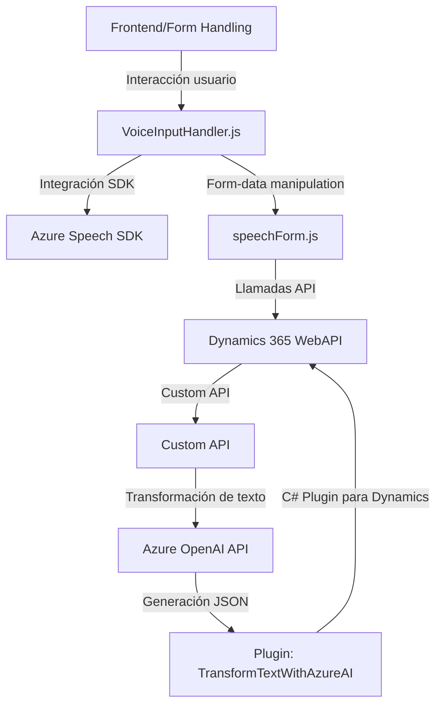

### Breve Resumen Técnico
El repositorio contiene código relacionado con la integración del reconocimiento y síntesis de voz en un entorno de Microsoft Dynamics 365, utilizando el **Azure Speech SDK** y la **Azure OpenAI API**. Su objetivo principal es facilitar el ingreso y transformación de datos a través de interacción por voz, además de procesar y transformar texto mediante inteligencia artificial para adaptarlo a los modelos de negocio.

---

### Descripción de Arquitectura
La arquitectura del sistema se basa en una combinación de patrones centrados en la modularidad, reutilización, y conectividad con servicios externos. Aunque la solución no cumple completamente con los principios de arquitectura hexagonal, sí tiene varias características relacionadas con este enfoque:

1. **Frontend con integración de voz**: Los scripts de JavaScript se encargan de gestionar la entrada/salida de voz mediante `Azure Speech SDK` y personalizan las interacciones del usuario con formularios dinámicos en el contexto de Dynamics CRM. Este componente actúa como una capa de presentación, facilitando la recopilación y síntesis de datos desde un formulario visual.
  
2. **Backend basado en plugins**: Los plugins en C# reflejan una implementación clásica de un patrón en capas en Dynamics CRM, con integración de servicios externos como **Azure OpenAI Services** para la lógica de negocio avanzada. Aquí se observa el uso de un enfoque modular para manejar la transformación de texto.

3. **Event-driven Architecture** (eventos del navegador y Dynamics CRM): Los scripts JS trabajan totalmente con eventos para cargar dinámicamente el SDK de voz, procesar el reconocimiento de voz en tiempo real y manejar los cambios sobre los formularios.

4. **External API Dependency**: Tanto el frontend con Azure Speech como el backend con Azure OpenAI tienen un diseño de integración con servicios externos, lo que les permite expandir su funcionalidad más allá del almacenamiento o procesamiento local. Esto refuerza una arquitectura distribuida.

---

### Tecnologías Usadas
1. **Frontend**:
   - **JavaScript (ES6)**: Para la creación de lógica relacionada con voz y la interacción con el SDK.
   - **Azure Speech SDK**: Carga dinámica mediante Lazy Loading para síntesis y reconocimiento de voz.
   - **Microsoft Dynamics APIs**: Uso de APIs Web para acceder y modificar los formularios dinámicos en Dynamics 365.

2. **Backend**:
   - **C# y .NET Framework**: Para implementar el plugin que realiza la transformación avanzada del texto mediante Azure.
   - **Azure OpenAI GPT Services**: Procesamiento de texto y reglas generativas.
   - **Dynamics CRM Plugin Framework**: Estructura tradicional para crear soluciones extendidas en Dynamics.

3. **Otros**:
   - **APIs de navegador**: Para manipulación del DOM y conexión dinámica con el SDK.
   - **System.Text.Json** y **Newtonsoft.Json**: Para manejar JSON.

---

### Diagrama Mermaid
El siguiente diagrama representa los componentes principales y su interacción dentro del sistema.

---

### Conclusión Final
Este repositorio implementa una solución híbrida para facilitar la interacción y procesamiento de datos en formularios dinámicos utilizando tecnologías de reconocimiento y síntesis de voz. La arquitectura puede considerarse una mezcla de **n capas** en la parte de backend (debido a la organización tradicional de plugins y servicios de Dynamics CRM) y **event-driven** en la parte de frontend.

Las dependencias principales incluyen herramientas de Microsoft (Dynamics, Azure SDK, OpenAI API) y frameworks estándar (JavaScript, .NET). Esta solución está bien diseñada y modular, permitiendo una alta reutilización y escalabilidad en un entorno corporativo de Microsoft Dynamics. 

El archivo `VoiceInputHandler.js`, junto con `speechForm.js`, representa el frontend y UX, mientras que `TransformTextWithAzureAI.cs` maneja la lógica avanzada en el backend.