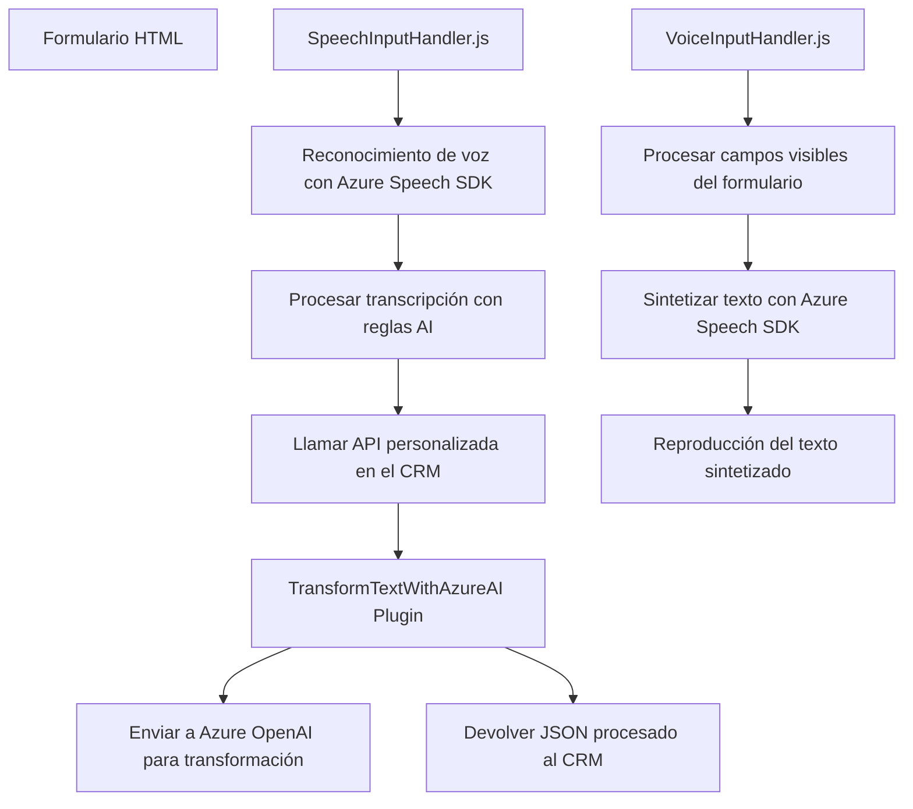

### Breve resumen técnico

La solución incluye un sistema que integra funciones frontend (JavaScript) y plugins backend (C#) para interactuar con los formularios en una plataforma CRM (como Dynamics CRM) mientras utiliza servicios externos de Azure (Speech SDK y OpenAI) para reconocimiento de voz, síntesis de voz y procesamiento avanzado de texto. De forma general, el sistema permite que los datos de formularios sean procesados tanto manualmente (mediante voz), como automáticamente (por IA).

---

### Descripción de arquitectura

La arquitectura de este sistema es **modular** y **integrativa**, diseñada para la interacción entre frontend (en el navegador) y backend (en la plataforma del CRM). Utiliza una combinación de patrones como **MVC (Modelo - Vista - Controlador)** y **Gateway**:

1. **Frontend**:
   - Implementa módulos que manejan la entrada y salida elemental desde el formulario: reconocimiento de voz (Speech SDK), lectura/escritura de sus campos y creación de eventos de síntesis de voz.
   - Funcionalidad orientada a un flujo procedural con llamadas a servicios externos por paquetes/modulos.
   - Alta dependencia de servicios en nube (Azure Speech SDK).

2. **Backend**:
   - Utiliza la arquitectura de **Plugin** propia del entorno CRM.
   - Establece conexiones con Azure OpenAI mediante un patrón gateway, donde el plugin traduce los datos de entrada al formato requerido por la API externa.
   - Diseñado para recibir eventos del CRM, transformarlos con reglas específicas, y devolver resultados a los flujos del CRM.

Ambos componentes funcionan bajo una **arquitectura cliente-servidor** basada en eventos (evento: entrada de voz -> acción de síntesis o de procesamiento).

---

### Tecnologías usadas

**Frontend (JavaScript):**
- Azure Speech SDK para reconocimiento y síntesis de voz.
- Manejo de formularios basado en DOM y API de Microsoft Dynamics CRM (supuestamente el objeto `formContext` está acoplado a la plataforma Dynamics).
- Servicios asincrónicos mediante promesas en reconocimiento de voz y API de procesamiento.

**Backend (C#, Plugins):**
- Dynamics CRM (Microsoft.Xrm.Sdk).
- Servicios HTTP (`System.Net.Http`) para integración con Azure OpenAI.
- JSON manipulado mediante `Newtonsoft.Json.Linq` y `System.Text.Json` para la estructuración.
- Patrones de desarrollo propios de Dynamics CRM.

**Servicios externos:**
- Azure Speech SDK para reconocimiento y síntesis de voz.
- Azure OpenAI para procesamiento avanzado de texto.
- Integración directa con la Web API de Microsoft Dynamics para CRM.

---

### Diagrama Mermaid válido para GitHub Markdown

---

### Conclusión final

La solución integra una funcionalidad avanzada de entrada y salida de datos basada en comandos de voz y enriquecida con servicios basados en inteligencia artificial. La arquitectura empleada combina patrones de programación modular, integración de servicios externos (Azure) y plugins CRM, lo que demuestra un enfoque práctico y comúnmente utilizado en ecosistemas relacionados con Microsoft Dynamics y nubes con soporte de IA. Sin embargo, la dependencia de servicios externos podría limitar la portabilidad del sistema a otras plataformas fuera del ecosistema Azure.

