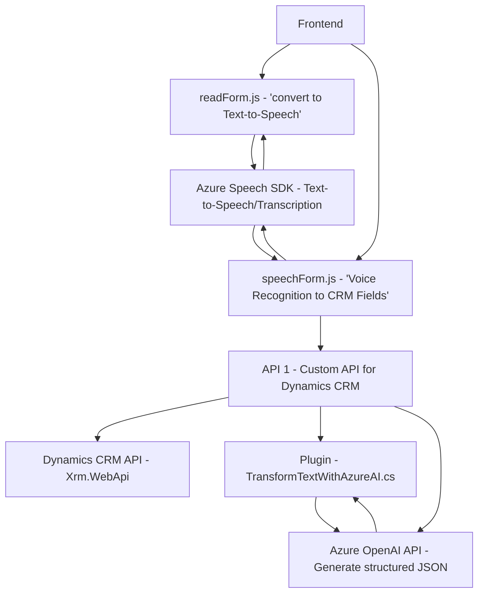

## Breve resumen técnico

El repositorio presenta tres archivos principales centrados en la interacción con Dynamics CRM y Azure services:

1. **`readForm.js` (Frontend/JS)**: Implementa la conversión de datos visibles de un formulario en texto y utiliza Azure Speech SDK para sintetizar el texto a voz. Está vinculado al frontend y a la interfaz del usuario en la plataforma Dynamics.
  
2. **`speechForm.js` (Frontend/JS)**: Gestiona el reconocimiento de voz, aprovechando el Azure Speech SDK para capturar audio, convertirlo a texto y procesar los datos para llenar formularios y enviar a una API personalizada o procesar mediante IA.

3. **`TransformTextWithAzureAI.cs` (Plugins)**: Contiene un plugin para Dynamics CRM desarrollado en C#, que usa Azure OpenAI para transformar texto en un JSON estructurado basado en normas predefinidas. 

## Descripción de arquitectura

La solución emplea una **arquitectura de n capas**, donde:
- **Capa de presentación**: Los archivos JavaScript (`readForm.js` y `speechForm.js`) se encargan de interacción con el usuario y manipulación de datos del formulario en Dynamics CRM.
- **Capa de negocio**: El plugin (`TransformTextWithAzureAI.cs`) ejecuta lógica de transformación avanzada usando el servicio de Azure OpenAI y valida los datos dentro del contexto de Dynamics CRM.
- **Capa de integración externa**: Se integran servicios externos como Azure Speech SDK y Azure OpenAI Service para reconocimiento de voz, síntesis de voz y procesamiento de texto.

## Tecnologías usadas

### Frontend
- **Azure Speech SDK**: Utilizado para reconocimiento de voz, síntesis de texto a voz y conversión de audio a texto en aplicaciones web.
- **Dynamics CRM Web API (Xrm.WebApi)**: Usado para manipulación de formularios y atributos en Dynamics CRM.
- **JavaScript/Vanilla JS**: Implementa las funciones clave para la interacción con servicios externos y el procesador del formulario dinámico.
- **Patrones**:
  - Lazy Loading: Carga bajo demanda para el SDK de Speech.
  - Event-Driven Programming.

### Backend
- **C# (.NET Framework)**: Usado para desarrollar el plugin de Dynamics CRM.
- **Azure OpenAI Service (GPT-4)**: Utilizado para transformar texto en elementos estructurados.
- **System.Net.Http**: Para realizar llamadas HTTP al API de OpenAI.
- **JSON Libraries**:
  - `System.Text.Json` y `Newtonsoft.Json` para manejar JSON serializado/deserializado.

## Dependencias o componentes externos

1. **Azure Speech SDK (`aka.ms/csspeech/jsbrowserpackageraw`)**: Biblioteca para conversión de audio/texto y síntesis de texto.
2. **Dynamics CRM Web API (`Xrm.WebApi`)**: API nativa de Dynamics CRM para manipular datos en formularios.
3. **Azure OpenAI API**: Servicio HTTP REST que realiza transformación de texto solicitado por el plugin en JSON.
4. **Integración IA personalizada (apuntada por `callCustomApi`)** para llevar la lógica adicional con un servicio backend.

## Diagrama Mermaid

## Conclusión final

Este repositorio está enfocado principalmente en extender Dynamics CRM mediante una solución **modular y orientada a servicios**, basada en la integración de Azure Speech SDK y Azure OpenAI. La arquitectura sigue un diseño de **n capas**, donde cada componente está claramente definido y separa la interacción en la capa de presentación (JavaScript frontend), la capa de negocio (plugin en C#) y la capa de integración externa (Azure APIs). 

Algunas áreas de mejora incluyen:
1. Externalizar credenciales críticas (Azure keys y endpoints) para evitar riesgos de seguridad.
2. Refactorización del código para manejar excepcionalidad en el plugin (`TransformTextWithAzureAI.cs`) y en los scripts JavaScript, como en las conexiones de red.
3. Documentar adicionalmente visibilidad de otros módulos del repositorio relacionados, para una integración más clara global.

En general, el código es sólido, modular y preparado para escalar según los objetivos de la solución.