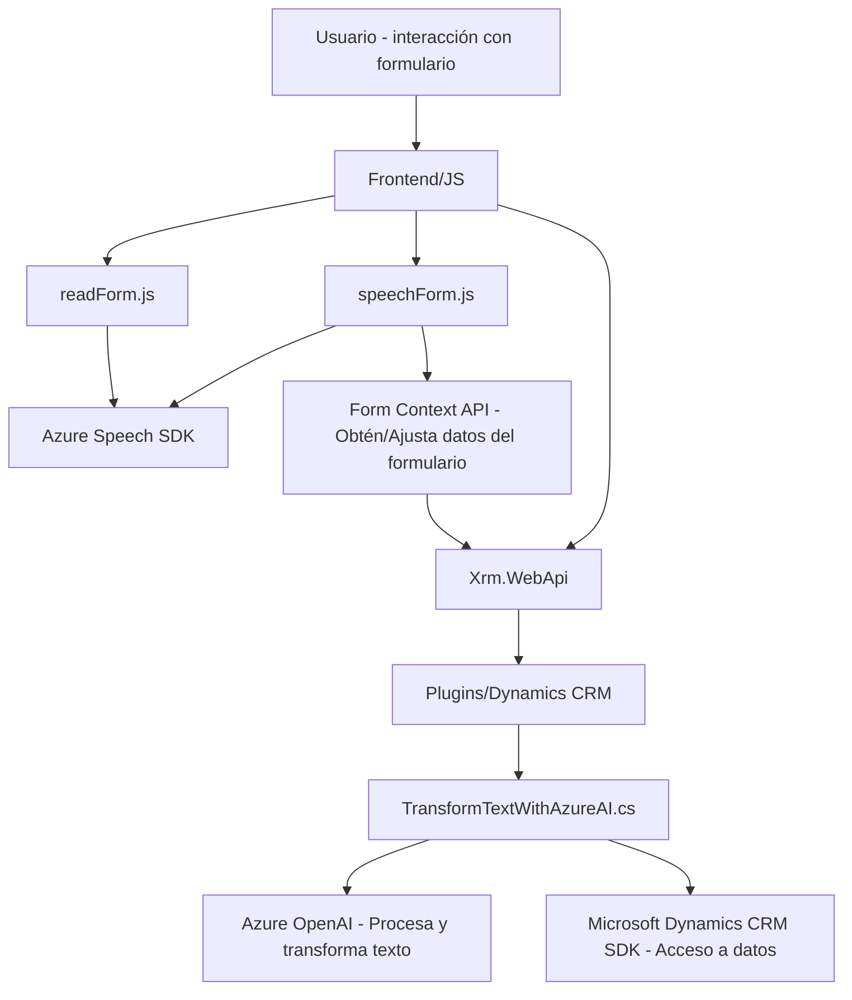

### Resumen Técnico

El repositorio contiene una solución orientada a la interacción entre Dynamics 365 y varios servicios de Azure, enfocada a mejorar la accesibilidad mediante herramientas de síntesis y reconocimiento de voz, así como transformación de texto utilizando IA. La funcionalidad principal está basada en la integración de APIs externas (Azure Speech SDK y Azure OpenAI) junto con plugins personalizados en Dynamics 365.

---

### Descripción de Arquitectura

La arquitectura está estructurada siguiendo un patrón **n capas** de dos categorías:
1. **Frontend/JS**: Implementa interacción directa con usuarios vía inputs de voz y texto usando el Azure Speech SDK.
2. **Backend (Plugins)**: Ejecuta transformaciones de datos mediante lógicas avanzadas, como servicios de IA (Azure OpenAI), al interactuar con el CRM.

Aunque se observa cierto nivel de independencia entre componentes, la solución no está completamente desacoplada ni sigue patrones más sofisticados como **arquitectura hexagonal**. Sin embargo, se prioriza modularidad mediante funciones y clases específicas para tareas concretas. Destacan los siguientes patrones:
- **Dependencia de servicios externos**: Integración directa con APIs de Azure.
- **Modularidad funcional**: Cada función/clase tiene una responsabilidad única, facilitando pruebas unitarias y mantenibilidad.
- **Cargador dinámico de SDK**: El Azure Speech SDK se carga dinámicamente en el frontend.
- **Interacción asincrónica**: Uso de promesas y callbacks para manejar la comunicación con APIs externas.

---

### Tecnologías Utilizadas

1. **Frontend (JavaScript)**: 
   - **Azure Speech SDK**: Para síntesis y reconocimiento de voz.
   - **Dynamics 365 Form Context API**: Manipulación de datos de formularios.
   - **Microsoft Xrm WebApi**: Llamadas a APIs del CRM desde JavaScript.
   - **Patrones Javascript funcionales**: Modularización por funciones.

2. **Backend (C#)**:
   - **Microsoft Dynamics CRM SDK**: Para desarrollo de plugins en Dynamics.
   - **Azure OpenAI**: Procesamiento y transformación de texto con IA.
   - **Newtonsoft.Json o System.Text.Json**: Para manipulación de JSON.
   - **HTTP Client (System.Net.Http)**: Comunicación con servicios externos.
   - **Plugin Pattern**: Utilizado para añadir lógica personalizada al CRM.

---

### Diagrama Mermaid **(GitHub Markdown Compatible)**

---

### Conclusión Final

La solución representa una arquitectura basada en **n capas**, donde el frontend interactúa estrechamente con los usuarios utilizando reconocimiento/síntesis de voz y manipulación de formularios en Dynamics 365, mientras que el backend usa lógicas de negocio avanzadas mediante plugins y procesamiento IA con Azure OpenAI. Los siguientes puntos son destacables:

1. **Ventajas**:
   - Modularidad: Cada archivo tiene roles bien definidos.
   - Escalabilidad soportada por Azure: Uso de servicios externos como OpenAI y Speech SDK facilita aumentos en carga sin afectar arquitectura base.
   - Integración robusta: Soluciones centradas en APIs y SDKs garantizan extensibilidad.

2. **Limitaciones**:
   - Alta dependencia de servicios externos (Azure Speech SDK, Azure OpenAI, Dynamics CRM), lo que podría aumentar costos de operación.
   - Carece de separación de capas físicas o desacoplamiento avanzado (ej. hexagonal o microservicios).

Esta arquitectura se posiciona como una implementación eficiente para soluciones basadas en Dynamics 365, pero podría evolucionar hacia un modelo más desacoplado en el futuro para ampliar su usabilidad y escalabilidad.