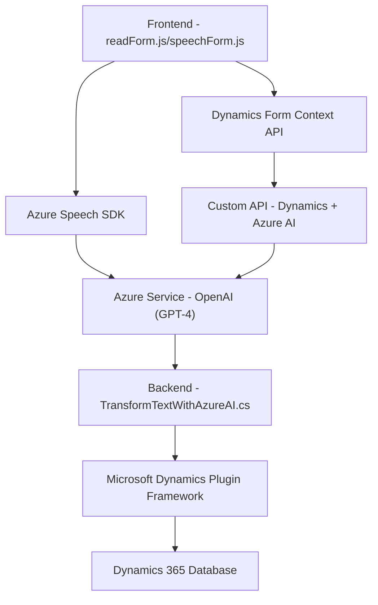

### Breve resumen técnico

El repositorio provisto incluye un sistema desarrollado para integrarse principalmente con Microsoft Dynamics 365 y Azure services, aportando funcionalidades de voz y procesamiento de texto con IA. Los archivos analizados habilitan un sistema de entrada y salida de voz enfocado en formularios y la transformación avanzada de datos utilizando Azure OpenAI.

---

### Descripción de arquitectura

La arquitectura del sistema puede clasificarse como **modular y de capas**, con integración hacia servicios externos como Azure Speech SDK, Azure OpenAI y Dynamics CRM. El comportamiento claramente separa responsabilidades: 

- **Capa de Entrada** con archivos `readForm.js` y `speechForm.js`, que gestionan la interacción con el usuario mediante voz y formulario.
- **Capa de Procesamiento** con el plugin `TransformTextWithAzureAI.cs`, que se encarga de transformar los datos en un formato manejable para Dynamics CRM.
- **Capa de Persistencia** accesible mediante `Dynamics 365 SDK` para almacenamiento de datos generados o modificados en los formularios.

Existe un **patrón de plugins** en Dynamics que habilita las extensiones para procesamiento en el backend. Además, se observa dependencia a un API personalizada para comunicación entre las interfaces de voz y Dynamics.

---

### Tecnologías usadas

1. **Frontend:**
   - JavaScript frameworks.
   - Azure Speech SDK para reconocimiento y síntesis de voz.
   - DOM API para modificar dinámicamente formularios.
   - Dynamics CRM context APIs (`Xrm.WebApi`).
   - Custom APIs alojadas en Dynamics.

2. **Backend:**
   - .NET Framework y C# para plugins de Dynamics.
   - Microsoft Dynamics SDK (`Microsoft.Xrm.Sdk`) para extender la funcionalidad.
   - Azure OpenAI API para procesamiento textual con modelos GPT-4.

3. **Patrones:**
   - **Dependency Injection:** Pasos específicos del contexto a las funciones.
   - **Facade Pattern:** Encapsulación de funcionalidades en métodos con objetivos claros (por ejemplo, `processTranscript`, `applyValueToField`).
   - **Plugin Architecture:** Extensión de Dynamics mediante capas independientes.
   - **Modular Components:** Cada archivo se enfoca en una subfunción funcional clara.

---

### Diagrama Mermaid válido para GitHub

---

### Conclusión final

El repositorio implementa claramente una **solución hybrid para Microsoft Dynamics CRM** que utiliza múltiples tecnologías de Microsoft como Dynamics Services, Azure OpenAI y Azure Speech SDK para crear un sistema de interacción basado en voz y procesamiento de texto. 

El enfoque arquitectónico queda definido por una **modularidad de capas** entre frontend, APIs, y plugin/backend, con un uso eficiente de patrones como Dependency Injection y plugins en Dynamics. Sin embargo, observaciones como incluir claves API directamente en el código podrían abrir vulnerabilidades que deberían gestionarse con configuraciones seguras (por ejemplo, Azure Key Vault).

La solución muestra un diseño robusto y cualificado para mejorar la accesibilidad y automatización en entornos empresariales.