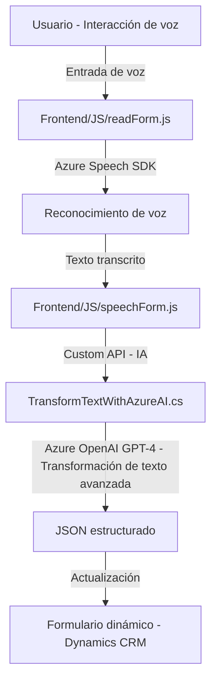

### Breve resumen técnico

El repositorio analiza archivos relacionados con el procesamiento de voz y texto mediante Azure Speech SDK, Azure OpenAI y plugins de Dynamics CRM. Estos scripts conectan servicios externos, recursos CRM y manejan datos del formulario para lectura, síntesis y procesamiento. La solución usa patrones de modularización funcional y desacoplamiento API en cada archivo.

---

### Descripción de arquitectura

1. **Frontend**:
   - Basado en JavaScript.
   - Utiliza el Azure Speech SDK para el reconocimiento y síntesis de voz.
   - Implementa lógica de integración con formularios dinámicos utilizando `executionContext` proporcionado por Dynamics CRM.
   
2. **Backend (Plugin)**:
   - Implementa un plugin de Dynamics CRM para transformar texto usando el servicio Azure OpenAI API.
   - Sigue el patrón típico de arquitectura de plugins en Dynamics CRM.

3. **Arquitectura general**:
   - **Multicapa (Frontend - Backend)**: 
     La solución está dividida en capas funcionales donde:
     - El Frontend gestiona la entrada del usuario, conectándose al SDK de Azure Speech.
     - El Backend, en Dynamics CRM, maneja la lógica avanzada de transformación y procesamiento usando Azure OpenAI.
   - **Desacoplamiento mediante API**: Las operaciones pesadas (reconocimiento de voz y transformación de texto) están delegadas a servicios externos.

---

### Tecnologías usadas

1. **Azure Speech SDK**:
   - Reconocimiento y conversión de voz a texto.
   - Generación de síntesis de voz desde texto visible en formularios.

2. **Azure OpenAI GPT-4**:
   - Transformación de texto en JSON estructurado basado en reglas IA.

3. **Dynamics CRM SDK**:
   - Extensiones y plugins con manipulación de contexto nativo.

4. **Librerías adicionales**:
   - `Newtonsoft.Json`: Gestión JSON en el plugin.
   - `System.Net.Http`: Comunicación con servicios externos.

---

### Dependencias o componentes externos

1. Azure Speech SDK (`https://aka.ms/csspeech/jsbrowserpackageraw`).
2. Azure OpenAI (GPT-4 API configurado en el plugin para transformación avanzada de texto).
3. Dynamics CRM como sistema central operativo.
4. Claves API para Azure Speech y OpenAI (`azureKey` y configuración dinámica de regiones).

---

### Diagrama **Mermaid** válido para GitHub

---

### Conclusión final

La solución analizada combina funcionalidad avanzada de reconocimiento de voz y transformación de texto con servicios externos de Azure. La arquitectura es multicapa, con una clara división entre frontend (interacción con el usuario) y backend (procesamiento de texto). Además, usa patrones de desacoplamiento mediante APIs y modularización funcional para mejorar la mantenibilidad y escalabilidad.

Este diseño es ideal para sistemas que buscan integrar tecnologías de IA y automatización en contextos empresariales, como Dynamics CRM.