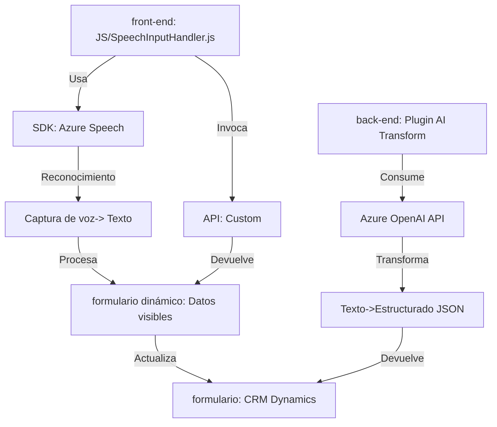

### Breve Resumen Técnico
El repositorio muestra un conjunto de funcionalidades integradas que interactúan con **Azure Speech SDK**, **Azure OpenAI API**, y **Microsoft Dynamics CRM**. Está construido para permitir reconocimiento, transcripción, y síntesis de voz, además de transformar datos capturados en formularios mediante procesamiento de texto avanzado. El enfoque está orientado principalmente a soluciones familiares con sistemas CRM.

### Descripción de Arquitectura
La arquitectura general sigue un patrón **n-capas**. Cada archivo cumple un rol aislado (front-end y back-end) para manejar casos específicos:
- **Front-end**: Implementa una capa interactiva basada en voz y formularios, orientada al usuario.
- **Back-end**: Define plugins o clases para procesamiento en el servidor. Estos están integrados directamente con Dynamics CRM.
- **External APIs**: Los patrones incluyen la integración con servicios como Azure Speech y Azure OpenAI usando HTTP y SDK.
  
Adicionalmente, los visos de una arquitectura semimodular aparecen en la separación funcional del procesamiento de voz y datos. Sin embargo, dada su integración directa con Dynamics CRM, existe una fuerte acoplamiento entre las funcionalidades y el sistema CRM, reduciendo la independencia modular.

### Tecnologías Usadas
- **Lenguajes**:
  - JavaScript (para el front-end y lógica de formulación dinámica).
  - C# (.NET Framework, usado en los plugins de Dynamics CRM).
- **Frameworks y SDKs**:
  - Azure Speech SDK: Usado en el front-end para reconocimiento y síntesis de voz.
  - Dynamics CRM SDK: Usado en plugins como integración directa.
  - Azure OpenAI API: Utilizado para transformación de texto avanzada.
  - Newtonsoft.Json y System.Text.Json: Para serialización/deserialización de JSON.
- **Estilos de Arquitectura**:
  - Event-driven (carga dinámica del SDK y callbacks).
  - Pipeline Processing (procesamiento de datos desde voz hasta formularios).
  - Integración directa con APIs externas (Azure).

### Dependencias o Componentes Externos
1. **Servicios Externos**:
   - Azure Speech SDK: Para reconocimiento de voz y síntesis TTS (text-to-speech).
   - Azure OpenAI API: Para procesamiento semántico del texto transcrito.
2. **Frameworks y Bibliotecas**:
   - `Microsoft.Xrm.Sdk`: Usado para interactuar con Dynamics CRM.
   - `Newtonsoft.Json` y `System.Text.Json`: Herramientas para trabajar con JSON en el backend.
3. **Carga Dinámica del SDK**: El SDK de Azure Speech se carga desde `https://aka.ms/csspeech/jsbrowserpackageraw`.

---

### Diagrama Mermaid Válido para GitHub

---

### Conclusión Final
El sistema está diseñado para interactuar estrechamente con Dynamics CRM, Azure Speech SDK, y OpenAI API. Sigue un enfoque modular de n-capas minimamente desacoplado. El **front-end** actúa como la interfaz interactiva y el **back-end** se encarga de procesamientos más complejos, como la transformación de texto en datos estructurados o integración con APIs SaaS. Aunque altamente funcional, el diseño podría beneficiarse de mayor desacoplamiento y abstracción para facilitar su portabilidad, extensibilidad y autonomía frente a cambios en los servicios externos.