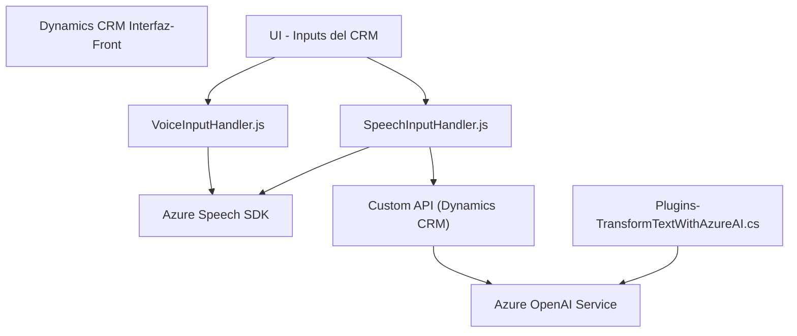

### **Breve Resumen Técnico**
El repositorio en cuestión es una solución compuesta que integra múltiples servicios para interactuar con un sistema basado en Microsoft Dynamics CRM usando tecnologías de frontend, APIs externas y plugins. Su enfoque principal es enriquecer la experiencia de usuario mediante integración de reconocimiento y síntesis de voz, inteligencia artificial (Azure OpenAI) y procesamiento dinámico de datos de formularios en CRM.

---

### **Descripción de arquitectura**
1. **Tipo de solución:** Microfrontend + extensiones del ecosistema Dynamics CRM
   - Los artefactos del repositorio representan una combinación de scripts frontend que se ejecutan en un contexto de CRM (VoiceInputHandler.js, SpeechInputHandler.js) y un plugin backend que interactúa con la lógica del sistema mediante Dynamics API y Azure OpenAI.

2. **Arquitectura utilizada:** Este diseño combina elementos de una arquitectura de **n capas** y **microfrontend** con **integración API**. 
   - Las capas están organizadas siguiendo:
     - **Frontend JS:** Interacciones del usuario mediante interfaz gráfica y voz.
     - **API externa:** Azure Speech SDK y Azure OpenAI procesan voz y transforman textos.
     - **Backend Plugin (C#)**: Procesa datos, actualiza atributos y realiza la integración.
   - *Nota:* Aunque las funcionalidades son modulares, la solución depende de un contexto ecosistema (Dynamics CRM), lo que hace que la arquitectura sea más monolítica en su núcleo.

3. **Tecnologías y patrones utilizados**:
   - **Frontend:**
     - Tecnologías: JavaScript, Azure Speech SDK.
     - Patrones: Modularidad, diseño orientado a eventos.
   - **Backend:**
     - Tecnologías: C#, Dynamics CRM Plugin API, Azure OpenAI.
     - Patrones: Plugin-Based Architecture, Gateway para servicios externos, Adaptador de API.
   - **Integración de servicios externos**: Fuerte dependencia de servicios de Microsoft y Azure para síntesis/reconocimiento de voz y procesamiento de texto.
   - **Modularidad:** Diseñada con funciones y clases bien organizadas, cada una enfocada en una sola responsabilidad.

---

### **Diagrama Mermaid**

---

### **Conclusión Final**
La solución en este repositorio está diseñada como una extensión modular para el ecosistema de Microsoft Dynamics CRM. Utiliza una combinación de scripts de frontend en JavaScript para integrar funcionalidades de síntesis y reconocimiento de voz con servicios externos (Azure). Por otro lado, emplea plugins desarrollados en C# para lógica backend que integra la plataforma Dynamics con Azure OpenAI.

Los patrones arquitectónicos observados incluyen diseño de microfrontend, modularidad, integración de servicios externos mediante SDKs, y API Gateway. La solución se estructura principalmente como un monolito expandido por módulos, siendo dependiente del ecosistema de Dynamics CRM y utilizando Azure tanto para procesamiento de voz como para inteligencia artificial asociada.

Esta arquitectura resulta adecuada para soluciones empresariales con un fuerte enfoque en interacción y automatización sobre plataformas SaaS como Dynamics CRM. Sin embargo, su dependiente relación con las tecnologías específicas de Azure y Dynamics limita la flexibilidad y la portabilidad de la solución. Sería aconsejable documentar con detalle las interacciones con APIs externas y asegurar que los mecanismos de error sean más robustos para escenarios empresariales críticos.