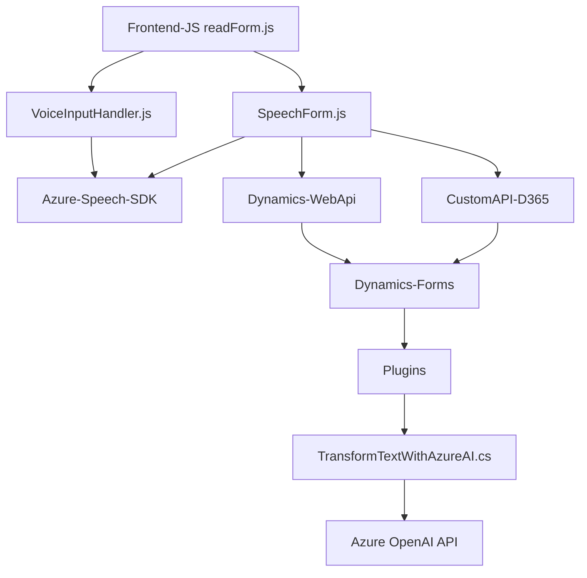

### Breve resumen técnico
El repositorio presenta una solución orientada a la integración entre una interfaz de usuario (frontend en JavaScript), un sistema CRM (Dynamics 365), y servicios en la nube de Azure, en particular el *Speech SDK* y *Azure OpenAI API*. 

Se trata de un sistema que habilita funcionalidades de accesibilidad (como síntesis de voz y reconocimiento de voz) junto con inteligencia artificial para estructurar texto hablado en un formato que los usuarios pueden ingresar directamente en formularios de Dynamics 365.

---

### Descripción de arquitectura
1. **Tipo de solución:** Esta es una solución híbrida que combina un frontend en JavaScript para la interacción con el usuario, APIs externas de Azure para habilitar la (i) síntesis y reconocimiento de voz mediante el *Azure Speech SDK* y (ii) la manipulación y transformación de datos con el *Azure OpenAI API*. También incluye un plugin backend para integrar la funcionalidad del modelo GPT en el entorno de Dynamics CRM.

2. **Arquitectura:**  
   - **Capas:** El sistema parece ser una arquitectura n-capas, y un plugin en Dynamics 365 actúa como el backend. El frontend y la API de Azure proporcionan funcionalidades específicas que apoyan la capa de presentación y de negocio.
   - **Modularidad:** La solución está particionada en módulos con alta cohesión (frontend para interacción de usuario, plugin para transformación en Dynamics CRM, integración con servicios externos como Azure Speech SDK y Azure OpenAI).
   - **Dependencia de servicios externos:** Principios de integración de microservicios y servicios externos están presentes.

3. **Patrones:**
   - **Event-driven programming:** El frontend usa callbacks para flujos asincrónicos (e.g., cargar dinámicamente el SDK de Azure Speech).
   - **Dependency Injection (en Plugins):** Se usan proveedores de servicios en Dynamics 365 para gestionar dependencias (p. ej., `IServiceProvider`).
   - **Service-Oriented:** Uso extensivo de servicios remotos para funcionalidades especializadas (Speech SDK, OpenAI).

---

### Tecnologías usadas
1. **Frontend (JavaScript):**
   - *Azure Speech SDK*: Para reconocimiento y síntesis de voz.
   - DOM APIs: Manipulación de elementos del documento para actualizar formularios.
   - Promesas y callbacks: Para flujos asincrónicos.

2. **Backend:**
   - *Dynamics 365 Plugins*: Extensiones personalizadas que usan `IPlugin`.
   - *Azure OpenAI API*: Para invocación de modelos GPT y transformación de texto.
   - C# (con .NET SDK): Desarrollo de plugins dentro del ecosistema de Microsoft Dynamics.

3. **Librerías externas:**
   - `Microsoft.Xrm.Sdk`: Interacción con Dynamics CRM.
   - `Newtonsoft.Json`: Procesamiento y manejo avanzado de JSON.
   - `System.Net.Http`: Para realizar la comunicación con APIs externas.

---

### Diagrama **Mermaid** válido para GitHub

---

### Conclusión final
La solución refleja una arquitectura modular de n-capas donde:
- La capa de presentación se implementa en JavaScript y utiliza el *Azure Speech SDK* para proporcionar funcionalidades de reconocimiento y síntesis de voz.
- La capa de negocio reside en plugins personalizados que se ejecutan dentro de Dynamics 365 CRM. Estos plugins interactúan con el *Azure OpenAI API*, procesando texto transcrito y estructurándolo para su integración directa con formularios del CRM.
- La solución también muestra dependencia directa de servicios externos por lo que el enfoque general puede considerarse como un híbrido entre n-capas y microservicios.

El diagrama Mermaid revela esta interacción, mostrando cómo los componentes trabajan juntos para cumplir la función de procesamiento y accesibilidad orientada a GUI y backend.