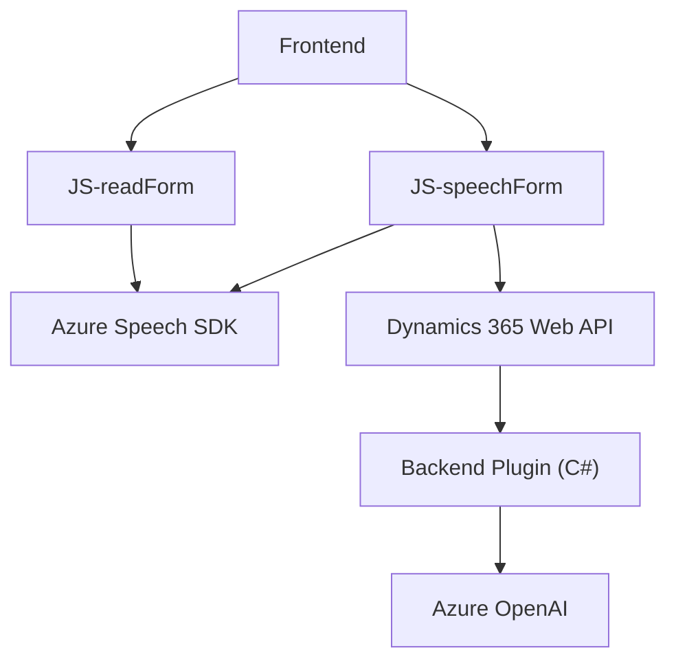

# Resumen Técnico

El repositorio parece cubrir varios aspectos relacionados con la interacción entre formularios web en el frontend y recursos de inteligencia artificial y voz en Azure. La solución está orientada hacia aplicaciones que integran síntesis de voz, reconocimiento de voz y procesamiento de texto con servicios en la nube. 

---

# Descripción de la Arquitectura

Este proyecto utiliza una arquitectura de **n-capas**, donde las responsabilidades están claramente separadas:
1. **Capa de presentación (frontend)**: Permite la interacción con el usuario mediante formularios y manipulación del DOM.
2. **Capa lógica**: Contiene la lógica de negocio para interpretar y transformar datos provenientes de la entrada de voz y de formularios en la interfaz.
3. **Capa API e integración**: Utiliza servicios externos (Azure Speech SDK, Dynamics 365 Web API y Azure OpenAI) para realizar tareas como la síntesis de voz, reconocimiento de voz y transformación avanzada de texto.
4. **Capa de datos**: Expone y emplea Dynamics 365 Web API como repositorio de datos para gestionar formularios.

El sistema emplea una mezcla de patrones:
1. **Event-driven architecture (EDA)**: Los SDK se cargan dinámicamente y las funciones se ejecutan en eventos específicos.
2. **Microservicios**: Se apoya en servicios externos como Azure Speech y Azure OpenAI para ejecutar procesos especializados.
3. **Plugin architecture (para Dynamics 365)**: Los plugins permiten extender la funcionalidad del sistema CRM con integración de IA.

---

# Tecnologías Usadas

### Frontend:
1. **JavaScript**: Proporciona manipulación del DOM, ejecución de eventos asincrónicos y carga dinámica de SDK.
2. **Azure Speech SDK**: Usado para síntesis y reconocimiento de voz.
3. **Dynamics 365 context API**: Proporciona conexión a formularios y objetos del sistema CRM.

### Backend (Dynamics 365 Plugin):
1. **C# (.NET Framework)**: Implementación de la lógica del plugin.
2. **Azure OpenAI**: Utilizado para transformar texto en JSON estructurado mediante GPT-4.
3. **Newtonsoft.Json**: Facilita el manejo de datos de JSON.
4. **Dynamics 365 SDK**: Ofrece capacidad de conectarse al contexto del plugin en el CRM.
5. **System.Net.Http y System.Text.Json**: Utilizados para interacciones REST y procesamiento de datos JSON.

---

# Diagrama **Mermaid**

---

# Conclusión Final

La solución presenta una arquitectura bien definida y apta para aplicaciones modernas que integren la interacción con formularios y APIs de inteligencia artificial. El uso del **Azure Speech SDK** y el desarrollo sobre **Dynamics 365 Web API** ofrece una potente sinergia para aplicaciones empresariales. Sin embargo, la configuración y manejo de datos sensibles (como claves de API) requiere un enfoque más robusto, por ejemplo, una integración con **Azure Key Vault** para garantizar que la seguridad no sea comprometida, especialmente en entornos de producción.