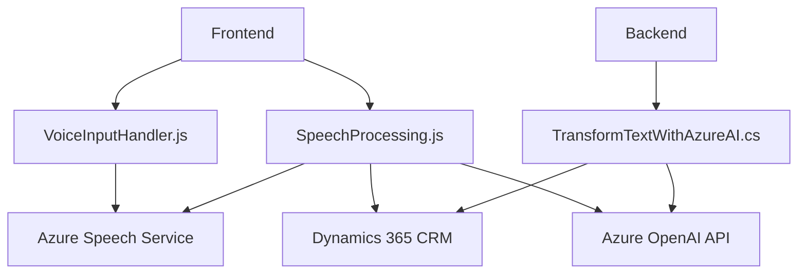

### Breve Resumen Técnico
El repositorio parece estar enfocado en la integración con **Microsoft Dynamics 365**, utilizando el **Azure Speech SDK** y el **Azure OpenAI API**. Los archivos indicados enriquecen la experiencia de usuario mediante interacción vocal con formularios y procesamiento avanzado de texto. La solución combina frontend en JavaScript para interacción directa y plugins en C# para lógica extendida y comunicación con servicios externos.

---

### Descripción de Arquitectura
La estructuración del proyecto refleja una **arquitectura cliente-servidor modular**, donde:
1. El **frontend** proporciona funcionalidad de entrada y salida de voz (captura de datos por reconocimiento vocal y lectura en voz alta de formularios).
2. Los **plugins del backend (C#)** extienden la lógica del sistema Dynamics 365, comunicándose con servicios de IA externos como Azure OpenAI.

A nivel arquitectónico, la solución puede clasificarse como una implementación de **n capas**, con separación entre:
- Capa de interacción del usuario (frontend).
- Capa de datos y lógica del negocio (Dynamics 365).
- Capa externa (Azure APIs).
---
  
### Tecnologías Usadas
1. **Frontend**
   - **JavaScript ES6** para manejo de eventos, transformación de datos y cadenas.
   - **Azure Speech SDK** para síntesis y reconocimiento de voz.
   - **Dynamics 365** Web API para integración con formularios y contexto.

2. **Backend**
   - **C# (.NET Framework)** para plugins CRM.
   - **Azure OpenAI API** para transformación de texto avanzado.
   - Dependencias:
     - `Newtonsoft.Json` y `System.Text.Json`: Serialización y deserialización.
     - `System.Net.Http`: Comunicación HTTP.

3. **Protocolos y Patrones**
   - Diseño modular con funciones especializadas en `JavaScript` y clases para plugins.
   - Gestión dinámica de dependencias (SDK de Azure Speech).
   - Patrón Plugin para extensibilidad en Dynamics 365.

---

### Diagrama Mermaid

---

### Conclusión Final
La solución presentada usa un enfoque integrativo para potenciar Dynamics 365 mediante funcionalidades de voz y procesamiento de texto. Su arquitectura modular aprovecha servicios RESTful de Azure para habilidades avanzadas en síntesis de voz y procesamiento de lenguaje natural. Esto promueve una relación estrecha entre el frontend (interacción directa del usuario) y el backend (procesos en Dynamics y APIs). 

Aunque la solución es eficiente y extensible, habría oportunidades para refactorización:
- Gestión externa de configuraciones sensibles (clave y región de Azure).
- Formalización en contenedores para despliegues más controlados, especialmente para los plugins y servicios de voz.