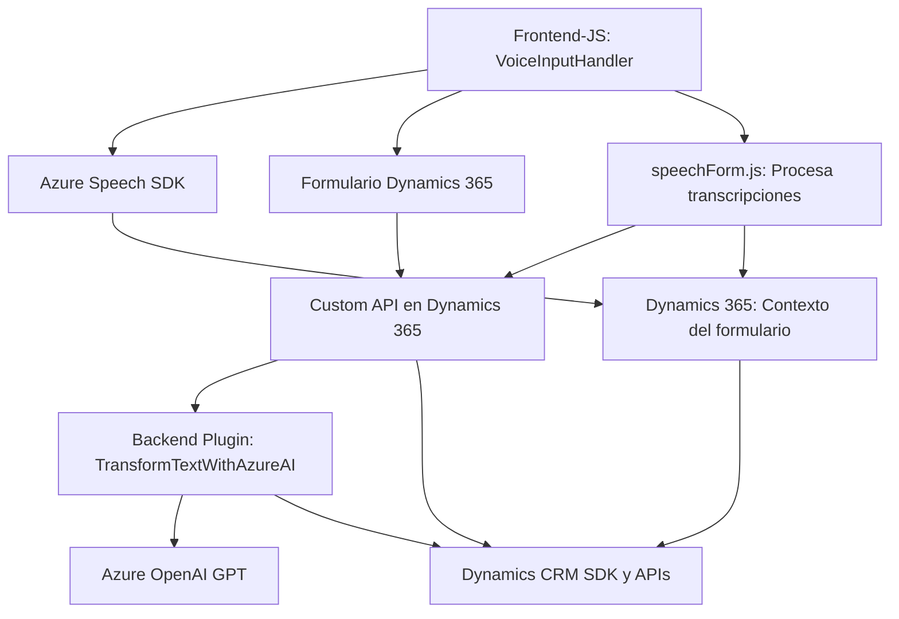

### Breve Resumen Técnico

El conjunto de archivos y estructura descrita representa una solución que combina interacción con formularios de Dynamics 365, integración con Azure Speech SDK para manejo de voz, y procesamiento avanzado mediante Azure OpenAI. La solución es altamente modular y utiliza tanto funcionalidades en el frontend como un plugin en backend para extender las capacidades de Dynamics CRM.

---

### Descripción de Arquitectura

La arquitectura del sistema parece ser una combinación de **n-capas** y **microservicios**, donde las capas están distribuidas entre:
1. **Frontend (JS)**: Maneja interacción en tiempo real con el usuario para leer datos y trabajar con funcionalidades de reconocimiento/síntesis de voz usando Azure Speech SDK.
2. **Backend (Plugin)**: Ejecuta lógica de negocio en forma de plugin para Dynamics CRM, incluyendo transformación de texto usando Azure OpenAI.

Aunque los componentes pueden ser ejecutados con cierto grado de independencia, la solución sigue siendo un modelo centralizado basado en Dynamics CRM. Esto implica que el “core” del sistema es un monolito extendido con dependencias externas (Azure Speech AI y OpenAI). Sin embargo, la estructura modular lo hace adaptable a distintos contextos, como operaciones con o sin IA.

---

### Tecnologías Usadas

1. **Frontend:**
   - **JavaScript ES6+**: Lenguaje principal para los componentes del frontend.
   - **Azure Speech SDK**: Para síntesis y reconocimiento de voz.
   - **Dynamics 365 APIs**: Integración directa con modelos de formularios para manipulación de datos.

2. **Backend Plugin:**
   - **C# (.NET Framework)**: Implementación del plugin de Dynamics CRM.
   - **Azure OpenAI Service**: Para transformar texto basado en reglas predefinidas.
   - **Librerías para procesamiento JSON**: Newtonsoft.Json, System.Text.Json.

3. **Patrones:**
   - **Patrón Observador**: En frontend para escuchar cambios en los datos de formulario y voz.
   - **Patrón Fábrica**: Ciertos métodos del SDK de Azure usan patrones fábrica para instanciar configuraciones específicas.
   - **Patrón Middleware**: Implementado de manera indirecta en el backend al delegar la transformación al servicio externo OpenAI.
   - **Modularidad Funcional**: Separación clara de lógica por función en ambos frontend y backend.

---

### Diagrama Mermaid

---

### Conclusión Final

La solución descrita es una extensión robusta de Dynamics CRM que utiliza tecnologías modernas tanto en el frontend como en el backend para ofrecer capacidades avanzadas de procesamiento basado en voz e IA. La arquitectura empleada es **híbrida**, donde el sistema centralizado basado en Dynamics CRM está fusionado con microservicios externos como Azure Speech SDK y OpenAI. Esto permite gran flexibilidad y potencia, aunque genera dependencias hacia servicios cloud que deben ser gestionadas eficientemente.

La modularidad de la solución asegura que sea escalable, fácilmente adaptable para incluir más servicios o funcionalidades, y que soporte futuros ajustes. Sin embargo, sería importante monitorear el uso y costos de los servicios cloud para evitar excedentes.