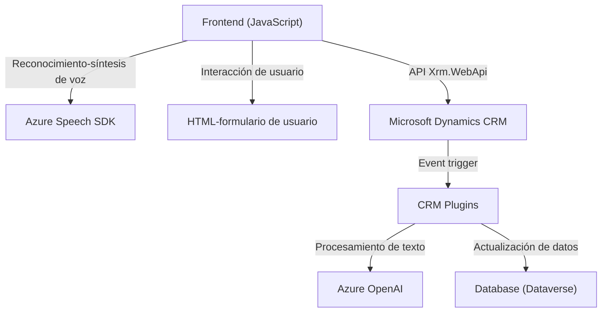

### Breve resumen técnico:
El repositorio contiene partes de una solución orientada a servicios que integra tecnologías de voz y procesamiento de lenguaje natural en interacción con formularios web y complementos de Dynamics CRM. La solución utiliza tanto un frontend basado en JavaScript como un backend construido sobre la arquitectura de extensibilidad de plugins de Dynamics CRM.

---

### Descripción de arquitectura:

#### Tipo de solución
La solución se divide en un frontend (interacción de usuario con el formulario y reconocimiento/síntesis de voz), y un backend (plugin de Dynamics CRM). Esto indica una orientación hacia una arquitectura distribuida que puede formar parte de un enfoque más amplio en el contexto de aplicaciones empresariales.

#### Arquitectura global
- **Híbrida (mezcla de N-capas y SOA)**: Se tiene una capa de presentación en el navegador (frontend), que interactúa directamente con servicios de la nube (Azure Speech SDK y Azure OpenAI) y transmite datos al backend en Dynamics CRM mediante API. El backend implementa plugins que responden a eventos de CRM, haciendo uso de arquitectura basada en servicios (SOA - Service-Oriented Architecture).

- Las llamadas al servicio se hacen mediante APIs y procesan texto y voz, lo que sugiere una **estructura modular** con componentes reutilizables separados por función.

---

### Tecnologías usadas:
- **Frontend**:
  - **Azure Speech SDK**: Para síntesis y reconocimiento de voz.
  - **JavaScript**: Lógica orientada a eventos y manejo dinámico del DOM.
  - **Xrm.WebApi**: API para la integración entre el frontend y Dynamics CRM.

- **Backend**:
  - **Dynamics CRM SDK**: Para creación y manejo de plugins de eventos.
  - **Azure OpenAI service**: Para procesar texto y generar JSON estructurado mediante transformación.
  - **Newtonsoft.Json.Linq** y **System.Text.Json**: Para serialización/deserialización de datos JSON.
  - **ASP.NET**: Para el desarrollo del plugin.

---

### Diagrama Mermaid:

---

### Conclusión final:
La solución descrita puede ser clasificada como una arquitectura híbrida, en la cual el frontend interactúa con servicios de Microsoft Azure para síntesis de voz y reconocimiento de lenguaje, mientras que el backend funciona como un plugin para Dynamics CRM que emplea el servicio de Azure OpenAI. Además, se observa una aplicación de principios de desarrollo modular utilizando patrones como **Facade** (en el frontend), e integración mediante **Service-Oriented Architecture** (SOA) para la comunicación entre componentes. La utilización de APIs, SDKs específicos y tecnologías estándar hacen que este proyecto sea una solución extensible y orientada a servicios, ideal para aplicaciones empresariales con alta interacción de usuario.