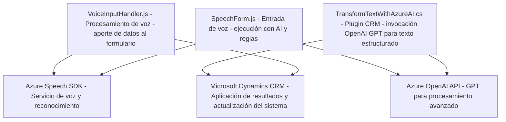

### Breve Resumen Técnico
El repositorio incluye tres archivos principales que, combinados, demuestran una solución orientada a la integración con servicios de voz e inteligencia artificial de **Azure**. Los módulos están diseñados para utilizar capacidades de síntesis y reconocimiento de voz, interacción con formularios, y procesamiento avanzado de texto mediante **Azure OpenAI** integrado en Microsoft Dynamics CRM.

---

### Descripción de Arquitectura
La solución utiliza una arquitectura **n capas** que separa tanto la interacción con el usuario (Frontend) como el procesamiento contextual (API y plugins en Microsoft Dynamics CRM). Existe una integración de servicios externos (Azure Speech SDK y Azure OpenAI). Los archivos interactúan en un flujo bien definido donde una capa captura datos de entrada (voz o texto), otra capa procesa esos datos, y finalmente una API o plugin aplica dichos valores al contexto del sistema CRM.

1. **Frontend:** Funcionalidades de entrada y salida de datos (captura y síntesis de voz).
2. **Plugins y CRM Backend:** Transformaciones avanzadas mediante Azure OpenAI, aplicando lógica específica del negocio.

---

### Tecnologías Usadas
1. **Frontend:**
   - **JavaScript ES6:** Utilizado para funcionalidades de entrada y salida.
   - **SDK de Azure Speech:** Carga dinámica para síntesis y reconocimiento de voz.

2. **Backend (Dynamics CRM Plugin):**
   - **Microsoft Dynamics SDK:** Nativo para entornos CRM.
   - **Azure OpenAI API:** Utiliza GPT para transformar textos.
   - **C#:** Lenguaje backend para escribir plugins.

3. **Dependencias:**
   - `Microsoft.Xrm.Sdk` y `System.Net.Http` en el backend.
   - Azure Speech SDK en el frontend.

---

### Diagrama Mermaid

---

### Conclusión Final
La solución describe un sistema que combina funcionalidades de **entrada de voz**, **procesamiento de texto basado en AI**, y aplicación en un entorno **Microsoft Dynamics CRM**. El diseño modular aborda requisitos de procesamiento externo a través de Azure SDK y OpenAI, manteniendo una lógica clara y extensible en capas. Las dependencias externas se gestionan cuidadosamente para garantizar una alta integración entre formularios dinámicos y capacidades de inteligencia artificial. Esto posiciona el sistema como una solución robusta para entornos empresariales basados en datos dinámicos y colaboración vía CRM.