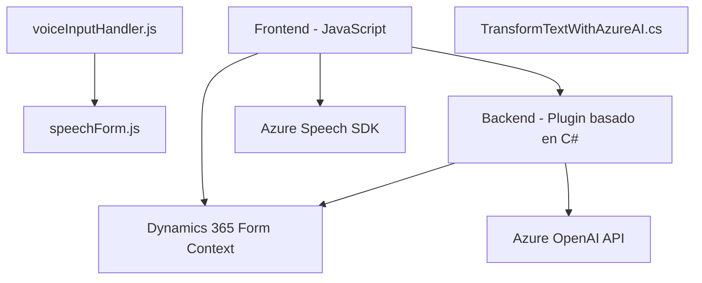

### Resumen Técnico

La solución presentada se trata de un entorno híbrido que combina componentes frontend y backend interconectados para operar sobre formularios en Dynamics 365 mediante reconocimiento y síntesis de voz utilizando el Azure Speech SDK, además de funcionalidades avanzadas de procesamiento de texto a través de Azure OpenAI.

Se observan tres áreas principales de interés:
1. **Frontend basado en JavaScript** para integrar experiencia de usuario con voz y manipulación automatizada de formularios en Dynamics 365.
2. **Backend basado en C# (plugin)** que extiende Dynamics CRM mediante transformaciones de texto usando servicios de Azure OpenAI.
3. **Integración de servicios externos** (Azure Speech y Azure OpenAI) para reconocimiento, síntesis y procesamiento de texto.

---

### Descripción de Arquitectura

La arquitectura combinada es una solución de **n capas conectada mediante servicios externos**:
1. **Capa de presentación**:
   - Implementada con JavaScript en el frontend para interacción directa con el usuario, reconocimiento de voz, y manipulación de formularios en Dynamics 365.
   - Interactúa directamente con Azure Speech SDK.
   
2. **Capa de lógica de negocio**:
   - Implementada en el backend como un plugin C# para Dynamics CRM, procesando datos en tiempo de ejecución, realizando transformaciones textuales y delegando trabajo a la API de Azure OpenAI.

3. **Capa de servicio**:
   - Uso de servicios cloud externos:
     - **Azure Speech SDK**: Para reconocimiento y síntesis de voz.
     - **Azure OpenAI API**: Para procesamiento avanzado y transformaciones de texto.

---

### Tecnologías Usadas

1. **Frontend**:
   - Lenguaje: JavaScript.
   - SDK: Azure Speech SDK.
   - Dependencias:
     - Dynamics 365 WebAPI para manipulación de datos.
   - Patrones observados: Modularización, Event-driven Programming, API Integration.

2. **Backend**:
   - Lenguaje: C#.
   - Framework: Dynamics CRM SDK.
   - Dependencias:
     - Microsoft.Xrm.Sdk (para integración con Dynamics CRM).
     - System.Net.Http (para llamadas HTTP).
     - JsonSerializer y Newtonsoft.Json (para serialización/deserialización JSON).
   - Patrones observados: Plugin-based Architecture, Service-Oriented Architecture.

3. **Servicios externos**:
   - **Azure Speech SDK**: Reconocimiento y síntesis de voz.
   - **Azure OpenAI API**: Procesamiento de texto avanzado.

---

### Diagrama Mermaid

### Conclusión Final

La solución combina componentes frontend y backend con capacidades de interacción de voz y procesamiento avanzado de texto. Es una implementación adecuada para mejorar la usabilidad y funcionalidad de formularios en Dynamics 365, proporcionando:
1. **Frontend plugin con soporte voz** para facilitar la interacción.
2. **Backend mediante plugin C#** para procesar y estructurar datos usando Azure OpenAI.
3. **Arquitectura de servicios conectados** que utiliza cloud-first SDKs como Azure Speech y OpenAI.

La integración permite que la solución sea extensible, escalable y fácil de adoptar en entornos corporativos. Sin embargo, requiere dependencias clave como el SDK de Azure Speech y acceso a servicios OpenAI.