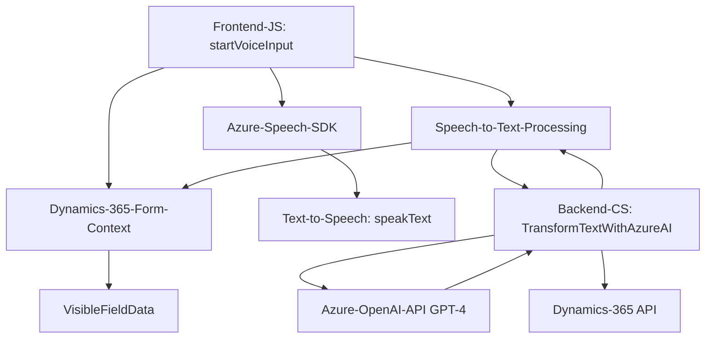

### Análisis Detallado
#### **Breve Resumen Técnico**
El repositorio parece ser parte de una solución más amplia que integra el procesamiento de texto a voz, reconocimiento de voz y manipulación de formularios mediante APIs de Microsoft Azure (Azure Speech SDK y Azure OpenAI). Además, está diseñado para interactuar con una plataforma CRM (presumiblemente Microsoft Dynamics 365), actualizando datos en sus formularios y ejecutando plugins programados.

---

#### **Descripción de la arquitectura**
La arquitectura observada es híbrida:
- Integra el **API de Azure Speech SDK** y **Azure OpenAI API** para procesos como reconocimiento de voz, síntesis de texto y procesamiento de datos externos.
- El diseño del plugin en `TransformTextWithAzureAI.cs` se adscribe a un patrón de plugin típico para **Dynamics 365 CRM**, utilizando `IPlugin` para reaccionar ante eventos y procesar datos en tiempo de ejecución.
- A nivel lógico, el sistema presenta una arquitectura de **n capas**, donde cada capa tiene su propia responsabilidad:
  1. **Capa de presentación (Frontend/JS scripts):** Permite la interacción directa con usuarios mediante formularios.
  2. **Capa de negocio (Plugins):** Define la lógica para procesar datos del CRM y comunicarse con servicios externos como Azure OpenAI.
  3. **Capa de integración (APIs y SDKs):** Conecta el sistema con APIs de terceros (Azure Cognitive Services y Dynamics 365 Custom APIs).
  
---

#### **Tecnologías Usadas**
1. **Frontend Layer (JavaScript):**
   - **JavaScript:** Principal lenguaje utilizado en los scripts.
   - **Azure Cognitive Services Speech SDK:** Para síntesis de voz (text-to-speech) y reconocimiento de voz (speech-to-text).
   - **Integration with Dynamics 365**: Probable uso de un SDK de Dynamics 365 para la manipulación del formulario vía `executionContext` y APIs como `Xrm.WebApi`.
   
2. **Backend Plugin (C#):**
   - **C#:** Para el desarrollo de plugins de Dynamics CRM.
   - **Microsoft.Xrm.Sdk:** Framework para el desarrollo e integración de plugins en Dynamics 365.
   - **System.Net.Http:** Para realizar solicitudes HTTP hacia APIs externas (en este caso, Azure OpenAI).
   - **Azure OpenAI API:** Para la transformación del texto basado en inteligencia artificial.
   - **JSON Libraries (Newtonsoft.Json, System.Text.Json):** Manejo y parseo eficiente de respuestas JSON.

3. **External Dependencies:**
   - **Azure Speech Service:** Usado para síntesis y reconocimiento de voz.
   - **Custom API**: Manejada mediante `Xrm.WebApi.online.execute` para procesar inputs usando la API de Dynamics 365.
   - **Azure OpenAI GPT Models**: Para transformar texto dentro del plugin.

---

#### **Diagrama Mermaid**

---

#### **Conclusión Final**
Este repositorio representa una solución parcial de una integración funcional entre reconocimiento de voz, síntesis de voz, procesamiento inteligente de texto y plataformas CRM como Dynamics 365. Su arquitectura se orienta al modelo **n capas** con una estrategia híbrida que combina el uso de APIs externas (Azure Cognitive Services, Azure OpenAI) con lógica personalizada escrita en **C# (Plugins para Dynamics CRM)** y **JavaScript (Frontend)**.

- El diseño es modular y parece haber un claro propósito en separar las funciones por responsabilidad, manteniendo una buena legibilidad del código.
- Las dependencias externas como Azure Speech SDK, Azure OpenAI API y Dynamics CRM juegan un papel fundamental en la solución. Es esencial que estas estén configuradas de manera segura (parametrizadas) para evitar problemas futuros.
- Si bien funcional, existen oportunidades para mejorar la arquitectura ajustando la configuración estática (como los valores hardcodeados en el plugin) y documentando mejor la interacción entre las capas.

El diagrama Mermaid presentado refleja esta interacción entre las capas de frontend, backends, y servicios externos.