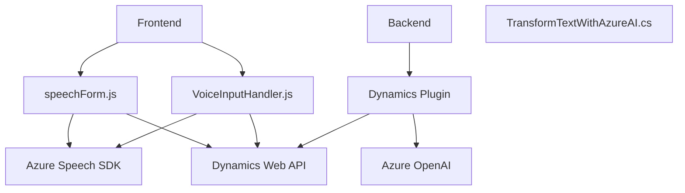

## Breve resumen técnico
Estos archivos representan una solución integrada que extiende la funcionalidad de Microsoft Dynamics 365 utilizando Azure Speech y Azure OpenAI para realizar tareas de reconocimiento de voz, síntesis de voz y generación dinámica de datos estructurados (JSON). La solución incluye un SDK de Azure Speech para procesamiento en el lado del cliente (frontend) y un plugin en el backend para aprovechar Azure OpenAI.

---

## Descripción de arquitectura
La solución tiene una arquitectura híbrida de **n capas** que combina un frontend modular basado en JavaScript con un backend extensible mediante plugins en Dynamics CRM. 

- **Frontend:** Consiste en múltiples módulos JS que interactúan con el formulario de Dynamics a través de APIs y el SDK de Azure Speech, permitiendo la entrada por voz, transcripción y síntesis de texto.
- **Backend:** Utiliza un plugin basado en la interfaz `IPlugin` de Dynamics CRM para realizar el procesamiento avanzado de texto con Azure OpenAI, transformándolo en JSON estructurado según normas predefinidas.

Esta arquitectura refleja una integración funcional entre cliente (JS/Browser SDKs) y servidor (Dynamics Plugins).

---

## Tecnologías usadas
- **Frontend:**
  - **JavaScript:** Lenguaje principal del desarrollo frontend.
  - **Azure Speech SDK:** Para reconocimiento de voz y síntesis de texto.
  - APIs de Dynamics CRM: Para actualizar formularios y consumir datos del sistema de manera dinámica.

- **Backend:**
  - **Microsoft Dynamics CRM SDK:** Para extender la lógica del CRM mediante plugins personalizados.
  - **Azure OpenAI:** Para transformar texto en JSON estructurado.
  - **Newtonsoft.Json:** Librería para parsear y manejar datos JSON en .NET.
  - **System.Net.Http:** Para realizar llamadas REST a servicios externos.

- **Patrones utilizados:**
  - **Estructura modular:** Cada tarea específica se encapsula en funciones distintas en los archivos JS.
  - **Plugin Pattern:** Aplicado en el backend con `IPlugin`.
  - **Broker Pattern:** Comunicación con Azure APIs de manera abstracta.
  - **Event-driven:** En el frontend, el flujo está guiado a través de callbacks y eventos al cargar SDKs o procesar datos asíncronamente.

---

## Diagrama Mermaid válido para GitHub

---

## Conclusión final
La configuración del repositorio describe una solución orientada a la mejora de la experiencia de usuario mediante entrada y salida de voz en Microsoft Dynamics CRM. Se trata de una solución integral que implementa una arquitectura de n-capas, donde los elementos frontend gestionan la interacción del usuario (voz y datos) y los plugins backend procesan la información en tiempo real usando APIs externas como Azure Speech y Azure OpenAI.

Esta solución se desarrolla principalmente para entornos empresariales que busquen incorporar inteligencia artificial y tecnologías de reconocimiento/síntesis de voz a sus procesos CRM de manera escalable y modular.