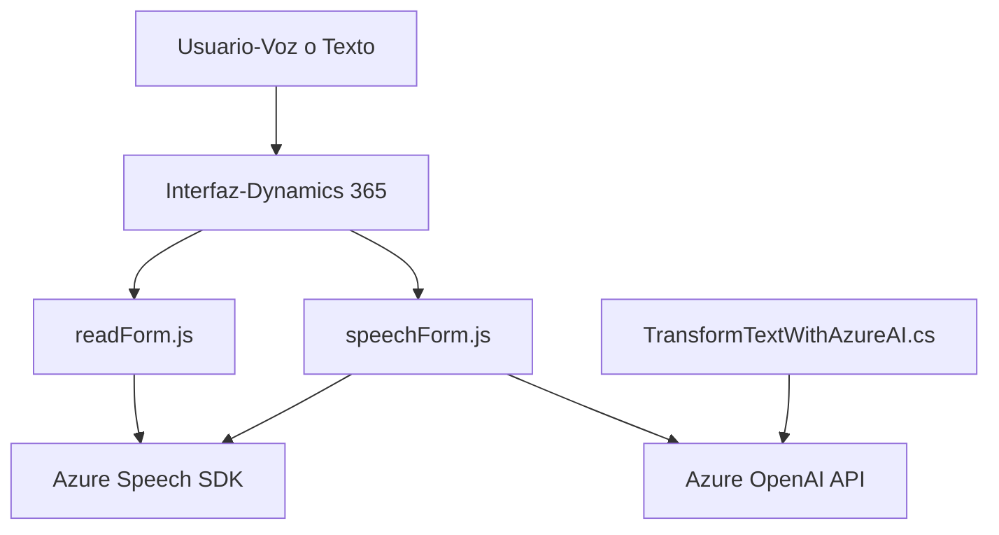

### Breve Resumen Técnico

El repositorio describe una solución que integra la entrada y salida de datos mediante voz dentro del ecosistema Microsoft Dynamics CRM, utilizando servicios de Azure como el Speech SDK y Azure OpenAI. Los archivos trabajan en conjunto para permitir tanto la síntesis de voz de formularios (desde texto a voz) como el reconocimiento de voz para llenar formularios (de voz a texto) y la transformación de texto en objetos estructurados mediante inteligencia artificial.

---

### Descripción de Arquitectura

La arquitectura parece corresponder a una aplicación basada en **n capas**, estructurada de la siguiente manera:

1. **Frontend:** Scripts de JavaScript, como `readForm.js` y `speechForm.js`. Estos están diseñados para interfase cliente, potenciados por el SDK de Azure para lograr interacciones por voz. Se integran con la interfaz de usuario de Dynamics 365.
2. **Negocio/Dominio:** Las funciones específicas para procesar y mapear datos desde formularios (ejemplo: `processTranscript`, `applyValueToField`).
3. **Plugins y Servicios:** El archivo `TransformTextWithAzureAI.cs` funciona como un plugin para Dynamics CRM que delega el procesamiento de texto estructurado a Azure OpenAI.

La arquitectura está parcialmente desacoplada, aprovechando tanto el modelo de plugins de Dynamics para extender funcionalidades como bibliotecas y SDK externos para interacción con inteligencia artificial.

---

### Tecnologías Usadas

1. **JavaScript:**
   - Uso de scripts para manejar formularios y procesamiento de datos en el Frontend.
   - Azure Speech SDK.
2. **Dynamics API:** Métodos como `Xrm.WebApi.online.execute` para acceder a datos dinámicos.
3. **Microsoft Azure:**
   - Azure Speech SDK para reconocimiento y síntesis de voz.
   - Azure OpenAI para transformación de texto en JSON.
4. **Backend .NET (C#):**
   - Plugin de Dynamics CRM (implementación de `IPlugin`).
   - Librerías como `Newtonsoft.Json` y `System.Net.Http` para manejo de API REST.

---

### Diagrama Mermaid Compatible con GitHub Markdown

---

### Conclusión Final

La solución es un ejemplo de arquitectura híbrida que mezcla las capacidades de Dynamics CRM con servicios en la nube de Azure para lograr una experiencia de usuario avanzada y versátil. Está implementada principalmente siguiendo una estructura de **n capas** con diseño modular y uso de servicios externos. Sin embargo, la solución podría beneficiarse del uso de más patrones de desacoplamiento, como el modelo de arquitectura **hexagonal**, para mejorar su sostenibilidad y extensibilidad en un ecosistema de microservicios y futuras integraciones.