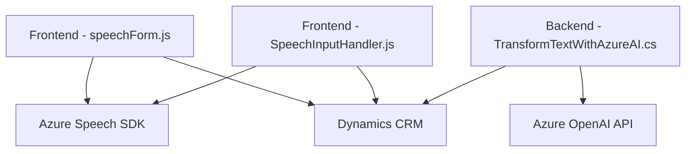

### Análisis técnico

#### Breve resumen técnico
El repositorio analiza tres archivos clave que implementan lógica para integración con formularios, entrada por voz y procesamiento de texto mediante servicios de Azure (Speech SDK y OpenAI). La solución está parcialmente desacoplada, con lógica distribuida entre frontend y backend, para enriquecer la interacción de usuarios con un sistema CRM basado en Microsoft Dynamics.

#### Descripción de arquitectura
La arquitectura principal sigue un modelo híbrido. En el nivel frontend, utiliza una estructura modular basada en principios de separación de responsabilidades. En el nivel backend, implementa un plugin para Dynamics CRM que facilita la comunicación con Azure OpenAI. La interacción entre frontend y backend indica una arquitectura de **cliente-servidor con integración de servicios externos**, aunque no llega a ser una arquitectura de microservicios completamente independiente.

#### Tecnologías usadas
1. **Frontend:**
   - **JavaScript:** Base para la funcionalidad de entrada por voz y síntesis.
   - **Azure Speech SDK:** Para reconocer voz y sintetizar texto hablado.
   - **Dynamics CRM API:** Para manipulación directa de formularios y datos en el CRM.

2. **Backend:**
   - **C#:** Implementación del plugin.
   - **Azure OpenAI (GPT-4):** Para conversión de texto en JSON estructurado.
   - **HTTP Client:** Para la comunicación con el endpoint de Azure OpenAI.

3. **Dependencias adicionales:**
   - **Newtonsoft.Json y System.Text.Json:** Para el manejo de datos en formato JSON.
   - **Microsoft Dynamics SDK:** Para integración directa con el CRM.

#### Diagrama Mermaid
El siguiente diagrama representa las interacciones y flujo lógico del sistema. Es simplificado y enfocado en el modelo explicado.

#### Conclusión final
La solución combina servicios en la nube de Microsoft Azure para habilitar spoken-to-text y text-to-JSON conversiones sobre formularios CRM. En el lado del frontend, prevalecen arquitecturas basadas en módulos, que son responsables de la interacción del usuario y la integración con SDKs de Azure. En el backend, se centraliza la lógica de procesamiento gracias a un plugin de Dynamics. Aunque no hay un diseño explícito de microservicios, la solución aprovecha APIs extensibles para desacoplar ciertas responsabilidades. Esto facilita la escalabilidad, pero algunos puntos como el uso síncrono de APIs y la mezcla de JSON frameworks deben ser mejorados.