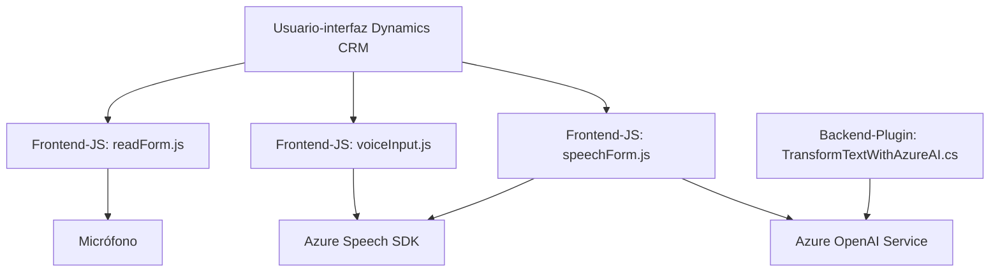

### Breve resumen técnico
El repositorio presenta una solución híbrida que incluye una integración entre frontend (JavaScript), lógica para el flujo de formularios en Dynamics CRM mediante el uso de plugins .NET, y servicios de Azure (Speech SDK y OpenAI). La solución facilita dos tareas principales:
1. **Síntesis de voz y reconocimiento de voz** en formularios de Dynamics 365 usando el Azure Speech SDK en el frontend.
2. **Procesamiento avanzado de texto** entre Dynamics CRM y el servicio Azure OpenAI mediante un plugin .NET.

### Descripción de arquitectura
La arquitectura se puede clasificar como **n-capas**, aunque muestra características de una **arquitectura orientada a servicios (SOA)** por la interacción con APIs externas (Azure Speech SDK y Azure OpenAI). Cada componente cumple roles específicos:
- **Frontend (JavaScript):** Manejo de interfaz para sintetizar voz desde formularios visibles y procesar entradas de voz.
- **Backend Plugins (.NET):** Procesamiento de texto avanzado con Azure OpenAI y actualización de formularios en Dynamics CRM.
  
El flujo de datos está altamente desacoplado gracias al uso de APIs y SDKs externos que procesan los datos en servicios dedicados (Azure).

### Tecnologías usadas
1. **Frontend:**
   - **Lenguaje:** JavaScript.
   - **Framework:** API/web estándar sin frameworks específicos.
   - **Servicios:** Azure Speech SDK para sintetizar y procesar voz.
   - **Patrones:** Modularización, lazy loading.

2. **Backend Plugins:**
   - **Lenguaje:** C# (.NET Framework).
   - **Servicios:** Dynamics CRM (Microsoft.Xrm.Sdk), Azure OpenAI API.
   - **Patrones:** Plugin Design Pattern, SOA, Inyección de Dependencia (IServiceProvider).

3. **Servicios externos:**
   - **Azure Speech SDK:** Manejo de voz y audio.
   - **Azure OpenAI:** Procesamiento de texto según normas.
   - **Dynamics WebAPI:** Gestión de datos en formularios.

### Dependencias o componentes externos
- **Frontend:**
  - **Speech SDK:** Descargado dinámicamente desde `https://aka.ms/csspeech/jsbrowserpackageraw`.
  - **APIs web estándar:** Manipulación de DOM y mensajes de alerta.
- **Backend Plugins:** 
  - **Dynamics CRM SDK:** Extracción y actualización de datos en formularios.
  - **Azure OpenAI API:** Generación de texto estructurado.
  - **HTTP libraries:** Para conectar servicios externos.

---

### Diagrama Mermaid

### Conclusión final
La solución implementa una arquitectura orientada a tareas específicas, desacoplada y modular, centrada en la integración de servicios externos (Azure Speech SDK y OpenAI) dentro de un flujo de trabajo ampliado para Dynamics CRM. Aunque es eficaz para las funciones que promete, el diseño podría beneficiarse de seguir principios como la **arquitectura hexagonal** o **event-driven** para mejorar su testabilidad y escalabilidad.