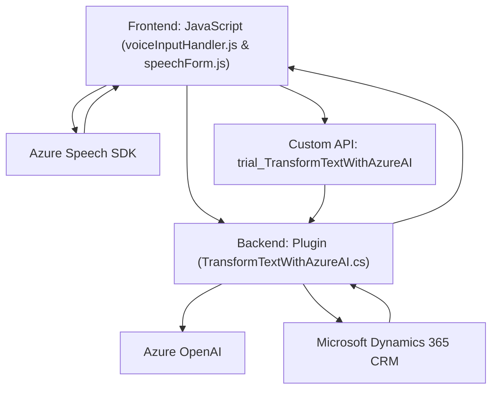

### Resumen técnico

Analizando los archivos proporcionados, el repositorio incluye elementos que permiten interacción con formularios en Dynamics 365 basándose en input por voz. La solución implica integración con APIs externas, en este caso el Azure Speech SDK y el servicio Azure OpenAI, y está compuesta por un frontend para interfaz con el usuario y un plugin de backend para lógica adicional y comunicación con servicios externos.

---

### Descripción de arquitectura

La solución sigue un **patrón de arquitectura híbrida** basado en una estructura de **n capas**. Hay un **frontend** desarrollado con JavaScript que interactúa directamente con el usuario para capturar entrada de texto y voz. Posteriormente, utiliza servicios externos (Azure Speech SDK) para sintetizar o analizar la entrada y enviar datos hacia el backend. 

En el backend, existe un plugin (`TransformTextWithAzureAI.cs`) que interactúa con el CRM de Dynamics 365 para recibir parámetros de entrada y hacer llamadas a una API externa (Azure OpenAI) con el fin de estructurar texto en formato JSON. Este enfoque permite la separación de preocupaciones entre presentación (frontend) y lógica de negocio (plugin/backend).

---

### Tecnologías utilizadas

1. **Frontend**:
   - **JavaScript**:
     - Desarrollo de scripts para manipulación de formularios.
     - Integración con APIs externas mediante peticiones HTTP.
   - **Azure Speech SDK**:
     - Reconocimiento de voz y síntesis de voz.
     - Cargado dinámicamente desde un CDN de Microsoft.
   - **Promises y Async/Await**:
     - Flujo asincrónico para manejar operaciones de red y dependencias externas.

2. **Backend**:
   - **Microsoft Dynamics 365**:
     - Interacción con formularios desde el CRM.
     - Implementación de un plugin basado en `IPlugin`.
   - **C# (.NET)**:
     - Desarrollo del plugin.
     - Integración con el servicio Azure OpenAI API usando `HttpClient`.
   - **Azure OpenAI API**:
     - Análisis y transformación de texto.
     - Implementación de normas personalizadas para estructuración en JSON.
   - **Newtonsoft.Json & System.Text.Json**:
     - Serialización y deserialización de JSON para comunicaciones con APIs y procesamiento interno.

---

### Dependencias y componentes externos

1. **Azure Speech SDK**:
   - Para reconocimiento y síntesis de voz en el frontend.
   - URL: `"https://aka.ms/csspeech/jsbrowserpackageraw"`.

2. **Azure OpenAI API**:
   - Para procesamiento avanzado de texto en el plugin backend.
   - Integra GPT-4o para análisis de texto y generación de JSON.

3. **Microsoft Dynamics 365 CRM**:
   - Plataforma en la que se ejecuta y aplica la lógica del plugin de backend.

4. **Librerías adicionales en el plugin backend**:
   - `System.Net.Http`: Para comunicación con REST APIs.
   - `Newtonsoft.Json.Linq` y `System.Text.Json`: Para manipulación JSON.
   - **Redundancias detectadas**:
     - `System.Text.RegularExpressions` y `Microsoft.Xrm.Sdk.Query` no usadas activamente.

5. **Custom API de Dynamics 365**:
   - `trial_TransformTextWithAzureAI` para procesamiento de texto con servicios de Azure.

---

### Diagrama Mermaid (GitHub-compatible)
Aquí está el diagrama que describe la relación entre los componentes del sistema:

---

### Conclusión final

Esta solución implementa un flujo eficiente para capturar voz, procesar formularios en Dynamics 365 y transformar texto mediante IA. Se utiliza una arquitectura modular en n capas, separando la presentación (frontend) y lógica de negocio (plugin backend). La integración con Azure Speech y Azure OpenAI permite funcionalidades avanzadas, como el análisis y síntesis de voz y estructuración basada en normas. Sin embargo:
- La clave API para OpenAI podría almacenarse de manera más segura.
- Es posible optimizar las dependencias eliminando librerías no utilizadas en el plugin backend. 

En general, la arquitectura es robusta, moderna y adecuada para escenarios de interacción dinámica con usuarios en aplicaciones orientadas a formularios.