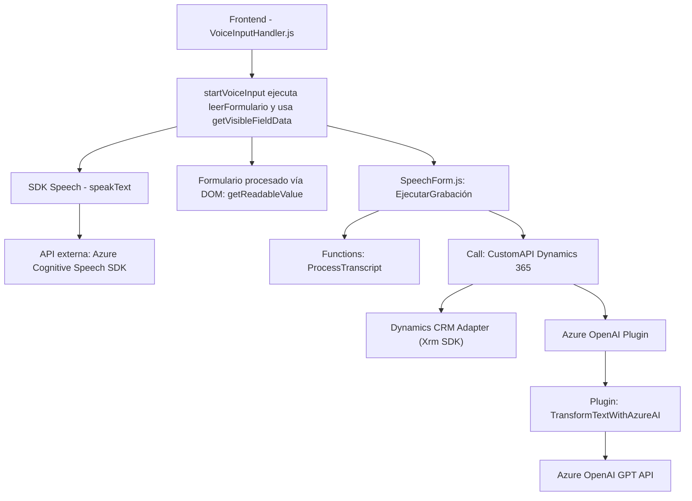

### Breve resumen técnico
El repositorio presenta una integración avanzada entre Microsoft Dynamics 365, el Azure Speech SDK y la API de Azure OpenAI para habilitar capacidades de entrada y síntesis de voz, así como mapeo y transformación de datos en formularios dinámicos. Se incluyen tres archivos representativos: dos del frontend (`readForm.js` y `VoiceInputHandler.js`) y un plugin para Dynamics CRM (`TransformTextWithAzureAI.cs`).

---

### Descripción de arquitectura
La solución presentada es un sistema distribuido basado en **arquitectura de microservicios**, con un fuerte enfoque en la integración entre componentes. El proyecto utiliza un enfoque **event-driven** y **orientado a servicios** a través de la interacción entre SDK y APIs externas. Muestra una orquesta entre el cliente (con componentes frontend) y el backend (plugin para Dynamics CRM). Además, se emplea un diseño modular con funciones específicas separadas, cada una cumpliendo la responsabilidad única.

El plugin, por su parte, opera como un miembro explícito de la arquitectura **hexagonal** al actuar como un adaptador especializado para la integración con servicios de Azure OpenAI.

---

### Tecnologías usadas
1. **Frontend**:
   - **JavaScript** (ES6)
   - Dynamics 365 Context APIs via `formContext` and `executionContext`.
   - **Azure Speech SDK** (`https://aka.ms/csspeech/jsbrowserpackageraw`) para procesamiento de voz.
   - Web APIs (promesas para comunicación con Dynamics 365 Custom APIs).

2. **Backend/Plugins**:
   - **Microsoft Dynamics CRM (XRM SDK)**.
   - `.NET Framework` para el desarrollo de plugins.
   - **Azure OpenAI API** para procesamiento avanzado de lenguaje natural.
   - JSON serialization (`System.Text.Json`, `Newtonsoft.Json.Linq`).

---

### Diagrama Mermaid válido para GitHub

---

### Conclusión final
La solución está diseñada como **una integración avanzada entre Dynamics 365 y Azure**, que opera de manera modular y con principios arquitectónicos escalables y reutilizables. Los archivos del frontend gestionan la captura de datos mediante voz y sintetizan texto a voz a través de Azure Speech SDK. En el backend, el plugin encargado de la transformación de texto sigue el patrón de **servicio externo encapsulado**. La arquitectura es **hexagonal distribuida**, soportando una interacción fluida entre la capa del cliente y servicios cloud, lo que asegura alta flexibilidad y adaptabilidad.