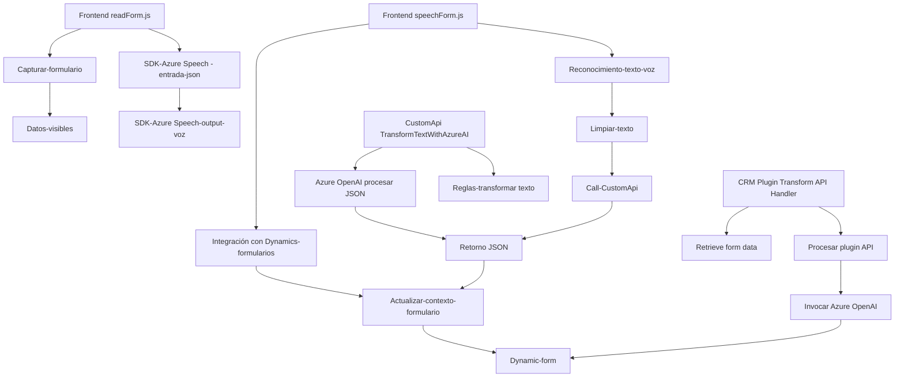

### Breve resumen técnico

La estructura del repositorio revela una solución orientada a la integración de formularios dinámicos con capacidades de procesamiento de voz y texto, utilizando servicios en la nube (Azure Speech SDK y Azure OpenAI). La solución consiste en una aplicación frontend basada en JavaScript y un backend en .NET, extendiendo la funcionalidad de Dynamics 365 mediante la creación de un plugin que interactúa con el servicio Azure OpenAI.

---

### Descripción de la arquitectura

La solución sigue una arquitectura híbrida basada en **SOA** (Service-Oriented Architecture) y complementada con modelos de diseño propios del estándar **MVC** y principios **SOLID**. La comunicación se establece principalmente mediante servicios externos (Azure SDKs y APIs personalizadas), mientras que la estructura atomiza la lógica en funciones y módulos independientes que favorecen su mantenimiento y reutilización.

1. En el frontend (archivos JavaScript):
   - El diseño se enfoca en el procesamiento de datos de formularios. Posee modularidad directa: 
     - Colección de datos (mapear, filtrar y estructurar).
     - Integración con servicios de voz (Azure Speech SDK).
     - Comunicación con APIs externas para tareas avanzadas con IA.
   - La carga dinámica del SDK para la síntesis de voz sigue principios de arquitectura adaptativa.
   - Uso de funciones como controladores y rutinas para entrada/salida.

2. En el backend (.NET plugin para Dynamics CRM):
   - Usa **plugin-based architecture**, una técnica común en frameworks de extensibilidad como Dynamics CRM.
   - El enfoque es simplificar y extender las operaciones estándar del CRM usando servicios externos (Azure OpenAI).
   - Promueve responsabilidades altamente especializadas, evitando fallos en otros elementos del sistema.

---

### Tecnologías, frameworks y patrones utilizados

#### Tecnologías:
- **Frontend (JavaScript)**:
  - Azure Speech SDK: Para la síntesis y reconocimiento de voz.
  - Dynamics 365 form SDK: Para la integración con formularios dinámicos.
- **Backend (.NET)**:
  - Azure OpenAI Service: Integración de IA para transformar texto.
  - .NET SDK: Implementación del plugin.
  - Newtonsoft.Json y System.Text.Json: Para manejo de estructuras JSON.
  - System.Net.Http: Llamadas API.

#### Frameworks:
- Microsoft Dynamics CRM SDK.
- .NET Framework/C#.
- Azure SDK (Speech y OpenAI).

#### Patrones:
- **Modularidad**: Separación de responsabilidades en funciones pequeñas y reutilizables.  
- **SoA (Service-Oriented Architecture)**: Uso de integración directa con servicios en la nube.  
- **Plugin-Based Architecture**: Extensión basada en formato de plugins en Dynamics CRM.  
- **MVC**: Separación lógica entre input/output, procesamiento y datos.  
- **Event-driven**: Uso de workflows y eventos (Dynamics CRM context y asíncronía en frontend).

---

### Diagrama Mermaid válido para GitHub

---

### Conclusión final

La solución implementada es una demostración avanzada que combina características de un **frontend con capacidades de procesamiento de entrada basada en voz**, un **API personalizada** para procesamiento textual mediante Inteligencia Artificial, y un plugin para **Microsoft Dynamics CRM** que facilita la integración.

La arquitectura usada integra servicios de nube, SDKs, APIs externas y principios sinérgicos como **Modularidad**, **SoA**, y **plugin-based architecture**, resultando en una solución escalable y mantenible que cumple con las mejores prácticas de diseño de software profesional.